Preface
==========

About SunFounder
------------------

SunFounder is a technology company focused on Raspberry Pi and Arduino
open source community development. Committed to the promotion of open
source culture, we strive to bring the fun of electronics making to
people all around the world and enable everyone to be a maker. Our
products include learning kits, development boards, robots, sensor
modules and development tools. In addition to high quality products,
SunFounder also offers video tutorials to help you make your own
project. If you have interest in open source or making something cool,
welcome to join us!

About This Kit
-----------------

The kit is suitable for SunFounder Uno, Mega 2560, Duemilanove and Nano
and also fully compatible with the corresponding Arduino boards. It
includes 37 various modules for you to learn and we provide
corresponding lessons which are simple and useful for better
understanding. Hope you can learn their applications quickly and use
them in your own projects!

In this book, we will show you circuits with both realistic
illustrations and schematic diagrams. You can go to our official website
`www.sunfounder.com <http://www.sunfounder.com>`__ to download related
materials (code, Fritzing figures and document in PDF) by clicking
`LEARN <http://www.sunfounder.com/index.php?c=case_incs>`__ -> `Get
Tutorials <http://www.sunfounder.com/index.php?c=case_incs&a=typelist>`__.

Free Support
---------------

   |image1|\ If you have any **TECHNICAL question**, add a topic under
   **FORUM** section on our website and we'll reply as soon as possible.

   |image2|\ For **NON-TECH questions** like order and shipment issues,
   please **send an email to**
   `service@sunfounder.com <mailto:support@sunfounder.com>`__. You're
   also welcomed to share your projects on FORUM.

`Component List 1`

`Get Started 9 <\l>`__

`SunFounder Arduino Board 9 <\l>`__

`Install Arduino IDE 10 <\l>`__

`Plug in the Board 11 <\l>`__

`Add libraries 11 <\l>`__

`Lesson 1 Display by I2C LCD1602 16 <\l>`__

`Lesson 2 Analog Hall Sensor 20 <\l>`__

`Lesson 3 Switch Hall Sensor 24 <\l>`__

`Lesson 4 Analog Temperature Sensor 27 <\l>`__

`Lesson 5 Temperature Detection by Thermistor 30 <\l>`__

`Lesson 6 Auto-flash LED 32 <\l>`__

`Lesson 7 Barometer BMP180 34 <\l>`__

`Lesson 8 Real-time Clock Module 37 <\l>`__

`Lesson 9 Flame Alarm 40 <\l>`__

`Lesson 10 Flammable Gas Detection 43 <\l>`__

`Lesson 11 Humiture Detection 45 <\l>`__

`Lesson 12 Joystick PS2 48 <\l>`__

`Lesson 13 Controlling an LED by Button 51 <\l>`__

`Lesson 14 Vibration Switch 53 <\l>`__

`Lesson 15 Touch Switch 55 <\l>`__

`Lesson 16 Photo-interrupter 57 <\l>`__

`Lesson 17 Photoswitch 60 <\l>`__

`Lesson 18 Reed Switch 63 <\l>`__

`Lesson 19 Relay 66 <\l>`__

`Lesson 20 Blinking an LED by Potentiometer 69 <\l>`__

`Lesson 21 Tilt Switch 71 <\l>`__

`Lesson 22 Buzzer 73 <\l>`__

`Lesson 23 Digital Temperature Sensor 76 <\l>`__

`Lesson 24 Rainbow LED 78 <\l>`__

`Lesson 25 Infrared Receiver 81 <\l>`__

`Lesson 26 Dual-color LED 83 <\l>`__

`Lesson 27 Sound Sensor 85 <\l>`__

`Lesson 28 Rotary Encoder 87 <\l>`__

`Lesson 29 Laser Transmitter 91 <\l>`__

`Lesson 30 IR Tracking Sensor 93 <\l>`__

`Lesson 31 IR Obstacle Avoidance Sensor 96 <\l>`__

`Lesson 32 Color Detection 99 <\l>`__

`Lesson 33 Analog-Digital Converter 102 <\l>`__

`Lesson 34 Raindrop Detection 106 <\l>`__

`Lesson 35 Distance Detection by Ultrasonic 109 <\l>`__

`Lesson 36 Thermostatic Water Tank 111 <\l>`__

Component List
==============

+------+----------------+-----+---------------------------------------+
| No.  | Name           | Qty.| Component                             |
|      |                |     |                                       |
+------+----------------+-----+---------------------------------------+
| 1    | Analog Hall    | 1   | .. image:: media/image3.png           |
|      |                |     |     :width: 2.1in                     |
|      |                |     |     :height: 1.6in                    |
+------+----------------+-----+---------------------------------------+
| 2    | Hall Switch    | 1   | .. image:: media/image4.png           |
|      | Sensor         |     |     :width: 2.1in                     |
|      |                |     |     :height: 2in                      |
+------+----------------+-----+---------------------------------------+
| 3    | Analog         | 1   | .. image:: media/image5.png           |
|      | Temperature    |     |     :width: 2.1in                     |
|      | Sensor         |     |     :height: 1.6in                    |
+------+----------------+-----+---------------------------------------+
| 4    | Auto Flash LED | 1   | .. image:: media/image6.png           |
|      |                |     |     :width: 2.1in                     |
|      |                |     |     :height: 1.6in                    |
+------+----------------+-----+---------------------------------------+
| 5    | Ba             | 1   | .. image:: media/image7.png           |
|      | rometer-BMP180 |     |     :width: 2in                       |
|      |                |     |     :height: 1.6in                    |
+------+----------------+-----+---------------------------------------+
| 6    | RTC-DS1302     | 1   | .. image:: media/image8.png           |
|      |                |     |     :width: 2.1in                     |
|      |                |     |     :height: 1.6in                    |
+------+----------------+-----+---------------------------------------+
| 7    | Flame Sensor   | 1   | .. image:: media/image9.png           |
|      |                |     |     :width: 2.1in                     |
|      |                |     |     :height: 1.6in                    |
+------+----------------+-----+---------------------------------------+
| 8    | Gas Sensor     | 1   | .. image:: media/image10.png          |
|      |                |     |     :width: 2.1in                     |
|      |                |     |     :height: 1.4in                    |
+------+----------------+-----+---------------------------------------+
| 9    | Humiture       | 1   | .. image:: media/image11.png          |
|      | Sensor         |     |     :width: 2.1in                     |
|      |                |     |     :height: 1.5in                    |
+------+----------------+-----+---------------------------------------+
| 10   | Joystick PS2   | 1   | .. image:: media/image12.png          |
|      |                |     |     :width: 2in                       |
|      |                |     |     :height: 1.6in                    |
+------+----------------+-----+---------------------------------------+
| 11   | Button         | 1   | .. image:: media/image13.png          |
|      |                |     |     :width: 2.1in                     |
|      |                |     |     :height: 1.6in                    |
+------+----------------+-----+---------------------------------------+
| 12   | Vibration      | 1   | .. image:: media/image14.png          |
|      | Switch         |     |     :width: 2.1in                     |
|      |                |     |     :height: 1.6in                    |
+------+----------------+-----+---------------------------------------+
| 13   | Touch Switch   | 1   | .. image:: media/image15.png          |
|      |                |     |     :width: 2.1in                     |
|      |                |     |     :height: 1.6in                    |
+------+----------------+-----+---------------------------------------+
| 14   | Pho            | 1   | .. image:: media/image16.png          |
|      | to-interrupter |     |     :width: 2.1in                     |
|      |                |     |     :height: 1.6in                    |
+------+----------------+-----+---------------------------------------+
| 15   | Photoresistor  | 1   | .. image:: media/image17.png          |
|      |                |     |     :width: 2.1in                     |
|      |                |     |     :height: 1.6in                    |
+------+----------------+-----+---------------------------------------+
| 16   | Reed Switch    | 1   | .. image:: media/image18.png          |
|      |                |     |     :width: 2.1in                     |
|      |                |     |     :height: 1.6in                    |
+------+----------------+-----+---------------------------------------+
| 17   | Potentiometer  | 1   | .. image:: media/image19.png          |
|      |                |     |     :width: 2.1in                     |
|      |                |     |     :height: 1.6in                    |
+------+----------------+-----+---------------------------------------+
| 18   | Relay Module   | 1   | .. image:: media/image20.png          |
|      |                |     |     :width: 2.3in                     |
|      |                |     |     :height: 1.4in                    |
+------+----------------+-----+---------------------------------------+
| 19   | Thermistor     | 1   | .. image:: media/image21.png          |
|      |                |     |     :width: 2.1in                     |
|      |                |     |     :height: 1.6in                    |
+------+----------------+-----+---------------------------------------+
| 20   | Tilt-Switch    | 1   | .. image:: media/image22.png          |
|      |                |     |     :width: 2.1in                     |
|      |                |     |     :height: 1.6in                    |
+------+----------------+-----+---------------------------------------+
| 21   | Active Buzzer  | 1   | .. image:: media/image23.png          |
|      |                |     |     :width: 2.1in                     |
|      |                |     |     :height: 1.6in                    |
+------+----------------+-----+---------------------------------------+
| 22   | Passive Buzzer | 1   | .. image:: media/image24.png          |
|      |                |     |     :width: 2.1in                     |
|      |                |     |     :height: 1.6in                    |
+------+----------------+-----+---------------------------------------+
| 23   | Temperature    | 1   | .. image:: media/image25.png          |
|      | Sensor DS18B20 |     |     :width: 2.1in                     |
|      |                |     |     :height: 1.6in                    |
+------+----------------+-----+---------------------------------------+
| 24   | RGB LED        | 1   | .. image:: media/image26.png          |
|      |                |     |     :width: 2in                       |
|      |                |     |     :height: 1.6in                    |
+------+----------------+-----+---------------------------------------+
| 25   | IR Receiver    | 1   | .. image:: media/image27.png          |
|      |                |     |     :width: 2.1in                     |
|      |                |     |     :height: 1.6in                    |
+------+----------------+-----+---------------------------------------+
| 26   | Dual-Color LED | 1   | .. image:: media/image28.png          |
|      |                |     |     :width: 2.1in                     |
|      |                |     |     :height: 1.6in                    |
+------+----------------+-----+---------------------------------------+
| 27   | Sound Sensor   | 1   | .. image:: media/image29.png          |
|      |                |     |     :width: 2in                       |
|      |                |     |     :height: 1.6in                    |
+------+----------------+-----+---------------------------------------+
| 28   | Rotary Encoder | 1   | .. image:: media/image30.png          |
|      |                |     |     :width: 2in                       |
|      |                |     |     :height: 1.5in                    |
+------+----------------+-----+---------------------------------------+
| 29   | Laser Emitter  | 1   | .. image:: media/image31.png          |
|      |                |     |     :width: 2.1in                     |
|      |                |     |     :height: 1.6in                    |
+------+----------------+-----+---------------------------------------+
| 30   | Tracking       | 1   | .. image:: media/image32.png          |
|      | Sensor         |     |     :width: 2.4in                     |
|      |                |     |     :height: 1.2in                    |
+------+----------------+-----+---------------------------------------+
| 31   | IR Obstacle    | 1   | .. image:: media/image33.png          |
|      | Sensor         |     |     :width: 2.2in                     |
|      |                |     |     :height: 1.4in                    |
+------+----------------+-----+---------------------------------------+
| 32   | Color Sensor   | 1   | .. image:: media/image34.jpeg         |
|      |                |     |     :width: 1.5in                     |
|      |                |     |     :height: 1.3in                    |
+------+----------------+-----+---------------------------------------+
| 33   | AD/DA          | 1   | .. image:: media/image35.png          |
|      | Converter      |     |     :width: 1.5in                     |
|      | PCF8591        |     |     :height: 1.3in                    |
+------+----------------+-----+---------------------------------------+
| 34   | Raindrop       | 1   | .. image:: media/image36.png          |
|      | Sensor         |     |    :width: 1.3in                      |
|      |                |     |    :height: 1.2625in                  |
|      |                |     |                                       |
|      |                |     |                                       |
|      |                |     | .. image:: media/image37.png          |
|      |                |     |    :width: 1.8in                      |
|      |                |     |    :height: 1.2625in                  |
+------+----------------+-----+---------------------------------------+
| 35   | Ultrasonic     | 1   | .. image:: media/image38.png          |
|      |                |     |     :width: 1.9in                     |
|      |                |     |     :height: 1.6in                    |
+------+----------------+-----+---------------------------------------+
| 36   | Remote         | 1   | .. image:: media/image39.png          |
|      | Controller     |     |     :width: 2.4in                     |
|      |                |     |     :height: 1.2in                    | 
+------+----------------+-----+---------------------------------------+
| 37   | I2C LCD1602    | 1   | .. image:: media/image40.png          |
|      |                |     |     :width: 2.4in                     |
|      |                |     |     :height: 1.2in                    |
+------+----------------+-----+---------------------------------------+
| 38   | Breadboard     | 1   | .. image:: media/image41.png          |
|      |                |     |     :width: 2.4in                     |
|      |                |     |     :height: 1.2in                    |
+------+----------------+-----+---------------------------------------+
| 39   | USB Cable      | 1   | .. image:: media/image42.jpeg         |
|      |                |     |     :width: 2.1in                     |
|      |                |     |     :height: 1.6in                    |
+------+----------------+-----+---------------------------------------+
| 40   | 5-Pin          | 5   | .. image:: media/image43.jpeg         |
|      | Anti-reverse   |     |     :width: 2.1in                     |
|      | Cable          |     |     :height: 1.6in                    |
+------+----------------+-----+---------------------------------------+
| 41   | 3-Pin          | 5   | .. image:: media/image44.jpeg         |
|      | Anti-reverse   |     |     :width: 2.1in                     |
|      | Cable          |     |     :height: 1.6in                    |
+------+----------------+-----+---------------------------------------+
| 42   | 4-Pin          | 5   | .. image:: media/image45.jpeg         |
|      | Anti-reverse   |     |     :width: 2.1in                     |
|      | Cable          |     |     :height: 1.6in                    |
+------+----------------+-----+---------------------------------------+
| 43   | 2-Pin          | 2   | .. image:: media/image46.jpeg         |
|      | Anti-reverse   |     |     :width: 2.1in                     |
|      | Cable          |     |     :height: 1.6in                    |
+------+----------------+-----+---------------------------------------+
| 44   | 2-Pin Ribbon   | 1   | .. image:: media/image47.jpeg         |
|      | Cable          |     |     :width: 2.1in                     |
|      | (F to F)       |     |     :height: 1.6in                    |
+------+----------------+-----+---------------------------------------+
| 45   | Dupont Wire    | 10  | .. image:: media/image48.jpeg         |
|      | (M to F)       |     |     :width: 2.1in                     |
|      |                |     |     :height: 1.6in                    |
+------+----------------+-----+---------------------------------------+
| 46   | Dupont Wire    | 10  | .. image:: media/image49.jpeg         |
|      | (M to M)       |     |     :width: 2.1in                     |
|      |                |     |     :height: 1.6in                    |
+------+----------------+-----+---------------------------------------+
| 47   | Dupont Wire    | 10  | .. image:: media/image50.jpeg         |
|      | (F to F)       |     |     :width: 2.1in                     |
|      |                |     |     :height: 1.6in                    |
+------+----------------+-----+---------------------------------------+

Get Started
===========

**Note:**

1) Before starting your own project, you must download the file `Sensor
   Kit V2.0 for
   Arduino.zip <http://www.sunfounder.com/learn/download/U21hcnRfQ2FyX2Zvcl9BcmR1aW5vLnppcA==/dispa>`__
   on our official website by visiting **LEARN** -> **Get Tutorials** ->
   **Sensor Kit V2.0 for Arduino** and unzip it.

2) Besides, a visual programming language software-Mixly is also
   provided. It can help you to complete the lessons quicker and easier.
   Mixly is a graphical programming software with some blocks embedded
   in. You can program by dragging and dropping blocks to combine
   together like building blocks, thus enabling a complete process of
   the same sketch in IDE. Download the file: **How to use Sensor Kit
   with Mixly.zip** on our official website by visiting **LEARN** ->
   **Get Tutorials** -> **Sensor Kit V2.0 for Arduino** and unzip it.

SunFounder Arduino Board
~~~~~~~~~~~~~~~~~~~~~~~~

.. image:: media/image51.jpeg
   :alt: 水星版套件
   :width: 5.10417in
   :height: 4.25764in

Now, SunFounder has five Arduino boards: SunFounder Uno R3 Board, Mega
2560 Board, Nano Board, SunFounder Mars Board and SunFounder Mercury
Board. The Uno Board and the Mars Board share the same kind of pins at
the same position. And the pins of the first half part on the Mega 2560
are the same as those on the Uno. The difference lies in that on the
Mega 2560 board, the I2C pin (SDA) and pin SCL don't correspond to pin
A4 and A5 but to pin 20 and 21. On the other hand, the Nano and the Uno
also share the same kind of pins at the same position. Though the Nano
is in a smaller size, making it applicable for projects.

The following is the parameters of the four boards:

+--------------+----------+----------+----------+---------+----------+
| Board        | Uno R3   | Mars     | Nano     | Mega    | Mercury  |
|              |          |          |          | 2560    |          |
| Parameters   |          |          |          |         |          |
+--------------+----------+----------+----------+---------+----------+
| Mic          | AT       | AT       | AT       | ATm     | AT       |
| rocontroller | mega328P | mega328P | mega328P | ega2560 | mega2560 |
+--------------+----------+----------+----------+---------+----------+
| USB          | Type B   | Type C   | Mini-B   | Type B  | Type C   |
| connection   |          |          |          |         |          |
+--------------+----------+----------+----------+---------+----------+
| U            | MEGA16U2 | FT232R   | PL2303   | M       | FT232R   |
| SB-to-Serial |          |          |          | EGA16U2 |          |
| Chip         |          |          |          |         |          |
+--------------+----------+----------+----------+---------+----------+
| Power jack?  | Y        | Y        | N        | Y       | Y        |
+--------------+----------+----------+----------+---------+----------+
| Operating    | 5V       | 5V       | 5V       | 5V      | 5V       |
| Voltage      |          |          |          |         |          |
+--------------+----------+----------+----------+---------+----------+
| Input        | 7-12V    | 7-12V    | 7-12V    | 7-12V   | 7-12V    |
| Voltage      |          |          |          |         |          |
+--------------+----------+----------+----------+---------+----------+
| Digital I/O  | 14 (of   | 14 (of   | 14 (of   | 54 (of  | 54 (of   |
| Pins         | which 6  | which 6  | which 6  | which   | which 15 |
|              | provide  | provide  | provide  | 15      | provide  |
|              | PWM      | PWM      | PWM      | provide | PWM      |
|              | output)  | output)  | output)  | PWM     | output)  |
|              |          |          |          | output) |          |
+--------------+----------+----------+----------+---------+----------+
| Analog Input | 6        | 6        | 8        | 16      | 16       |
| Pins         |          |          |          |         |          |
+--------------+----------+----------+----------+---------+----------+
| DC Current   | 20 mA    | 20mA     | 20 mA    | 20 mA   | 20 mA    |
| per I/O Pin  |          |          |          |         |          |
+--------------+----------+----------+----------+---------+----------+

Install Arduino IDE 
~~~~~~~~~~~~~~~~~~~

The code in this kit is written based on Arduino, so you need to install
the IDE first. Skip it if you have done this.

Now go to `arduino.cc <http://www.arduino.cc>`__ and click **DOWNLOAD**.
On the page, check the software list on the right side under **Download
the Arduino Software**.

.. image:: media/image52.png
   :width: 6.37917in
   :height: 3.22917in

Find the one that suits your operation system and click to download.
There are two versions of Arduino for Windows: Installer or ZIP file.
You're recommended to download the former. Just download the package,
and run the executable file to start installation. It will download the
driver needed to run Arduino IDE. After downloading, follow the prompts
to install. For the details of installing steps, you can refer to the
guide on **Learning**->\ **Getting Started with Arduino**, scroll down
and see **Install the Arduino Software**.

After installing, you will see Arduino icon on your desktop and double
click to open it.

.. image:: media/image53.png
   :width: 0.77014in
   :height: 0.72847in

Plug in the Board
~~~~~~~~~~~~~~~~~

Connect the control board to your computer with a USB cable. If you use
Uno, Mega2560 or Mars as the control board, the system will
automatically install the driver when you plug it in. After a while, a
prompt will show up at the bottom right corner telling you which port
the board locates at.

Add libraries
~~~~~~~~~~~~~

-  **What is Library?**

A library, gathering some function definitions and header files, usually
contains two files: .h (header file, including function statement, Macro
definition, constructor definition, etc.) and .cpp (execution file, with
function implementation, variable definition, and so on). When you need
to use a function in some library, you just need to add a header file
(e.g. #include <LiquidCrystal_I2C.h>), and then call that function. This
can make your code more concise. If you don't want to use the library,
you can also write that function definition directly. Though as a
result, the code will be long and inconvenient to read.

-  **How to add libraries?**

Some libraries are already built in the Arduino IDE, when some others
may need to be added. So now let's see how to add one. There are two
methods for that.

**Method 1**

Directly import the library in Arduino IDE (take LiquidCrystal_I2C as an
example below). The advantage of this method is easy to understand and
operate, but on the other hand, only one library can be imported at a
time. So it is inconvenient when you need to add quite a lot of
libraries.

**Step 1:** Select **Sketch** -> **Include Library** -> **Add ZIP
Library**.

.. image:: media/image54.png
   :width: 4.56806in
   :height: 2.01042in

**Step 2:** Find *Sensor Kit V2.0 for
Arduino\Library\LiquidCrystal_I2C*, Click **Open**.

.. image:: media/image55.png
   :width: 4.3375in
   :height: 3.29167in

**Step 3:** When you see “Library added to your libraries. Check
"Include library" menu”, it means you have added the library
successfully. Please use the same method to add other libraries then.

.. image:: media/image56.png
   :width: 5.09167in
   :height: 0.55625in

**Method 2**

Directly copy the library to libraries/Arduino path. This method can
copy all libraries and add them at a time, but the drawback is that it
is difficult to find libraries/Arduino.

**Step 1:** Click **File** -> **Preferences** and on the pop-up window
you can see the path of the libraries folder in the textbox as shown
below.

.. image:: media/image57.png
   :width: 6.58819in
   :height: 2.10486in

**Step 2:** Copy all Libraries in the path *Sensor* Kit *V2.0 for
Arduino\Library\\*.

.. image:: media/image58.png
   :width: 3.89583in
   :height: 4.125in

**Step 3:** Go to the path above and you will see there is a *Libraries*
folder, click to open it.

.. image:: media/image59.png
   :width: 6.40625in
   :height: 2.4375in

**Step 4:** Paste the libraries copied to the folder. Then you can see
them in libraries.

.. image:: media/image60.png
   :width: 6.4375in
   :height: 2.83333in

For more details about Arduino IDE, go to **Learning**->\ **Getting**
**started**->\ **Foundation** on the arduino.cc and click **Arduino
Software (IDE)** on the page:

http://www.arduino.cc/en/Guide/Environment.

If your sketch fails the upload, on the same page click
**Troubleshooting**

http://www.arduino.cc/en/Guide/Troubleshooting.

**Notes:**

-  If your computer is running on the Windows XP system, the new version
   IDE will prompt errors when running the code. You are recommended to
   download the Arduino 1.0.5 or Arduino 1.0.6. Or you can also upgrade
   your Window system.

-  All the experiments in this kit are done with SunFounder Uno R3
   board, but they are also compatible with SunFounder Mega 2560,
   SunFounder Mars, SunFounder Nano and all official Arduino Boards. All
   the code included in this kit works with these boards.

..

   So what does COMPATIBLE mean here? It means you can use any of the
   three boards to do the same experiment with the same wiring. Simply
   put, if the wire is connected to Pin 12 of Uno in the user manual,
   likewise, you can connect it to Pin 12 on any other official Arduino
   boards you are using. Then open the corresponding sketch and upload
   them.

**Now let’s begin!**

Lesson 1 Display by I2C LCD1602
===============================

**Introduction**

As we all know, though LCD and some other displays greatly enrich the
man-machine interaction, they share a common weakness. When they are
connected to a controller, multiple IOs will be occupied of the
controller which has no so many outer ports. Also it restricts other
functions of the controller. Therefore, LCD1602 with an I2C bus is
developed to solve the problem.

The blue potentiometer on the I2C LCD1602 (see the figure below) is used
to adjust the backlight for better display. I²C uses only two
bidirectional open-drain lines, Serial Data Line (SDA) and Serial Clock
Line (SCL), pulled up with resistors. Typical voltages used are +5 V or
+3.3 V although systems with other voltages are permitted.

.. image:: media/image40.png
   :alt: E:\Basic Kits\Arduino\Sensor Kit V2.0 for
   Arduino\模块图片\sensor pisd 抠图\LCD 1602.pngLCD 1602
   :width: 2.725in
   :height: 1.23819in

**Components**

- 1 \* SunFounder Uno board

- 1 \* I2C LCD1602 module

- 1 \* USB cable

- 1 \* 4-Pin Dupont wire (M to F)

**Principle**

In this experiment, we will let I2C LCD1602 display “SunFounder" and
“hello, world" by programming.

**Experimental Procedures**

**Step 1:** Build the circuit

+---------------------------+------------------------------------------+
| **I2C LCD1602**           | **SunFounder Uno/ Mega2560**             |
+---------------------------+------------------------------------------+
| GND                       | GND                                      |
+---------------------------+------------------------------------------+
| VCC                       | 5V                                       |
+---------------------------+------------------------------------------+
| SDA                       | A4 (Uno)/Pin 20 (Mega2560)               |
+---------------------------+------------------------------------------+
| SCL                       | A5 (Uno)/Pin 21 (Mega2560)               |
+---------------------------+------------------------------------------+

**Note**: The I2C LCD1602 is connected to Mega2560 differently compared
with being done to Uno. PLEASE follow the wiring above.

.. image:: media/image61.png
   :alt: G:\电路图sensor kit\Frizting 图\I2C_LCD1602_bb.png
   :width: 6.12222in
   :height: 3.2in

**Step 2:** Open the code file

In the folder **Sensor Kit V2.0 for Arduino** you just downloaded and
unzipped, you can see the folder for the corresponding lesson which
includes two folders: *code* (the sketch) and *circuit* (Fritzing file).
Go to the *code* folder and find the *.ino* file (.ino is the format of
the sketch). Then double click to open it. You can also open an empty
*.ino* file and type in the code we provide.

**Step 3:** Select the **Board** and **Port**

Before uploading the code, you need to select the Board and Port.

Click **Tools ->Board** and select **Arduino/Genuino Uno**. If your
board is Mega2560, then select Arduino/Genuino Uno Mega or Mega2560.

.. image:: media/image62.png
   :width: 6.04653in
   :height: 2.625in

Then select Tools ->Port. Your port should be different from mine.

.. image:: media/image63.png
   :width: 6.55625in
   :height: 2.89583in

**Step 4:** Upload the sketch to the SunFounder Uno board

Click the **Upload** icon to upload the code to the control board.

.. image:: media/image64.png
   :width: 5.20833in
   :height: 1.8125in

If "**Done uploading**" appears at the bottom of the window, it means
the sketch has been successfully uploaded.

.. image:: media/image65.png
   :width: 4.77083in
   :height: 1.79167in

You should now see your I2C LCD1602 display the flowing characters:
"SunFounder" and "hello, world".

.. image:: media/image66.png
   :alt: G:\模块资料\商城\上传\55.I2C LCD1602\_MG_5297-1.png
   :width: 6.71389in
   :height: 2.48958in

Lesson 2 Analog Hall Sensor
===========================

**Introduction**

|image5|\ Based on the Hall Effect, a Hall sensor is a one that varies
its output voltage in response to a magnetic field. Hall sensors are
used for proximity switching, positioning, speed detection, and current
sensing applications.

Hall sensors can be categorized into linear (analog) Hall sensors and
switch Hall sensors. A switch Hall sensor consists of voltage regulator,
Hall element, differential amplifier, Schmitt trigger, and output
terminal and it outputs Boolean value (0/1). A linear Hall sensor
consists of Hall element, linear amplifier, and emitter follower and it
outputs analog values. If a comparator is added to a linear (analog)
Hall sensor, it can output both analog and digital signals.

**Components**

- 1 \* SunFounder Uno board

- 1 \* USB data cable

- 1 \* Analog Hall sensor module

- 1 \* 4-Pin anti-reverse cable

- 1 \* Magnet

**Principle**

**Hall Effect**

Hall Effect is a kind of electromagnetic effect. It was discovered by
Edwin Hall in 1879 when he was researching conductive mechanism about
metals. The effect is seen when a conductor is passed through a uniform
magnetic field. The natural electron drift of the charge carriers causes
the magnetic field to apply a Lorentz force (the force exerted on a
charged particle in an electromagnetic field) to these charge carriers.
The result is what is seen as a charge separation, with a buildup of
either positive or negative charges on the bottom or on the top of the
plate.

.. image:: media/image67.png
   :width: 4.88264in
   :height: 2.19792in

A Hall sensor is a magnetic field sensor based on it.

Electricity carried through a conductor will produce a magnetic field
that varies with current, and a Hall sensor can be used to measure the
current without interrupting the circuit. Typically, the sensor is
integrated with a wound core or permanent magnet that surrounds the
conductor to be measured.

In this experiment, when the sensor approaches the magnet, the value of
pin A0 will change. When the value exceeds the threshold set by the
potentiometer before, D0 will output low level and the corresponding LED
lights up.

The schematic diagram of the analog Hall sensor module:

.. image:: media/image68.emf
   :width: 6.39167in
   :height: 4.02292in

**
**

**Experimental Procedures**

**Step 1:** Build the circuit

.. image:: media/image69.png
   :width: 4.23542in
   :height: 5.41736in

**Step 2:** Open the code file

**Step 3:** Select correct Board and Port

**Step 4:** Upload the sketch to the SunFounder Uno board

Now, put a magnet close to the Hall sensor. The voltage of D0 changes
from high to low, and then the LED on the sensor and that attached to
pin 13 of the SunFounder Uno light up. You can see the value of A0 and
D0 on Serial Monitor.

.. image:: media/image70.jpeg
   :alt: \_MG_0404
   :width: 6.67639in
   :height: 4.87986in

Before the experiment

.. image:: media/image71.jpeg
   :alt: \_MG_0400
   :width: 6.69306in
   :height: 4.20486in

After the experiment

Lesson 3 Switch Hall Sensor
===========================

|image6|\ **Introduction**

A switch Hall sensor consists of voltage regulator, Hall element,
differential amplifier, Schmitt trigger, and output terminal. It outputs
digital values.

**Components**

- 1 \* SunFounder Uno board

- 1 \* USB data cable

- 1 \* Switch Hall sensor module

- 2 \* 3-Pin anti-reverse cable

- 1 \* Passive buzzer

- 1 \* Magnet

**Principle**

Hook up the switch Hall sensor module with pin 8 of the SunFounder Uno,
and the buzzer to pin 7. When an energized conductor approaches the
module, the output terminal SIG outputs low level; the buzzer beeps and
at the same time the corresponding LED lights up.

.. image:: media/image72.emf
   :width: 5.73403in
   :height: 3.85764in

**
**

**Experimental Procedures**

**Step 1:** Build the circuit

The wiring between the switch Hall sensor and SunFounder Uno board:

+-----------------------------------+-----------------------------------+
| Switch Hall Sensor                | SunFounder Uno                    |
+-----------------------------------+-----------------------------------+
| SIG                               | 8                                 |
+-----------------------------------+-----------------------------------+
| VCC                               | 5V                                |
+-----------------------------------+-----------------------------------+
| GND                               | GND                               |
+-----------------------------------+-----------------------------------+

The wiring between the passive buzzer and SunFounder Uno board:

+-----------------------------------+-----------------------------------+
| Passive Buzzer                    | SunFounder Uno                    |
+-----------------------------------+-----------------------------------+
| SIG                               | 7                                 |
+-----------------------------------+-----------------------------------+
| VCC                               | 5V                                |
+-----------------------------------+-----------------------------------+
| GND                               | GND                               |
+-----------------------------------+-----------------------------------+

.. image:: media/image73.png
   :alt: G:\Kit Code\Sensor Kit V2.0 for Arduino\Lesson 3 Switch Hall
   Sensor\circuit\Switch Hall Sensor_bb.png
   :width: 3.55556in
   :height: 4.74792in

**Step 2:** Open the code file

**Step 3:** Select correct Board and Port

**Step 4:** Upload the sketch to the SunFounder Uno board

Now, if a magnet approaches the switch Hall sensor, the indicator light
on the sensor will light up and the buzzer will beep. At the same time,
the LED attached to pin 13 on the SunFounder Uno board will also light
up.

.. image:: media/image74.jpeg
   :alt: \_MG_0411
   :width: 5.04931in
   :height: 4.28194in

Before

.. image:: media/image75.jpeg
   :alt: \_MG_0413
   :width: 4.88889in
   :height: 4.12014in

After

Lesson 4 Analog Temperature Sensor
==================================

**Introduction**

A temperature sensor is a component that senses temperature and converts
it into output signals. By material and component features, temperature
sensors can be divided into two types: thermal resistor and
thermocouple. Thermistor is one kind of the former type. It is made of
semiconductor materials; most thermistors are negative temperature
coefficient (NTC) ones, the resistance of which decreases with rising
temperature. Since their resistance changes acutely with temperature
changes, thermistors are the most sensitive temperature sensors.

The Analog Temperature Sensor module uses an NTC thermistor, thus
measuring temperature sensitively. It also has a built-in comparator
LM393 which enables the module to output both digital and analog signals
at the same time. The module can be used for temperature alarm and
temperature measurement.

.. image:: media/image5.png
   :alt: E:\Basic Kits\Arduino\Sensor Kit V2.0 for
   Arduino\模块图片\sensor pisd 抠图\Analog Temperature Sensor.pngAnalog
   Temperature Sensor
   :width: 2.93681in
   :height: 2.31597in

**Components**

- 1 \* SunFounder Uno board

- 1 \* USB data cable

- 1 \* Analog temperature sensor module

- 1 \* 4-Pin anti-reverse cable

**Principle**

There is a comparator LM393 on the analog temperature sensor module. You
may set a threshold by the potentiometer on it. When you touch the
thermistor, the value of A0 decreases. Once the value is lower than the
threshold, D0 will output high level and the indicator LED on the analog
temperature sensor module and that attached to pin 13 of the SunFounder
Uno will go out. You can check the value of A0 and D0 on Serial Monitor.
The schematic diagram of the module:

.. image:: media/image76.emf
   :width: 5.81806in
   :height: 3.90625in

**Experimental Procedures**

**Step 1:** Build the circuit

.. image:: media/image77.png
   :width: 3.71736in
   :height: 4.50278in

**Step 2:** Open the code file

**Step 3:** Select correct Board and Port

**Step 4:** Upload the sketch to the SunFounder Uno board

Now, touch the thermistor, and the LED on the analog temperature sensor
module and that attached to pin 13 of the SunFounder Uno will go out.

.. image:: media/image78.jpeg
   :alt: \_MG_0423
   :width: 6.67986in
   :height: 4.37986in

Lesson 5 Temperature Detection by Thermistor
============================================

**Introduction**

|image7|\ As mentioned in Lesson 4, thermistors are the most sensitive
temperature sensors because their resistance changes acutely with
temperature changes. Therefore, the thermistor sensor module measures
temperature sensitively though it can output only analog signals. The
module is often used to detect the temperature changes in ambient
environment.

**Components**

- 1 \* SunFounder Uno board

- 1 \* USB data cable

- 1 \* Thermistor module

- 1 \* I2C LCD1602 module

- 1 \* 3-Pin anti-reverse cable

- 1 \* 4-Pin anti-reverse cable

- 1 \* Dupont wire (F to F)

**Principle**

How a thermistor works: its resistance varies significantly with the
ambient temperature. It can detect surrounding temperature changes in a
real-time manner and send the temperature data to analog I/O port of the
SunFounder board. What you need to do is convert the output to Celsius
temperatures by simple programming and then display it on an LCD.

The schematic diagram of the module:

.. image:: media/image79.emf
   :width: 3.15486in
   :height: 3.01319in

**Experimental Procedures**

**Step 1:** Build the circuit

.. image:: media/image80.png
   :width: 6.27917in
   :height: 3.85069in

**Step 2:** Open the code file

**Step 3:** Select correct Board and Port

**Step 4:** Upload the sketch to the SunFounder Uno board

Now, you can see the current value of temperature displayed on the LCD,
in both Celsius and Fahrenheit degrees.

.. image:: media/image81.jpeg
   :alt: \_MG_2028
   :width: 6.04514in
   :height: 4.03056in

Lesson 6 Auto-flash LED
=======================

|image8|\ **Introduction**

The 7-color auto-flash LED module can automatically flash built-in
colors after power on. It can be used to make quite fascinating light
effects.

**Components**

- 1 \* SunFounder Uno board

- 1 \* USB data cable

- 1 \* 7-color auto-flash LED module

- 1 \* 3-Pin anti-reverse cable

**Principle**

When it is power on, the 7-color auto flash LED will flash built-in
colors. The schematic diagram of the module:

.. image:: media/image82.emf
   :width: 3.42569in
   :height: 2.94653in

**Experimental Procedures**

Just connect pin VCC of the module to 5V of the SunFounder Uno board and
pin GND to GND.

**Note**\ *: There are two GND pins on the module. You only need to
connect one of them.*

.. image:: media/image83.png
   :alt: G:\电路图sensor kit\Frizting 图\05 Auto-flash LED.png
   :width: 4.17986in
   :height: 5.33194in

Now, you should see the LED flashing seven colors.

.. image:: media/image84.jpeg
   :alt: \_MG_0431
   :width: 5.54653in
   :height: 4.17014in

Lesson 7 Barometer BMP180
=========================

**Introduction**

|image9|\ The BMP180 barometer is the new digital barometric pressure
sensor, with a very high performance, which enables applications in
advanced mobile devices, such as smart phones, tablets and sports
devices. It complies with the BMP085 but boasts many improvements, like
a smaller size and more digital interfaces.

**Components**

- 1 \* SunFounder Uno Board

- 1 \* USB Cable

- 1 \* BMP180 Module

- Several Jump Wires

- 1\* Breadboard

**Principle**

The schematic diagram of the module:

.. image:: media/image85.png
   :alt: IMG_256
   :width: 6.09722in
   :height: 4.42153in

**
**

**Experimental Procedures**

**Step 1:** Build the circuit

+-----------------------+----------------------------------------------+
| BMP180                | SunFounder Uno/Mega2560                      |
+-----------------------+----------------------------------------------+
| VCC                   | 5V                                           |
+-----------------------+----------------------------------------------+
| GND                   | GND                                          |
+-----------------------+----------------------------------------------+
| SCL                   | A5/Pin 21 Mega2560                           |
+-----------------------+----------------------------------------------+
| SDA                   | A4/Pin 20 Mega2560                           |
+-----------------------+----------------------------------------------+

.. image:: media/image86.png
   :width: 4.14653in
   :height: 5.55278in

**Step 2:** Open the code file

**Step 3:** Select correct Board and Port

**Step 4:** Upload the sketch to the SunFounder Uno board

Open the serial monitor, and you will see the figures of the temperature
and the air pressure.

.. image:: media/image87.jpeg
   :alt: \_MG_8949
   :width: 5.64375in
   :height: 3.91736in

.. image:: media/image88.png
   :width: 6.08472in
   :height: 4.15417in

Lesson 8 Real-time Clock Module
===============================

**Introduction**

Nowadays there are many popular serial clock circuits such as DS1302,
DS1307, PCF8485, etc. They are widely used for simple interface, low
cost, and ease of use. In this lesson, we will use the DS1302 real-time
clock (RTC) module to obtain current date and time.

.. image:: media/image8.png
   :alt: E:\Basic Kits\Arduino\Sensor Kit V2.0 for
   Arduino\模块图片\sensor pisd 抠图\RTC-DS1302 Module.pngRTC-DS1302
   Module
   :width: 2.20139in
   :height: 1.86319in

**Components**

- 1 \* SunFounder Uno board

- 1 \* USB data cable

- 1 \* RTC-DS1302 module

- 1 \* I2C LCD1602 module

- 1 \* 5-Pin anti-reverse cable

- 1 \* 4-Pin anti-reverse cable

- 1 \* Dupont wire (F to F)

**Principle**

DS1302 is a trickle charging clock chip, launched by DALLAS in America.
With a built-in real-time clock/calendar and a 31-byte static RAM, it
can communicate with MCU through simple serial ports. The real-time
clock/calendar circuit provides information about second, minute, hour,
day, week, month, and year. DS1302 can automatically adjust the number
of days per month and days in leap year. You can determine to use a
24-hour or 12-hour system by AM/PM selection. It can simply communicate
with MCU in synchronous serial way and only needs to use three port
cables: Reset (RST) cable, I/O data (SDA) cable and serial clock (SCL)
cable. The schematic diagram of the module:

.. image:: media/image89.emf
   :width: 4.69306in
   :height: 3.41875in

**Experimental Procedures**

**Step 1:** Build the circuit

The wiring between DS1302 and SunFounder Uno board is as shown below:

+-----------------------------------+-----------------------------------+
| DS1302                            | SunFounder Uno                    |
+-----------------------------------+-----------------------------------+
| SCL                               | 7                                 |
+-----------------------------------+-----------------------------------+
| SDA                               | 6                                 |
+-----------------------------------+-----------------------------------+
| RST                               | 5                                 |
+-----------------------------------+-----------------------------------+
| VCC                               | 3.3V                              |
+-----------------------------------+-----------------------------------+
| GND                               | GND                               |
+-----------------------------------+-----------------------------------+

.. image:: media/image90.png
   :alt: G:\电路图sensor kit\Frizting 图\DS1302_bb.png
   :width: 6.04514in
   :height: 3.47292in

**Step 2:** Open the code file

**Step 3:** Select correct Board and Port

**Step 4:** Upload the sketch to the SunFounder Uno board

Now, you can see the current date and time information displayed on the
I2C LCD1602.

.. image:: media/image91.jpeg
   :alt: \_MG_0442
   :width: 6.51319in
   :height: 3.82708in

Lesson 9 Flame Alarm
====================

|image10|\ **Introduction**

A flame sensor module performs detection by capturing infrared
wavelengths from flame. It can be used to detect and warn of flames.

**Components**

- 1 \* SunFounder Uno board

- 1 \* USB data cable

- 1 \* Flame sensor module

- 1 \* Passive buzzer module

- 1 \* 4-Pin anti-reverse cable

- 1 \* 3-Pin anti-reverse cable

**Principle**

There are several types of flame sensors. In this experiment, we will
use a far-infrared flame sensor. It can detect infrared light with a
wavelength ranging from 700nm to 1000nm. A far-infrared flame probe
converts the strength changes of the external infrared light into
current changes. And then it converts analog quantities into digital
ones.

In this experiment, connect pin D0 to the digital port 8 of the
SunFounder board. Then when the flame sensor detects flame signals, the
buzzer beeps and the corresponding LED lights up. When it detects no
flame signals, the buzzer stops and the LED goes out.

The schematic diagram of the module:

.. image:: media/image92.emf
   :width: 5.72361in
   :height: 2.94167in

**Experimental Procedures**

**Step 1:** Build the circuit

The wiring between the flame sensor and SunFounder Uno board:

+-----------------------------------+-----------------------------------+
| Flame Sensor                      | SunFounder Uno                    |
+-----------------------------------+-----------------------------------+
| D0                                | 8                                 |
+-----------------------------------+-----------------------------------+
| A0                                | A0                                |
+-----------------------------------+-----------------------------------+
| VCC                               | 5V                                |
+-----------------------------------+-----------------------------------+
| GND                               | GND                               |
+-----------------------------------+-----------------------------------+

The wiring between the passive buzzer and SunFounder Uno board:

+----------------------------------+-----------------------------------+
| Passive Buzzer                   | SunFounder Uno                    |
+----------------------------------+-----------------------------------+
| SIG                              | 7                                 |
+----------------------------------+-----------------------------------+
| VCC                              | 5V                                |
+----------------------------------+-----------------------------------+
| GND                              | GND                               |
+----------------------------------+-----------------------------------+

.. image:: media/image93.png
   :alt: G:\Kit Code\Sensor Kit V2.0 for Arduino\Lesson 9 Flame
   Alarm\circuit\flame sensor_bb.png
   :width: 5.53889in
   :height: 4.16597in

**
**

**Step 2:** Open the code file

**Step 3:** Select correct Board and Port

**Step 4:** Upload the sketch to the SunFounder Uno board

Now, ignite a lighter near the flame sensor. Then the buzzer will beep,
and the LED on the flame sensor module and that attached to pin 13 of
the SunFounder board will light up.

.. image:: media/image94.jpeg
   :alt: \_MG_0446
   :width: 6.68958in
   :height: 4.87986in

Lesson 10 Flammable Gas Detection
=================================

**Introduction**

|image11|\ Gas Sensor MQ-2 is a sensor for flammable gas and smoke by
detecting the concentration of combustible gas in the air. They are
often used in gas detecting equipment for smoke and flammable gasses
such as LPG, i-butane, propane, methane and alcohol in household,
industry or automobile.

**Components**

- 1 \* SunFounder Uno board

- 1 \* USB data cable

- 1 \* MQ-2 gas sensor module

- 1 \* 4-Pin anti-reverse cable

**Principle**

MQ-2 gas sensor applies SnO2 (an oxygen-deficient n-type semiconductor)
which has a lower conductivity in the clear air as a gas-sensing
material. In an atmosphere where there may be inflammable gases, the
conductivity of the gas sensor raises along with the inflammable gas
concentration increases. MQ-2 performs a good detection to different
inflammable gases such as natural gas, especially sensitive to liquefied
gas, propane and hydrogen.

In this experiment, release some combustible gas around the sensor and
the value at A0 increases. Once the concentration of the gas exceeds a
limit, D0 outputs low level and the corresponding LED will light up.
Please note that the sensor needs burn-in time so the readings can be
more consistent and reliable.

.. image:: media/image95.emf
   :width: 5.74444in
   :height: 2.89583in

**Experimental Procedures**

**Step 1:** Build the circuit

.. image:: media/image96.png
   :width: 5.21111in
   :height: 3.65in

**Step 2:** Open the code file

**Step 3:** Select correct Board and Port

**Step 4:** Upload the sketch to the SunFounder Uno board

Now, ignite a lighter. Then the sensor detects the gas emitted. Thus,
the LED on the gas sensor and that attached to pin 13 on the SunFounder
Uno board will light up. Also you can see the value at A0 and D0 printed
on Serial Monitor.

**Note:** It is normal that the gas sensor generates heat. Actually, the
higher the temperature is, the sensor is more sensitive.

.. image:: media/image97.jpeg
   :alt: \_MG_0449
   :width: 4.75764in
   :height: 3.40347in

Lesson 11 Humiture Detection
============================

**Introduction**

|image12|\ The digital temperature and humidity sensor DHT11 is a
composite sensor that contains a calibrated digital signal output of
temperature and humidity. The technology of a dedicated digital modules
collection and the temperature and humidity sensing technology are
applied to ensure that the product has high reliability and excellent
long-term stability.

The sensor includes a resistive sense of wet component and an NTC
temperature measurement device, and is connected with a high-performance
8-bit microcontroller.

**Components**

- 1 \* SunFounder Uno board

- 1 \* USB data cable

- 1 \* Humiture sensor module

- 1 \* I2C LCD1602

- 1 \* 3-Pin anti-reverse cable

- 1 \* 4-Pin anti-reverse cable

- 1 \* Dupont wire (F to F)

**Principle**

Only three pins are available for use: VCC, GND, and DATA. The
communication process begins with the DATA line sending start signals to
DHT11, and DHT11 receives the signals and returns an answer signal. Then
the host receives the answer signal and begins to receive 40-bit
humiture data (8-bit humidity integer + 8-bit humidity decimal + 8-bit
temperature integer + 8-bit temperature decimal + 8-bit checksum).

.. image:: media/image98.png
   :width: 2.99861in
   :height: 2.20833in

For more information, please refer to the datasheet of DHT11.

The schematic diagram

.. image:: media/image99.emf
   :width: 4.93056in
   :height: 3.46806in

**Experimental Procedures**

**Step 1:** Build the circuit

.. image:: media/image100.png
   :width: 6.34028in
   :height: 3.34792in

**Step 2:** Open the code file

**Step 3:** Select correct Board and Port

**Step 4:** Upload the sketch to the SunFounder Uno board

Now, you can see the value of current humidity and temperature displayed
on the LCD.

.. image:: media/image101.jpeg
   :alt: 图片5
   :width: 6.68472in
   :height: 4.92986in

Lesson 12 Joystick PS2
======================

**Introduction**

A joystick is an input device consisting of a stick that pivots on a
base and reports its angle or direction to the device it is controlling.
Joysticks are often used to control video games and robots. A Joystick
PS2 is used here.

.. image:: media/image12.png
   :alt: Joystick PS2
   :width: 2.73472in
   :height: 1.70417in

**Components**

- 1 \* SunFounder Uno board

- 1 \* USB data cable

- 1 \* Joystick PS2 module

- 1 \* 5-Pin anti-reverse cable

**Principle**

This module has two analog outputs (corresponding to X and Y
coordinates) and one digital output representing whether it is pressed
on Z axis.

.. image:: media/image102.emf
   :width: 6.41667in
   :height: 4.04236in

**
**

**Experimental Procedures**

**Step 1:** Build the circuit

The wiring between the Joystick PS2 and SunFounder Uno board:

+----------------------------------+-----------------------------------+
| Joystick PS2                     | SunFounder Uno                    |
+----------------------------------+-----------------------------------+
| GND                              | GND                               |
+----------------------------------+-----------------------------------+
| VCC                              | 5V                                |
+----------------------------------+-----------------------------------+
| Bt                               | 7                                 |
+----------------------------------+-----------------------------------+
| x                                | A0                                |
+----------------------------------+-----------------------------------+
| y                                | A1                                |
+----------------------------------+-----------------------------------+

.. image:: media/image103.png
   :width: 6.30694in
   :height: 4.26042in

**Step 2:** Open the code file

**Step 3:** Select correct Board and Port

**Step 4:** Upload the sketch to the SunFounder Uno board

Now, push the rocker and the coordinates of X and Y axes displayed on
Serial Monitor will change accordingly; press the button, and the
coordinate of Z=0 will also be displayed.

.. image:: media/image104.jpeg
   :alt: \_MG_0453
   :width: 6.68958in
   :height: 4.27014in

Lesson 13 Controlling an LED by Button
======================================

|image13|\ **Introduction**

As you can see, an LED has been attached to pin 13 on most of the
SunFounder boards already. So just a button module can be used to build
a simple circuit to make the LED light up.

**Components**

- 1 \* SunFounder Uno board

- 1 \* USB data cable

- 1 \* Button module

- 1 \* 3-Pin anti-reverse cable

**Principle**

Since the LED has been attached to pin 13, just connect the button
module to digital pin 7. When the button module identifies inductive
button-pressing signals, the LED will be on. Otherwise it will be off.

.. image:: media/image105.emf
   :width: 4.55972in
   :height: 3.67986in

**Experimental Procedures**

**Step 1:** Build the circuit

.. image:: media/image106.png
   :width: 3.09722in
   :height: 4.85in

**Step 2:** Open the code file

**Step 3:** Select correct Board and Port

**Step 4:** Upload the sketch to the SunFounder Uno board

Now, press the button, and then the LED on the button module and that
hooked up with pin 13 of the SunFounder Uno board will light up.

.. image:: media/image107.jpeg
   :alt: \_MG_0473
   :width: 5.41528in
   :height: 3.79583in

Lesson 14 Vibration Switch
==========================

**Introduction**

|image14|\ A vibration switch, also called spring switch or shock
sensor, is an electronic switch which senses vibration amplitude and
transfers the signals to a circuit device thus switching on the circuit.
It composes of conductive vibration spring, switch, trigger pin, and
packaging agent.

**Components**

- 1 \* SunFounder Uno board

- 1 \* USB data cable

- 1 \* Vibration switch module

- Jumper wires

**Principle**

In a vibration switch module, the conductive vibration spring and
trigger pin are precisely placed in the switch and fixed by adhesive.
Normally, the spring and the trigger pin are separated. Once the sensor
detects shock, the spring will vibrate and contact with the trigger pin,
thus conducting and generating trigger signals. The schematic diagram:

.. image:: media/image108.emf
   :width: 4.62778in
   :height: 3.44792in

**Experimental Procedures**

**Step 1:** Build the circuit

With the LED attached to pin 13 already, connect the vibration switch to
digital pin 8. When the vibration switch generates vibration signals,
pin SIG will output low level, and the LED on the module and that
attached to pin 13 will light up.

.. image:: media/image109.png
   :alt: G:\电路图RFID kit\Frizting\Vibration Switch_bb.png
   :width: 5.28889in
   :height: 3.8125in

**Step 2:** Open the code file (Lesson 14 Vibration Switch)

**Step 3:** Select correct Board and Port

**Step 4:** Upload the sketch to the SunFounder Uno board

Now, shake the switch module, and you should see the LED attached to pin
13 on SunFounder Uno board and that on the module light up.

.. image:: media/image110.png
   :alt: G:\电路图RFID kit\实验图\xiugai.png
   :width: 5.38264in
   :height: 3.94167in

Lesson 15 Touch Switch
======================

|image15|\ **Introduction**

A metal touch sensor is a type of switch that only operates when it's
touched by a charged body. It has a high-frequency transistor which is
energized when receiving electromagnetic signals.

**Components**

- 1 \* SunFounder Uno board

- 1 \* USB data cable

- 1 \* Touch Switch module

- 1 \* 3-Pin anti-reverse cable

**Principle**

In this experiment, touch the base electrode of the transistor to make
it conduct electricity, for human body itself is a kind of conductor and
an antenna that can receive electromagnetic waves in the air.

.. image:: media/image111.emf
   :width: 6.16528in
   :height: 3.95764in

**Experimental Procedures**

**Step 1:** Build the circuit

.. image:: media/image112.png
   :width: 2.92431in
   :height: 3.9375in

**Step 2:** Open the code file

**Step 3:** Select correct Board and Port

**Step 4:** Upload the sketch to the SunFounder Uno board

When the module is electrified, the original state of pin SIG is low and
the LED onside is on. Now, touch the electrode with your finger. Then it
outputs high and the LED on it and that attached to pin 13 on the
SunFounder Uno board will go out. Move away and touch it again, and
it'll output low with the LEDs turned on, and so forth. Thus, the output
level changes between high and low with each touch, together with LEDs
brightening and dimming.

| |\_MG_0479|

Lesson 16 Photo-interrupter
===========================

**Introduction**

|image16|\ A photo-interrupter is a sensor with a light-emitting
component and light-receiving component packaged face to face. It
applies the principle that light is interrupted when an object passes
through the sensor. Therefore, photo-interrupters are widely used in
speed measurement.

**Components**

- 1 \* SunFounder Uno board

- 1 \* USB data cable

- 1 \* Photo-interrupter module

- 1 \* 3-Pin anti-reverse cable

**Principle**

Basically a photo-interrupter consists of two parts: transmitter and
receiver. The transmitter (e.g., an LED or a laser) emits light and then
the light goes to the receiver. If the light beam between the
transmitter and receiver is interrupted by an obstacle, the receiver
will detect no incident light even for a moment and the output level
will change. In this experiment, we will turn an LED on or off by using
this change.

.. image:: media/image114.emf
   :width: 4.27083in
   :height: 3.60208in

**
**

**Experimental Procedures**

**Step 1:** Build the circuit

.. image:: media/image115.png
   :width: 4.00139in
   :height: 5.19653in

**Step 2:** Open the code file

**Step 3:** Select correct Board and Port

**Step 4:** Upload the sketch to the SunFounder Uno board

Now, stick a piece of paper in the gap of the sensor, and the LED
attached to pin 13 on the SunFounder Uno will go out; remove the paper,
and then the LED will light up again.

.. image:: media/image116.jpeg
   :alt: \_MG_0484
   :width: 5.96667in
   :height: 4.40208in

Before

.. image:: media/image117.jpeg
   :alt: \_MG_0483
   :width: 5.86736in
   :height: 4.51528in

With paper interrupting

Lesson 17 Photoswitch
=====================

|image17|\ **Introduction**

The sensor is in fact a photoresistor which changes its resistance with
varying light intensity. It can be used to make a photoswitch.

**Components**

- 1 \* SunFounder Uno board

- 1 \* USB data cable

- 1 \* Relay module

- 1 \* Photoresistor sensor module

- 2 \* 3-Pin anti-reverse cable

- 1 \* Dupont wire (F to F)

**Principle**

A photoresistor or light-dependent resistor (LDR) or photocell is a
light-controlled variable resistor. The resistance of a photoresistor
decreases with increasing incident light intensity; in other words, it
exhibits photoconductivity. A photoresistor can be applied in
light-sensitive detector circuits, and light- and dark-activated
switching circuits. In this experiment, hook up the photoresistor to A0
of the SunFounder board, and relay to pin 8. When the value reaches or
even exceeds 400, the normally open contact of the relay is closed and
the LED at pin 13 on the SunFounder Uno board will light up; otherwise,
it will be off. In this way you can make a photoswitch.

|image18|\ **
**

**Experimental Procedures**

**Step 1:** Build the circuit

The wiring between the relay and SunFounder Uno board:

+-----------------------------------+-----------------------------------+
| Relay                             | SunFounder Uno                    |
+-----------------------------------+-----------------------------------+
| GND                               | GND                               |
+-----------------------------------+-----------------------------------+
| VCC                               | 5V                                |
+-----------------------------------+-----------------------------------+
| SIG                               | 8                                 |
+-----------------------------------+-----------------------------------+

The wiring between the photoresistor and SunFounder Uno board:

+-----------------------------------+-----------------------------------+
| Photoresistor                     | SunFounder Uno                    |
+-----------------------------------+-----------------------------------+
| SIG                               | A0                                |
+-----------------------------------+-----------------------------------+
| VCC                               | 5V                                |
+-----------------------------------+-----------------------------------+
| SIG                               | A0                                |
+-----------------------------------+-----------------------------------+

.. image:: media/image119.png
   :alt: G:\电路图sensor kit\Frizting 图\16 Photoresistor Sensor.png
   :width: 5.77361in
   :height: 3.94583in

**Step 2:** Open the code file

**Step 3:** Select correct Board and Port

**Step 4:** Upload the sketch to the SunFounder Uno board

Now hold the photoresistor with your fingers and check the value at A0
on Serial Monitor. You can see when the resistance is up to 400ohm, the
normally open contact of the relay is closed and the LED connected to
pin 13 on the SunFounder Uno board lights up; or else, it keeps out.

.. image:: media/image120.jpeg
   :alt: 图片1
   :width: 6.68889in
   :height: 5.14444in

**Summary**

In this experiment we've use the sensor making a photoswitch. You may
try other applications. For instance, connect a bulb to the relay module
based on the circuit. Then when it gets dimmer, the normally open
contact of the relay is closed and the bulb will light up. The same way
applies to the street light.

Lesson 18 Reed Switch
=====================

|image19|\ **Introduction**

A reed switch is also a sensor used to detect the magnetic field. Hall
sensors are generally used to measure the speed of intelligent vehicles
and count assembly lines, while reed switches are often used to detect
the existence of a magnetic field.

**Components**

- 1 \* SunFounder Uno board

- 1 \* USB data cable

- 1 \* Reed Switch module

- 1 \* 3-Pin anti-reverse cable

- 1 \* Magnet

**Principle**

A reed switch is a type of line switch component that realizes control
by magnetic signals. It induces by a magnet. The “switch" here means dry
reed pipe, which is a kind of contact passive electronic switch
component with the advantage of simple structure, small size, and
convenient control. The shell of a reed switch is commonly a sealed
glass pipe in which two iron elastic reed electroplates are equipped and
inert gases are filled. Normally, the two reeds made of special
materials in the glass tube are separated. However, when a magnetic
substance approaches the glass tube, the two reeds in the glass tube are
magnetized to attract each other and contact under the function of
magnetic field lines. As a result, the two reeds will pull together to
connect the circuit connected with the nodes.

After external magnetic force disappears, the two reeds will be
separated with each other because they have the same magnetism, so the
circuit is also disconnected. Therefore, as a line switch component
controlling by magnetic signals, the dry reed pipe can be used as a
sensor to count, limit positions and so on. At the same time, it is
widely used in a variety of communication devices.

In this experiment, since an LED has been attached to pin 13, just
connect pin SIG of the reed switch to digital pin 7 of SunFounder Uno
board. When the reed switch identifies magnetic field signals, the LED
will be on. Otherwise it will be off.

The schematic diagram

.. image:: media/image121.emf
   :width: 4.26806in
   :height: 3.82083in

**Experimental Procedures**

**Step 1:** Build the circuit

.. image:: media/image122.png
   :width: 3.02361in
   :height: 3.98611in

**Step 2:** Open the code file

**Step 3:** Select correct Board and Port

**Step 4:** Upload the sketch to the SunFounder Uno board

Now, use a magnet to approach the reed switch, and the LED on the reed
switch module and that on the SunFounder board light up. Move the magnet
farther and the LED will go out.

.. image:: media/image123.jpeg
   :alt: \_MG_0490
   :width: 6.67222in
   :height: 4.99931in

Lesson 19 Relay
===============

**Introduction**

|image20|\ As we know relay is a device which is used to provide
connection between two or more points or device in response to the input
signal applied. In another words relay provide isolation between the
controller and the device as we know devices may work on AC as well as
on DC. However, they receive signals from microcontroller which works on
DC hence we require a relay to bridge the gap. Relay is extremely useful
when you need to control a large amount of current or voltage with small
electrical signal.

**Components**

- 1 \* SunFounder Uno board

- 1 \* USB data cable

- 1 \* Relay module

- 1 \* 3-Pin anti-reverse cable

**Principle**

**Relay** – There are 5 parts in every relay:

1. **Electromagnet** – It consists of an iron core wounded by coil of
wires. When electricity is passed through, it becomes magnetic.
Therefore, it is called electromagnet.

2. **Armature** – The movable magnetic strip is known as armature. When
current flows through them, the coil is it energized thus producing a
magnetic field which is used to make or break the normally open (N/O) or
normally close (N/C) points. And the armature can be moved with direct
current (DC) as well as alternating current (AC).

3. **Spring** – When no currents flow through the coil on the
electromagnet, the spring pulls the armature away so the circuit cannot
be completed.

4. Set of electrical **contacts** – There are two contact points:

-  Normally open - connected when the relay is activated, and
   disconnected when it is inactive.

-  Normally close – not connected when the relay is activated, and
   connected when it is inactive.

5. Molded frame – Relays are covered with plastic for protection.

**Working of Relay**

The working principle of relay is simple. When power is supplied to the
relay, currents start flowing through the control coil; as a result, the
electromagnet starts energizing. Then the armature is attracted to the
coil, pulling down the moving contact together thus connecting with the
normally open contacts. So the circuit with the load is energized. Then
breaking the circuit would a similar case, as the moving contact will be
pulled up to the normally closed contacts under the force of the spring.
In this way, the switching on and off of the relay can control the state
of a load circuit.

.. image:: media/image124.jpeg
   :alt: tutu
   :width: 4.21736in
   :height: 2.44722in

So in this experiment, hook the SIG to the SunFounder Uno board. Send a
low level to SIG; the PNP transistor is energized and the coil of the
relay is electrified. Thus, the normally open contact of the relay is
closed, while the normally closed contact of the relay will be off the
public port. Send a high level to SIG; the transistor will be
de-energized and the relay will restore to the initial state.

|image21|\ **
**

**Experimental Procedures**

**Step 1:** Build the circuit

.. image:: media/image126.png
   :width: 4.70625in
   :height: 3.55694in

**Step 2:** Open the code file

**Step 3:** Select correct Board and Port

**Step 4:** Upload the sketch to the SunFounder Uno board

Now, you may hear the ticktock. That's the normally closed contact
opened and the normally open contact closed.

|\_MG_0492|
Lesson 20 Blinking an LED by Potentiometer
==========================================

|image22|\ **Introduction**

A potentiometer can help to control the interval at which the LED on the
SunFounder board blinks.

**Components**

- 1 \* SunFounder Uno board

- 1 \* 3-Pin anti-reverse cable

- 1 \* Potentiometer module

- 1 \* USB cable

**Principle**

An analog potentiometer is an analog electronic component. What’s the
difference between an analog one and a digital one? Simply put, a
digital potentiometer refers to just two states like on/off, high/low
levels, i.e. either 0 or 1, while a digital one supports analog signals
like a number from 1 to 1000. The signal value changes over time instead
of keeping an exact number. Analog signals include light intensity,
humidity, temperature, and so on.

In this experiment, hook up the pin SIG of the potentiometer module to
A0 of the SunFounder Uno board and check the value at A0. Then use the
value to control the interval at which the LED connected with pin 13 of
the Uno board blinks. Rotate the shaft of the potentiometer and the LED
blink interval will increases or decreases.

.. image:: media/image128.emf
   :width: 3.77708in
   :height: 3.35139in

**Experimental Procedures**

**Step 1:** Build the circuit

.. image:: media/image129.png
   :width: 4.00833in
   :height: 3.03125in

**Step 2:** Open the code file

**Step 3:** Select correct Board and Port

**Step 4:** Upload the sketch to the SunFounder Uno board

Rotate the shaft of the potentiometer and the interval at which the LED
attached to pin 13 of the SunFounder Uno blinks will increase or
decrease.

.. image:: media/image130.jpeg
   :alt: \_MG_0496
   :width: 6.65972in
   :height: 4.44028in

Lesson 21 Tilt Switch
=====================

|image23|\ **Introduction**

The tilt switch sensor module is a ball tilt switch with a metal ball
inside. It is used to detect inclinations of a small angle.

**Components**

- 1 \* SunFounder Uno board

- 1 \* USB data cable

- 1 \* Tilt switch module

- 1 \* 3-Pin anti-reverse cable

**Principle**

The principle is very simple. When the switch is tilted in a certain
angle, the ball inside rolls down and touches the two contacts connected
to the pins outside, thus triggering circuits. Otherwise the ball will
stay away from the contacts, thus breaking the circuits.

In this experiment, we use a tilt switch module and an LED that has been
attached to pin 13 of the SunFounder board to build a simple circuit.

With the LED attached to pin 13, connect pin SIG to digital pin 7 of the
SunFounder Uno board. Then the tilt switch outputs low signals and the
LED will be on. Otherwise it will be off.

.. image:: media/image131.png
   :alt: C:\Users\sunfounder\Desktop\123.png
   :width: 4.94653in
   :height: 3.79236in

**
Experimental Procedures**

**Step 1:** Build the circuit

.. image:: media/image132.png
   :alt: G:\Kit Code\Sensor Kit V2.0 for Arduino\Lesson 21
   Tilt-Switch\circuit\Tilt_switch_bb.png
   :width: 3.38194in
   :height: 4.18681in

**Step 2:** Open the code file

**Step 3:** Select correct Board and Port

**Step 4:** Upload the sketch to the SunFounder Uno board

Now, tilt the switch and the LED attached to pin 13 on SunFounder Uno
board will light up.

.. image:: media/image133.jpeg
   :alt: 图片4
   :width: 5.53472in
   :height: 3.52014in

Lesson 22 Buzzer
================

**Introduction**

A buzzer is an audio signaling device. Buzzers can be categorized into
active and passive ones (see as below).

|image24| |image25|

**Components**

- 1 \* SunFounder Uno board

- 1 \* USB data cable

- 1 \* Active buzzer

- 1 \* Passive buzzer

- 2 \* 3-Pin anti-reverse cable

**Principle**

Place the pins of two buzzers face up and you can see the one with a
green circuit board is a passive buzzer, while the other with a black
tape, instead of a board, is an active buzzer, as shown below.

.. image:: media/image134.png
   :alt: E:\Sally's file\Done\Super kit for arduino&rpi\buzzer.png
   :width: 5.14931in
   :height: 1.84861in

**Active buzzer Passive buzzer**

An active buzzer has a built-in oscillating source, so it will make
sounds when electrified. But a passive buzzer does not have such source,
so it will not beep if DC signals are used; instead, you need to use
square waves whose frequency is between 2K and 5K to drive it. The
active buzzer is often more expensive than the passive one because of
multiple built-in oscillating circuits.

The schematic diagram:

.. image:: media/image135.emf
   :width: 4.31806in
   :height: 2.85556in

**Experimental Procedures**

**Step 1:** Build the circuit

.. image:: media/image136.png
   :width: 2.98889in
   :height: 4.10208in

**Passive Buzzer**

**Step 2:** Open the code file (Passive)

**Step 3:** Select correct Board and Port

**Step 4:** Upload the sketch to the SunFounder Uno board

Now, you can hear the passive buzzer beeping. It also works in the same
way if you use an active one here.

.. image:: media/image137.jpeg
   :alt: \_MG_0514
   :width: 4.53403in
   :height: 3.45972in

**Active Buzzer**

Note: The active buzzer has a built-in oscillating source, so it will
beep as long as it is wired up.

**Step 2:** Open the code file (Active)

**Step 3:** Select correct Board and Port

**Step 4:** Upload the sketch to the SunFounder Uno board

Now, you can hear the active buzzer beeping. But it won't work if you
use a passive one here.

.. image:: media/image138.jpeg
   :alt: \_MG_0511
   :width: 5.36806in
   :height: 3.89375in

Lesson 23 Digital Temperature Sensor
====================================

**Introduction**

|image26|\ Temperature Sensor DS18B20 is a commonly used digital
temperature sensor featured with small size, low-cost hardware, strong
anti-interference capability and high precision. The digital temperature
sensor is easy to wire and can be applied a various occasions after
packaging. Different from conventional AD collection temperature
sensors, it uses a 1-wire bus and can directly output temperature data.

**Components**

- 1 \* SunFounder Uno board

- 1 \* USB data cable

- 1 \* DS18B20 Temperature Sensor module

- 1 \* I2C LCD1602

- 1 \* 3-Pin anti-reverse cable

- 1 \* 4-Pin anti-reverse cable

- 1 \* Dupont wire (F to F)

**Principle**

With a unique single-wire interface, DS18B20 requires only one pin for a
two-way communication with a microprocessor. It supports multi-point
networking to measure multi-point temperatures. Eight DS18B20s can be
connected at most, because too many of them will consume too much of the
power supply and cause low voltage thus instability of signal
transmission. The schematic diagram is as follows:

.. image:: media/image139.emf
   :width: 3.11736in
   :height: 2.87569in

**Experimental Procedures**

**Step 1:** Build the circuit

.. image:: media/image140.png
   :width: 6.55833in
   :height: 3.31389in

**Step 2:** Open the code file

**Step 3:** Select correct Board and Port

**Step 4:** Upload the sketch to the SunFounder Uno board

Now, you can see the value of current temperature displayed on the LCD.

.. image:: media/image141.jpeg
   :width: 6.39236in
   :height: 4.17986in

Lesson 24 Rainbow LED
=====================

**Introduction**

|image27|\ RGB LED modules can emit various colors of light. Three LEDs
of red, green, and blue are packaged into a transparent or
semitransparent plastic shell with four pins led out. The three primary
colors, red, green, and blue, can be mixed and compose all kinds of
colors by brightness, so you can make an RGB LED emit colorful light by
controlling the circuit.

**Components**

- 1 \* SunFounder Uno board

- 1 \* USB data cable

- 1 \* RGB LED module

- 1 \* 4-Pin anti-reverse cable

**Principle**

In this experiment, we will use PWM technology to the brightness of RGB.

Pulse Width Modulation, or PWM, is a technique for getting analog
results with digital means. Digital control is used to create a square
wave, a signal switched between on and off. This on-off pattern can
simulate voltages in between full on (5V) and off (0V) by changing the
portion of the time the signal spends on versus the time that the signal
spends off. The duration of "on time" is called the pulse width. To get
varying analog values, you change, or modulate, that pulse width. If you
repeat this on-off pattern fast enough with an LED for example, the
result is as if the signal is a steady voltage between 0 and 5v
controlling the brightness of the LED. (See the PWM description on the
official website of Arduino).

.. image:: media/image142.png
   :alt: G:\电路图starter basic kit\v1.0\fdfs.png
   :width: 4.40625in
   :height: 2.76806in

We can see from the oscillogram above that the amplitude of DC voltage
output is 5V. However, the actual voltage output is only 3.75V through
PWM, for the high level only takes up 75% of the total voltage within a
period.

Here are the three basic parameters of PWM:

.. image:: media/image143.png
   :width: 6.41667in
   :height: 3.61458in

1. The term **duty cycle** describes the proportion of "on" time to the
   regular interval or "period" of time

2. **Period** describes the reciprocal of pulses in one second.

3. The voltage amplitude is 0-5V.

Here we input any value between 0 and 255 to the three pins of the RGB
LED to make it display different colors.

RGB LEDs can be categorized into common anode LED and common cathode
LED. In this experiment, we use a common anode RGB LED.

.. image:: media/image144.emf
   :width: 4.25556in
   :height: 2.18681in

**
**

**Experimental Procedures**

**Step 1:** Build the circuit

.. image:: media/image145.png
   :width: 5.62222in
   :height: 4.20069in

**Step 2:** Open the code file

**Step 3:** Select correct Board and Port

**Step 4:** Upload the sketch to the SunFounder Uno board

Now, you can see RGB LED flash red, green and blue first, and then
change to red, orange, yellow, green, blue, indigo and purple.

.. image:: media/image146.jpeg
   :alt: dsfdsh
   :width: 4.85417in
   :height: 3.57292in

Lesson 25 Infrared Receiver
===========================

|image28|\ **Introduction**

|image29|\ An infrared-receiver is a component which receives infrared
signals and can independently receive infrared ray and output signals
compatible with TTL level. It's similar with a normal plastic-packaged
transistor in size and is suitable for all kinds of infrared remote
control and infrared transmission.

**Components**

- 1 \* SunFounder Uno board

- 1 \* USB data cable

- 1 \* Infrared-receiver module

- 1 \* Remote controller

- 1 \* 3-Pin anti-reverse cable

**Principle**

Control a certain key (for example, Power key) via a remote controller
by programming. When you press the key, infrared rays will be emitted
from the remote controller and received by the infrared receiver, and
the LED on the SunFounder Uno board will light up. Add an LED to connect
with pin 13 of the Uno board, so you can see remotely whether the Power
or another key is pressed down.

.. image:: media/image147.emf
   :width: 4.46944in
   :height: 3.3125in

**Experimental Procedures**

**Step 1:** Build the circuit

.. image:: media/image148.png
   :alt: Infrared-Receiver_bb_看图王
   :width: 4.59306in
   :height: 3.69583in

**Step 2:** Open the code file

**Step 3:** Select correct Board and Port

**Step 4:** Upload the sketch to the SunFounder Uno board

Now, press the Power key of a remote controller, and the LED attached to
pin 13 on the SunFounder Uno board will light up. Then press any other
key, and the LED will go out.

.. image:: media/image149.jpeg
   :alt: \_MG_000yh2
   :width: 5.34514in
   :height: 3.74514in

Lesson 26 Dual-color LED
========================

**Introduction**

|image30|\ A dual-color light emitting diode (LED) is capable of
emitting two different colors of light, typically red and green, rather
than only one color. It is housed in a 3mm or 5mm epoxy package. It has
3 leads; common cathode or common anode is available. A dual-color LED
features two LED terminals, or pins, arranged in the circuit in
anti-parallel and connected by a cathode/anode. Positive voltage can be
directed towards one of the LED terminals, causing that terminal to emit
light of the corresponding color; when the direction of the voltage is
reversed, the light of the other color is emitted. In a dual-color LED,
only one of the pins can receive voltage at a time. As a result, this
type of LED frequently functions as indicator lights for a variety of
devices, including televisions, digital cameras, and remote controls.

**Components**

- 1 \* SunFounder Uno board

- 1 \* USB data cable

- 1 \* Dual-color LED module

- 1 \* 3-Pin anti-reverse cable

**Principle**

Control the LED brightness by the digital port. The color of the LED
changes from red to green as well as flashes a mixed color.

.. image:: media/image150.png
   :width: 5.34861in
   :height: 2.06806in

**
**

**Experimental Procedures**

**Step 1:** Build the circuit

.. image:: media/image151.png
   :width: 3.75in
   :height: 3.98958in

**Step 2:** Open the code file

**Step 3:** Select correct Board and Port

**Step 4:** Upload the sketch to the SunFounder Uno board

Now, you can see the dual-color LED changes from red to green
alternately, as well as flashing a mixed color during the alternation.

.. image:: media/image152.jpeg
   :alt: \_MG_0539
   :width: 4.88611in
   :height: 3.74722in

Lesson 27 Sound Sensor
======================

|image31|\ **Introduction**

Sound Sensor is a component that receives sound waves and converts them
into electrical signals. It detects the sound intensity in ambient
environment like a microphone.

**Components**

- 1 \* SunFounder Uno board

- 1 \* USB data cable

- 1 \* Sound Sensor module

- 1 \* 3-Pin anti-reverse cable

**Principle**

The sensor has a capacitive electret microphone which is sensitive to
sound. Sound waves cause the thin film of the electret to vibrate and
then the capacitance changes, thus producing the corresponding changed
voltage. Since the voltage change is extremely weak, it needs to be
amplified. LM358 here is a power amplifier of 100 times gain. Connect
the SIG output pin of the sound sensor to A0 of the SunFounder Uno
board. Then you can see the value of sound intensity on Serial Monitor,
or display the wave forms on an oscilloscope if you have connected one.
The schematic diagram:

|image32|\ **
**

**Experimental Procedures**

**Step 1:** Build the circuit

.. image:: media/image154.png
   :alt: G:\电路图sensor kit\Frizting 图\26 Sound sensor_bb.png
   :width: 4.70069in
   :height: 3.69722in

**Step 2:** Open the code file

**Step 3:** Select correct Board and Port

**Step 4:** Upload the sketch to the SunFounder Uno board

Now you can see the value of sound intensity on Serial Monitor. When the
volume reaches to a certain value, the LED attached to pin 13 on the
SunFounder Uno will light up.

.. image:: media/image155.jpeg
   :alt: 图片2
   :width: 5.09861in
   :height: 3.72986in

Lesson 28 Rotary Encoder
========================

**Introduction**

|image33|\ A rotary encoder is an electro-mechanical device that
converts the angular position or motion of a shaft or axle to an analog
or digital code. Rotary encoders are usually placed at the side which is
perpendicular to the shaft. Rotary encoders act as sensors for detecting
angle, speed, length, position and acceleration in automation field.

**Components**

- 1 \* SunFounder Uno board

- 1 \* USB data cable

- 1 \* Rotary Encoder module

- 1 \* 5-Pin anti-reverse cable

**Principle**

There are mainly two types of rotary encoder: absolute and incremental
(relative) ones. The output of absolute encoders indicates the current
position of the shaft, making them angle transducers. The output of
incremental encoders provides information about the motion of the shaft,
which is typically further processed elsewhere into information such as
speed, distance, and position.

In this experiment, we will use the latter. An incremental encoder is a
rotary sensor to turn rotational displacement into a series of digital
pulse signals which are then used to control the angular displacement.
It generates two-phase square waves whose phase difference is 90°.
Usually the two-phase square waves are called channel A and channel B as
shown below.

.. image:: media/image156.png
   :alt: rotary-encoder
   :width: 2.84861in
   :height: 2.64583in

It is difficult to distinguish between the left turn and right turn
during SCM programming. However, when using an oscilloscope to observe
the left turn and right turn of a switch, you will find a phase
difference between the signals of the two output pins as shown below.

.. image:: media/image157.png
   :alt: QQ截图20140418170144
   :width: 5.12639in
   :height: 4.09861in

It shows that if output 1 is high and output 2 is high, then the switch
rotates clockwise; if output 1 is high and output 2 is low, then the
switch rotates counterclockwise. As a result, during SCM programming, if
output 1 is high, then you can tell whether the rotary encoder rotates
left or right as long as you know the state of output 2.

.. image:: media/image158.emf
   :width: 5.39097in
   :height: 3.46944in

**
**

**Experimental Procedures**

**Step 1:** Build the circuit

The wiring between the rotary encoder and SunFounder Uno board:

+-----------------------------------+-----------------------------------+
| Rotary Encoder                    | SunFounder Uno                    |
+-----------------------------------+-----------------------------------+
| CLK                               | 2                                 |
+-----------------------------------+-----------------------------------+
| DT                                | 3                                 |
+-----------------------------------+-----------------------------------+
| SW                                | 4                                 |
+-----------------------------------+-----------------------------------+
| VCC                               | 5V                                |
+-----------------------------------+-----------------------------------+
| GND                               | GND                               |
+-----------------------------------+-----------------------------------+

.. image:: media/image159.png
   :width: 6.375in
   :height: 4.44792in

**Step 2:** Open the code file

**Step 3:** Select correct Board and Port

**Step 4:** Upload the sketch to the SunFounder Uno board

Now, you can see the angular displacement of the rotary encoder printed
on Serial Monitor. When the rotary encoder rotates clockwise, the
angular displacement increases; when it does counterclockwise, the value
decreases. Press the switch on the rotary encoder, the value will return
to zero.

.. image:: media/image160.jpeg
   :alt: \_MG_0541
   :width: 6.67292in
   :height: 4.55694in

Lesson 29 Laser Transmitter
===========================

**Introduction**

Laser is widely used in medical treatment, military, and other fields
due to its good directivity and energy concentration. The Laser
Transmitter module, as the name suggests, is a one that can emit laser.

.. image:: media/image31.png
   :alt: E:\Basic Kits\Arduino\Sensor Kit V2.0 for
   Arduino\模块图片\sensor pisd 抠图\Laser Emitter.pngLaser Emitter
   :width: 2.0375in
   :height: 1.48056in

**Components**

- 1 \* SunFounder Uno board

- 1 \* USB data cable

- 1 \* Laser transmitter module

- 1 \* 2-Pin anti-reverse cable

**Principle**

A laser is a device that emits light through a process of optical
amplification based on the stimulated emission of electromagnetic
radiation. Lasers differ from other sources of light because they emit
light coherently.

Spatial coherence allows a laser to be focused to a tight spot, enabling
applications like laser cutting and lithography, and a laser beam to
stay narrow over long distances (collimation), enabling applications
such as laser pointer. Lasers can also have high temporal coherence
which allows them to have a very narrow spectrum, i.e., they only emit
light of a single color. And its temporal coherence can be used to
produce pulses of light—as short as a femtosecond.

.. image:: media/image161.emf
   :width: 4.325in
   :height: 2.21389in

**
**

**Experimental Procedures**

**Step 1:** Build the circuit

.. image:: media/image162.png
   :width: 3.10278in
   :height: 4.03819in

**Step 2:** Open the code file

**Step 3:** Select correct Board and Port

**Step 4:** Upload the sketch to the SunFounder Uno board

Now, you can see the Laser Transmitter module send out Morse signals.

.. image:: media/image163.jpeg
   :alt: 激光
   :width: 4.60278in
   :height: 3.48194in

**Note:**\ *DO NOT look directly at the laser head. It can cause great
harm to your eyes.*

Lesson 30 IR Tracking Sensor
============================

**Introduction**

The infrared tracking sensor uses a TRT5000 sensor. The blue LED of
TRT5000 is the emission tube and after electrified it emits infrared
light invisible to human eye. The black part of the sensor is for
receiving; the resistance of the resistor inside changes with the
infrared light received.

.. image:: media/image32.png
   :alt: E:\Basic Kits\Arduino\Sensor Kit V2.0 for
   Arduino\模块图片\sensor pisd 抠图\Tracking Sensor.pngTracking Sensor
   :width: 3.37569in
   :height: 1.31528in

**Components**

- 1 \* SunFounder Uno board

- 1 \* USB data cable

- 1 \* Tracking sensor module

- 1 \* 3-Pin anti-reverse cable

**Principle**

The IR emission tube of TCRT5000 sensor constantly emits infrared light.
Since the black absorbs light, when the IR emission tube shines on a
black surface, the reflected light is less and so less IR rays are
received by the receiving tube. It indicates the resistance is large;
then the comparator outputs high and the indicator LED goes out.
Similarly, when it shines on a white surface, the reflected light
becomes more. So the resistance of the receiving tube is lower; thus,
the comparator outputs low and the indicator LED lights up.

In this experiment, use a tracking sensor module and the LED attached to
pin 13 on the SunFounder Uno board to build a simple circuit. Since the
LED has been attached to pin 13, connect the pin SIG to digital pin 7 of
the Uno board. When the module gets on a black line, it output high and
the corresponding LED stays off; when it meets a white line, it outputs
low and the LED lights up. See the schematic diagram below.

.. image:: media/image164.emf
   :width: 6.36806in
   :height: 3.24583in

**Experimental Procedures**

**Step 1:** Build the circuit

.. image:: media/image165.png
   :width: 6.08958in
   :height: 3.87431in

**Step 2:** Open the code file

**Step 3:** Select correct Board and Port

**Step 4:** Upload the sketch to the SunFounder Uno board

Now, draw two black bold lines on the paper. If the rays emitted by the
sensor encounter the black lines, the LED attached to pin 13 on the
SunFounder Uno board will light up; otherwise, it is off.

**Note**\ *: The black line should be wider than the TCRT5000 sensor.*

.. image:: media/image166.jpeg
   :alt: \_MG_0547
   :width: 6.65972in
   :height: 4.44028in

Lesson 31 IR Obstacle Avoidance Sensor
======================================

**Introduction**

|image34|\ An IR Obstacle Sensor works in accordance with the infrared
reflection principle to detect obstacles. When there is no object, the
infrared receiver receives no signals; when there is an object ahead
which blocks and reflects the infrared light, the infrared receiver will
receive signals.

**Components**

- 1 \* SunFounder Uno board

- 1 \* USB data cable

- 1 \* Obstacle avoidance sensor module

- 1 \* 3-Pin anti-reverse cable

**Principle**

An obstacle avoidance sensor mainly consists of an infrared transmitter,
an infrared receiver and a potentiometer. According to the reflecting
character of an object, if there is no obstacle, the emitted infrared
ray will weaken with the distance it spreads and finally disappear. If
there is an obstacle, when the infrared ray encounters it, the ray will
be reflected back to the infrared receiver. Then the infrared receiver
detects this signal and confirms an obstacle in front.

In this experiment, we will use an Obstacle Avoidance Sensor module and
the LED attached to pin 13 of the SunFounder Uno board to build a simple
circuit.

Since the LED has been attached to pin 13, connect the pin SIG to
digital pin 7 of the Uno board. When the Obstacle Avoidance Sensor
detects an obstacle, the LED will be on. Otherwise it will be off.

**Note**\ *: The detection distance of the infrared sensor is adjustable
- you may adjust it by the potentiometer.*

**
**

The schematic diagram is as follows:

.. image:: media/image167.emf
   :width: 6.40625in
   :height: 4.08819in

**Experimental Procedures**

**Step 1:** Build the circuit

.. image:: media/image168.png
   :width: 3.05278in
   :height: 4.44931in

**Step 2:** Open the code file

**Step 3:** Select correct Board and Port

**Step 4:** Upload the sketch to the SunFounder Uno board

Now, place a piece of paper in front of the Obstacle Avoidance Sensor,
and the LED attached to pin 13 on the SunFounder Uno board will light
up.

**Note**\ *: The obstacle should better be white.*

.. image:: media/image169.jpeg
   :alt: \_MG_0553
   :width: 4.47569in
   :height: 3.77986in

Before

.. image:: media/image170.jpeg
   :alt: \_MG_0552
   :width: 5.96806in
   :height: 3.71111in

With obstacle

Lesson 32 Color Detection
=========================

|image35|\ **Introduction**

The Color Sensor is a complete color detector. It consists of a TAOS
TCS3200 RGB sensor chip and 4 white LEDs. It can detect and measure a
nearly limitless range of visible colors to a certain degree.

**Components**

- 1 \* SunFounder Uno board

- 1 \* USB data cable

- 1 \* Color sensor

- 1 \* 4-Pin anti-reverse cable

- 1 \* 3-Pin anti-reverse cable

**Principle**

The color of an object we can see in fact is the chromatic light the
object reflects in the white light (sunlight) after it absorbs the rest
ones. The white color is a mixture of various visible colors, which
means it includes each colored light like red (**R**), yellow (**Y**),
green (**G**), blue (**B**), and purple (**P**). Based on the theory of
three primary colors, any color is made by mixing the three primary
colors (red, green, and blue) in a certain proportion.

Thus, knowing the proportion you can get the color of the tested object.
For TCS3200, when a color filter is selected, it only allows a specific
primary color to pass through and blocks the other two colors. With the
light intensity value of the three primary colors, by analysis we can
know the color of light reflected to TCS3200D.

The TCS3200D sensor has 4 types of filter: red filter, green filter,
blue filter, and clear with no filter. The filter is selected based on
the high/low of pin S2 and S3 on the module (see the table below):

+-------------+---------------+---------------------------------------+
| S2          | S3            | Photo Diode Type                      |
+-------------+---------------+---------------------------------------+
| L           | L             | Red                                   |
+-------------+---------------+---------------------------------------+
| L           | H             | Blue                                  |
+-------------+---------------+---------------------------------------+
| H           | L             | Clear (no filter)                     |
+-------------+---------------+---------------------------------------+
| H           | H             | Green                                 |
+-------------+---------------+---------------------------------------+

The module contains a programmable converter which transforms colorlight
to frequency. When the part of RGB colors in the light reflected by the
object passes through the filter selected to the TAOS TCS3200RGB chip,
the built-in oscillator outputs square waves. The frequency of the waves
is directly proportional to the light intensity – the more intense the
light is, the higher is the frequency. Also, the frequency of the OUT
pin on the sensor module is proportional to that of the oscillator; the
proportion depends on the high/low of pin S0 and S1, as shown in the
table.

+-------------+---------------+----------------------------------------+
| S0          | S1            | OUTPUT Frequency Scaling (f0)          |
+-------------+---------------+----------------------------------------+
| L           | L             | Power Down                             |
+-------------+---------------+----------------------------------------+
| L           | H             | 2%                                     |
+-------------+---------------+----------------------------------------+
| H           | L             | 20%                                    |
+-------------+---------------+----------------------------------------+
| H           | H             | 100%                                   |
+-------------+---------------+----------------------------------------+

The schematic diagram of the module:

.. image:: media/image172.emf
   :width: 6.79167in
   :height: 3.00486in

**Experimental Procedures**

**Step 1:** Build the circuit

The wiring between the color sensor and SunFounder Uno board:

+-------------------------------+--------------------------------------+
| Color Sensor                  | SunFounder Uno                       |
+-------------------------------+--------------------------------------+
| GND                           | GND                                  |
+-------------------------------+--------------------------------------+
| VCC                           | 5V                                   |
+-------------------------------+--------------------------------------+
| OUT                           | 2                                    |
+-------------------------------+--------------------------------------+
| S0                            | 3                                    |
+-------------------------------+--------------------------------------+
| S1                            | 4                                    |
+-------------------------------+--------------------------------------+
| S2                            | 5                                    |
+-------------------------------+--------------------------------------+
| S3                            | 6                                    |
+-------------------------------+--------------------------------------+

.. image:: media/image173.png
   :width: 3.45903in
   :height: 4.90208in

**Step 2:** Open the code file

**Step 3:** Select correct Board and Port

**Step 4:** Upload the sketch to the SunFounder Uno board

Now you may check the RGB value of the color on Serial Monitor.

.. image:: media/image174.jpeg
   :alt: G:\电路图sensor kit\实验图\实验图2\_MG_1027.JPG
   :width: 4.76042in
   :height: 3.96528in

Lesson 33 Analog-Digital Converter
==================================

**Introduction**

|image36|\ The PCF8591 is a single-chip, single-supply and low-power
8-bit CMOS data acquisition device with four analog inputs, one analog
output and a serial I2C-bus interface. Three address pins A0, A1 and A2
are used for programming the hardware address, allowing the use of up to
eight devices connected to the I2C-bus without additional hardware.
Address, control and data to and from the device are transferred
serially via the two-line bidirectional I2C-bus.

**Components**

- 1 \* SunFounder Uno board

- 1 \* USB data cable

- 1 \* AD/DA Converter PCF8591

- 5 \* DuPont wires (M to F)

**Principle**

**Addressing**

Each PCF8591 device in an I2C-bus system is activated by sending a valid
address to the device. The address consists of a fixed part and a
programmable part. The programmable part must be set according to the
address pins A0, A1 and A2. The address always has to be sent as the
first byte after the start condition in the I2C-bus protocol. The last
bit of the address byte is the read/write-bit which sets the direction
of the following data transfer (see the figure below).

.. image:: media/image175.png
   :width: 4.11042in
   :height: 1.23611in

**
**

**Control byte**

The second byte sent to a PCF8591 device will be stored in its control
register and is required to control the device function. The upper
nibble of the control register is used for enabling the analog output,
and for programming the analog inputs as single-ended or differential
inputs. The lower nibble selects one of the analog input channels
defined by the upper nibble (see Fig.5). If the auto-increment flag is
set, the channel number is incremented automatically after each A/D
conversion. See the figure below.

.. image:: media/image176.png
   :alt: G:\图片\擦.png
   :width: 6.59236in
   :height: 7.13542in

In this experiment, set the second byte sent to a PCF8591 device as
high, so as to enable the analog output – make AOUT output an analog
quantity which changes gradually. The indicator light D2 on the AD/DA
converter PCF8591 gradually lights up and goes out alternately. The same
happens to the LED attached to pin 13 of the SunFounder Uno board if it
is hooked up with AOUT.

.. image:: media/image177.emf
   :width: 6.65556in
   :height: 3.39583in

**Experimental Procedures**

**Step 1:** Build the circuit

The wiring between PCF8591 and SunFounder Uno board:

+-------------------------------+--------------------------------------+
| PCF8591                       | SunFounder Uno                       |
+-------------------------------+--------------------------------------+
| VCC                           | 5V                                   |
+-------------------------------+--------------------------------------+
| GND                           | GND                                  |
+-------------------------------+--------------------------------------+
| SDA                           | A4                                   |
+-------------------------------+--------------------------------------+
| SCL                           | A5                                   |
+-------------------------------+--------------------------------------+
| AOUT                          | 13                                   |
+-------------------------------+--------------------------------------+

.. image:: media/image178.png
   :width: 5.08264in
   :height: 3.97639in

**Step 2:** Open the code file

**Step 3:** Select correct Board and Port

**Step 4:** Upload the sketch to the SunFounder Uno board

We can see the indicator light D2 on the AD/DA converter PCF8591
gradually lights up and goes out alternately. The same happens to the
LED attached to pin 13 of the SunFounder Uno board

.. image:: media/image179.jpeg
   :alt: \_MG_1268
   :width: 4.98681in
   :height: 3.98958in

Lesson 34 Raindrop Detection
============================

|image37|\ **Introduction**

|image38|\ A raindrop sensor, or raindrop detection sensor, is used to
detect whether it is raining and also the rainfall. It is widely used in
the automatic wiper system, smart lighting system and sunroof system of
automobiles.

**Components**

- 1 \* SunFounder Uno board

- 1 \* USB data cable

- 1 \* Raindrop Sensor

- 1 \* Raindrop Sensor Analyser

- 1 \* 4-Pin anti-reverse cable

- 1 \* 2-Pin ribbon cable

**Principle**

In a raindrop/water wiper system, detect the rainfall with the raindrop
sensor and convert the signals detected by a controller. Then the
interval of the wiper scraping will be set automatically based on the
signals, so as to control the motor of the wiper conveniently. In a
smart lighting system, detect the driving environment and adjust the
lighting mode automatically, to improve the driving safety in a severe
environment. In a smart sunroof system, detect whether it is raining –
to close the sunroof automatically if raindrops are detected.

In this experiment, we use the module and the LED attached to pin 13 of
the SunFounder Uno board to build a circuit. Hook up A0 of the raindrop
sensor module with A0 of the Uno board, D0 to pin 7. Drop some water
onto the sensor. The more drops, the lower value at A0. When the
quantity of the raindrops exceeds the threshold set, D0 will change from
high to low and the corresponding LED will light up.

The schematic diagram is shown as below:

.. image:: media/image180.emf
   :width: 6.75903in
   :height: 3.69792in

**Experimental Procedures**

**Step 1:** Build the circuit

.. image:: media/image181.png
   :alt: G:\电路图sensor kit\Frizting 图\33 Raindrop Sensor_bb.png
   :width: 6.5in
   :height: 3.31806in

**Step 2:** Open the code file

**Step 3:** Select correct Board and Port

**Step 4:** Upload the sketch to the SunFounder Uno board

Now drop some water onto the sensor, When the quantities of the
raindrops exceeds the threshold, the LED on the raindrop sensor module
and that hooked up with pin 13 of the SunFounder Uno board light up;
otherwise, they stay turned off. You may adjust the sensitivity of the
sensor by the potentiometer on it, which means to set the threshold for
it.

.. image:: media/image182.jpeg
   :alt: 雨滴传感器
   :width: 6.75903in
   :height: 4.3in

Lesson 35 Distance Detection by Ultrasonic
==========================================

**Introduction**

The ultrasonic sensor uses sound to accurately detect objects and
measure distances. It sends out ultrasonic waves and converts them into
electronic signals.

.. image:: media/image38.png
   :alt: E:\Basic Kits\Arduino\Sensor Kit V2.0 for
   Arduino\模块图片\sensor pisd 抠图\Ultrasonic.pngUltrasonic
   :width: 2.41667in
   :height: 1.54931in

**Components**

- 1 \* SunFounder Uno board

- 1 \* USB data cable

- 1 \* Ultrasonic sensor

- 1 \* I2C LCD1602

- 2 \* 4-Pin anti-reverse cable

- 1 \* Dupont wire (F to F)

**Principle**

The sensor works by sending a sound wave out and calculating the time it
takes for the sound wave to get back to the ultrasonic sensor. By doing
this, it can tell us how far away objects are relative to the ultrasonic
sensor.

**Experimental Procedures**

**Step 1:** Build the circuit

The wiring between the ultrasonic sensor and SunFounder Uno board:

+-----------------------------------+-----------------------------------+
| Ultrasonic Sensor                 | SunFounder Uno                    |
+-----------------------------------+-----------------------------------+
| VCC                               | 5V                                |
+-----------------------------------+-----------------------------------+
| Trig                              | 2                                 |
+-----------------------------------+-----------------------------------+
| Echo                              | 3                                 |
+-----------------------------------+-----------------------------------+
| GND                               | GND                               |
+-----------------------------------+-----------------------------------+

.. image:: media/image183.png
   :alt: ultrasonic_bb_看图王
   :width: 6.48194in
   :height: 3.12639in

**Step 2:** Open the code file

**Step 3:** Select correct Board and Port

**Step 4:** Upload the sketch to the SunFounder Uno board

Now, move a piece of paper close to the sensor or remove it farther. You
can see the value displayed on the LCD changes accordingly; it indicates
the distance between the paper and the ultrasonic sensor.

.. image:: media/image184.jpeg
   :alt: 超声波最新
   :width: 6.75556in
   :height: 4.82569in

Lesson 36 Thermostatic Water Tank
=================================

**Introduction**

After having learnt so many modules independently, let’s combine these
modules together to make some funny interactive works. In this lesson,
we will use a Rotary Encoder module, a Thermistor module, a Relay
module, a Button module and an I2C LCD1602, all of which we have learnt
previously, to assemble a Thermostatic Water Tank. The tank can be used
in the test department of medical organizations and colleges, scientific
research, chemical industry, printing and dyeing industry to distil,
dry, inspissate and heat chemical medicines and cultivate biological
products in constant temperature, as well as to boil and disinfect
equipment.

**Components**

- 1 \* SunFounder Uno board

- 1 \* USB data cable

- 1 \* Rotary Encoder module

- 1 \* Thermistor module

- 1 \* I2C LCD1602

- 1 \* Relay module

- 1 \* Button module

- 3 \* 3-Pin anti-reverse cable

- 1 \* 5-Pin anti-reverse cable

- 1 \* 4-Pin anti-reverse cable

- 2 \* Dupont wire (M to M)

- 1 \* Breadboard

**Principle**

**How a thermostatic water tank works**

Set a temperature value for the tank. When the temperature is lower than
that set, the tank gets heated and is power off till the temperature
reaches the set value. Thus, the tank can keep a constant temperature
all the time.

Based on the principle, in this experiment, use an LCD screen and a
thermistor module to both display value of the current temperature and
the value set. Also use a rotary encoder to allow the set temperature
value adjustable.

When the temperature is lower than that set, the normally open contact
of the relay is closed and the characters on the LCD blur. Touch the
thermistor with fingers and the temperature gets higher. When it reaches
or is higher than the value set, the contact is open and the characters
will become clear again.

For more about each component in the experiment, please see the previous
experiments.

**Experimental Procedures**

**Step 1:** Build the circuit

The wiring between the Button module and SunFounder Uno board:

+---------------------------------+------------------------------------+
| Button                          | SunFounder Uno                     |
+---------------------------------+------------------------------------+
| SIG                             | 10                                 |
+---------------------------------+------------------------------------+
| VCC                             | 5V                                 |
+---------------------------------+------------------------------------+
| GND                             | GND                                |
+---------------------------------+------------------------------------+

The wiring between the Thermistor module and SunFounder Uno is as shown
below:

+---------------------------------+------------------------------------+
| Thermistor                      | SunFounder Uno                     |
+---------------------------------+------------------------------------+
| SIG                             | A0                                 |
+---------------------------------+------------------------------------+
| VCC                             | 5V                                 |
+---------------------------------+------------------------------------+
| GND                             | GND                                |
+---------------------------------+------------------------------------+

The wiring between the Rotary Encoder module and SunFounder Uno:

+-------------------------------+--------------------------------------+
| Rotary Encoder                | SunFounder Uno                       |
+-------------------------------+--------------------------------------+
| CLK                           | 7                                    |
+-------------------------------+--------------------------------------+
| DT                            | 6                                    |
+-------------------------------+--------------------------------------+
| SW                            | 5                                    |
+-------------------------------+--------------------------------------+
| VCC                           | 5V                                   |
+-------------------------------+--------------------------------------+
| GND                           | GND                                  |
+-------------------------------+--------------------------------------+

The wiring between the Relay module and SunFounder Uno:

+------------------------------+---------------------------------------+
| Relay                        | SunFounder Uno                        |
+------------------------------+---------------------------------------+
| SIG                          | 2                                     |
+------------------------------+---------------------------------------+
| VCC                          | 5V                                    |
+------------------------------+---------------------------------------+
| GND                          | GND                                   |
+------------------------------+---------------------------------------+

The wiring between the I2C LCD1602 module and SunFounder Uno:

+-------------------------------+--------------------------------------+
| I2C LCD1602                   | SunFounder Uno                       |
+-------------------------------+--------------------------------------+
| VCC                           | 5V                                   |
+-------------------------------+--------------------------------------+
| GND                           | GND                                  |
+-------------------------------+--------------------------------------+
| SDA                           | A4                                   |
+-------------------------------+--------------------------------------+
| SCL                           | A5                                   |
+-------------------------------+--------------------------------------+

.. image:: media/image185.png
   :alt: G:\电路图sensor kit\Frizting 图\36.Thermostatic Water
   Tank_bb.png
   :width: 6.74514in
   :height: 4.44583in

**Step 2:** Open the code file

**Step 3:** Select correct Board and Port

**Step 4:** Upload the sketch to the SunFounder Uno board

Now, after the startup, the LCD1602 first displays **Thermostatic Water
Tank** and then the value of the current temperature. Press the button
on the Button module to enter setup mode. Then rotate the Rotary Encoder
to change the threshold of the temperature value. After setting a value,
like 30℃, you can press the switch on the Rotary Encoder module to
confirm.

If the current temperature is lower than 30℃ (the threshold you just
set), the normally open contact of the relay is closed. Thus, the
characters on the LCD become blurred and the LED on the SunFounder Uno
goes out. Touch the thermistor. Then the value displayed on the LCD will
increase and at last the LED on the Uno board will light up. Release
your fingers and the value of temperature displayed on the LCD will
decrease. When the value reaches the threshold, the contact is open,
characters on the LCD blurred, and LED out.

.. image:: media/image186.jpeg
   :alt: 36
   :width: 6.76389in
   :height: 5.03194in

**Copyright Notice**

All contents including but not limited to texts, images, and code in
this manual are owned by the SunFounder Company. You should only use it
for personal study, investigation, enjoyment, or other non-commercial or
nonprofit purposes, under the related regulations and copyrights laws,
without infringing the legal rights of the author and relevant right
holders. For any individual or organization that uses these for
commercial profit without permission, the Company reserves the right to
take legal action.

.. |image1| image:: media/image1.png
   :width: 0.34792in
   :height: 0.33472in
.. |image2| image:: media/image2.png
   :width: 0.34236in
   :height: 0.33403in
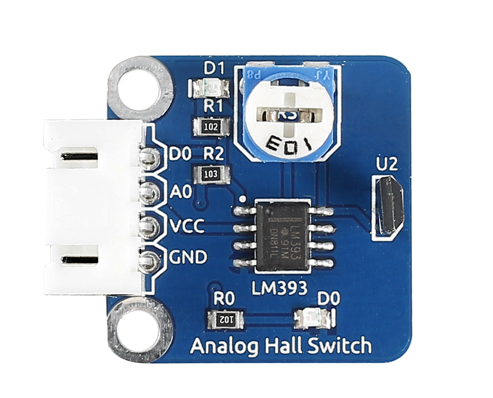
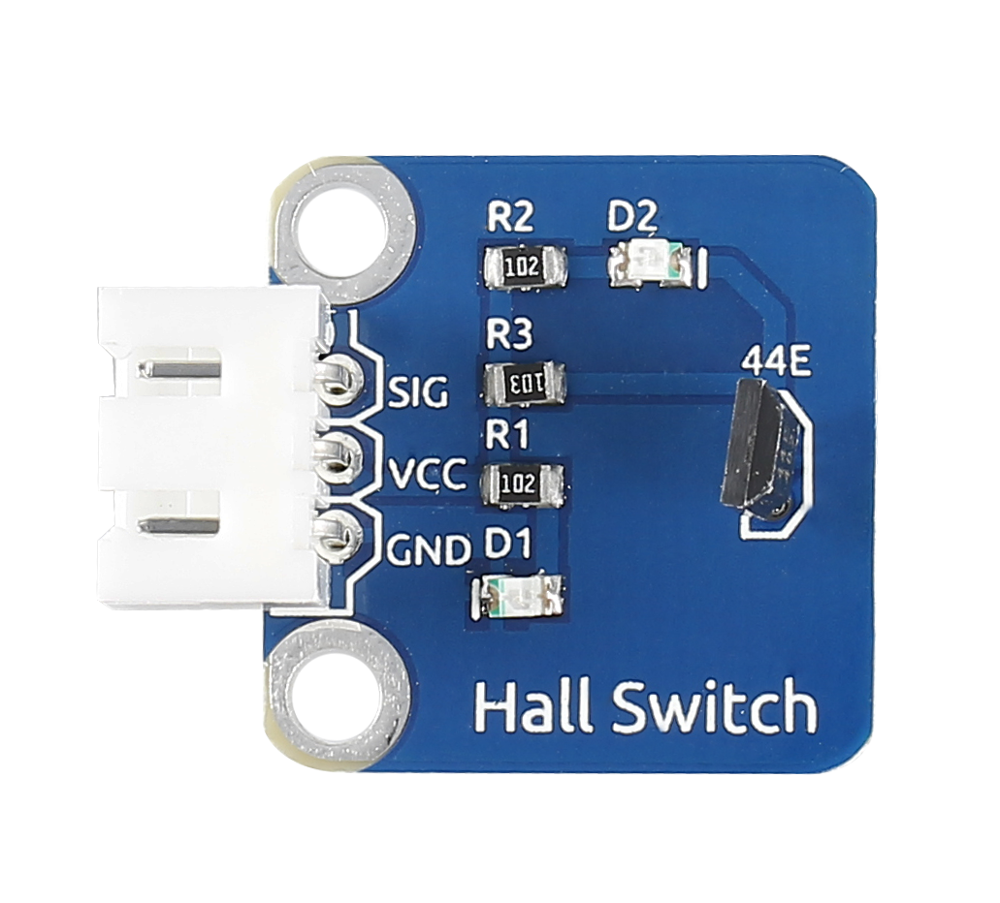
.. |E:\Basic Kits\Arduino\Sensor Kit V2.0 for Arduino\模块图片\sensor pisd 抠图\Analog Temperature Sensor.pngAnalog Temperature Sensor| image:: media/image5.png
   :width: 1.99514in
   :height: 1.63264in
.. |E:\Basic Kits\Arduino\Sensor Kit V2.0 for Arduino\模块图片\sensor pisd 抠图\Auto Flash LED.pngAuto Flash LED| image:: media/image6.png
   :width: 2.08333in
   :height: 1.71111in
.. |C:\Users\sunfounder\Desktop\图片文件统合(草稿)\_MG_895022.png_MG_895022| image:: media/image7.png
   :width: 1.83889in
   :height: 1.54375in
.. |E:\Basic Kits\Arduino\Sensor Kit V2.0 for Arduino\模块图片\sensor pisd 抠图\RTC-DS1302 Module.pngRTC-DS1302 Module| image:: media/image8.png
   :width: 1.82708in
   :height: 1.51736in
.. |E:\Basic Kits\Arduino\Sensor Kit V2.0 for Arduino\模块图片\sensor pisd 抠图\Flame Sensor.pngFlame Sensor| image:: media/image9.png
   :width: 2.13611in
   :height: 1.53889in
.. |E:\Basic Kits\Arduino\Sensor Kit V2.0 for Arduino\模块图片\sensor pisd 抠图\Gas Sensor.pngGas Sensor| image:: media/image10.png
   :width: 2.34167in
   :height: 1.17847in
.. |E:\Basic Kits\Arduino\Sensor Kit V2.0 for Arduino\模块图片\sensor pisd 抠图\Humiture Sensor.pngHumiture Sensor| image:: media/image11.png
   :width: 1.81389in
   :height: 1.51458in
.. |E:\Basic Kits\Arduino\Sensor Kit V2.0 for Arduino\模块图片\sensor pisd 抠图\Joystick PS2.pngJoystick PS2| image:: media/image12.png
   :width: 2.72639in
   :height: 1.69931in
.. |E:\Basic Kits\Arduino\Sensor Kit V2.0 for Arduino\模块图片\sensor pisd 抠图\Button.pngButton| image:: media/image13.png
   :width: 2.39861in
   :height: 1.78056in
.. |E:\Basic Kits\Arduino\Sensor Kit V2.0 for Arduino\模块图片\sensor pisd 抠图\Vibration Switch.pngVibration Switch| image:: media/image14.png
   :width: 1.9125in
   :height: 1.62569in
.. |E:\Basic Kits\Arduino\Sensor Kit V2.0 for Arduino\模块图片\sensor pisd 抠图\Touch Switch.pngTouch Switch| image:: media/image15.png
   :width: 1.93194in
   :height: 1.60208in
.. |E:\Basic Kits\Arduino\Sensor Kit V2.0 for Arduino\模块图片\sensor pisd 抠图\Photo-interrupter.pngPhoto-interrupter| image:: media/image16.png
   :width: 1.87847in
   :height: 1.47153in
.. |E:\Basic Kits\Arduino\Sensor Kit V2.0 for Arduino\模块图片\sensor pisd 抠图\Photoresistor.pngPhotoresistor| image:: media/image17.png
   :width: 2.01458in
   :height: 1.525in
.. |E:\Basic Kits\Arduino\Sensor Kit V2.0 for Arduino\模块图片\sensor pisd 抠图\Reed Switch.pngReed Switch| image:: media/image18.png
   :width: 1.96528in
   :height: 1.49444in
.. |E:\Basic Kits\Arduino\Sensor Kit V2.0 for Arduino\模块图片\sensor pisd 抠图\Potentiometer.pngPotentiometer| image:: media/image19.png
   :width: 1.90278in
   :height: 1.62708in
.. |E:\Basic Kits\Arduino\Sensor Kit V2.0 for Arduino\模块图片\sensor pisd 抠图\Relay Module.pngRelay Module| image:: media/image20.png
   :width: 2.83125in
   :height: 1.29167in
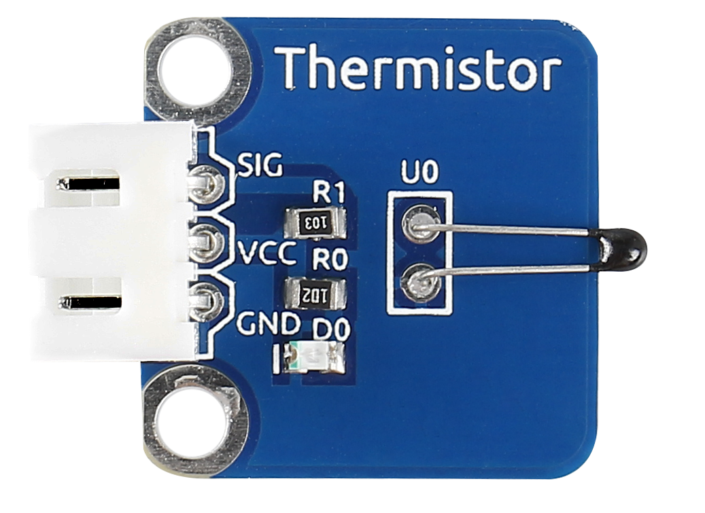
.. |E:\Basic Kits\Arduino\Sensor Kit V2.0 for Arduino\模块图片\sensor pisd 抠图\Tilt Swich.pngTilt Swich| image:: media/image22.png
   :width: 1.83125in
   :height: 1.50694in
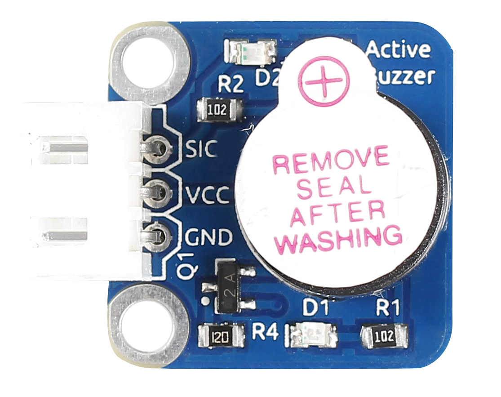
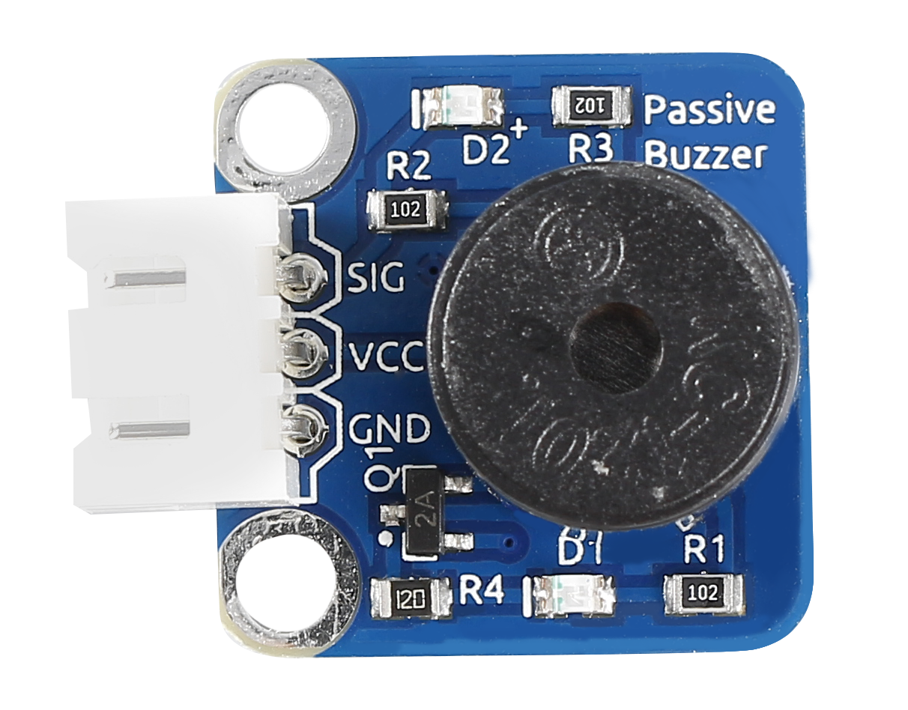
.. |E:\Basic Kits\Arduino\Sensor Kit V2.0 for Arduino\模块图片\sensor pisd 抠图\Temperature sensor.pngTemperature sensor| image:: media/image25.png
   :width: 2.07639in
   :height: 1.625in
.. |E:\Basic Kits\Arduino\Sensor Kit V2.0 for Arduino\模块图片\sensor pisd 抠图\RGB LED.pngRGB LED| image:: media/image26.png
   :width: 1.84722in
   :height: 1.44097in
.. |E:\Basic Kits\Arduino\Sensor Kit V2.0 for Arduino\模块图片\sensor pisd 抠图\IR Receiver.pngIR Receiver| image:: media/image27.png
   :width: 1.90833in
   :height: 1.54306in
.. |E:\Basic Kits\Arduino\Sensor Kit V2.0 for Arduino\模块图片\sensor pisd 抠图\Dual Color LED.pngDual Color LED| image:: media/image28.png
   :width: 1.97986in
   :height: 1.64028in
.. |E:\Basic Kits\Arduino\Sensor Kit V2.0 for Arduino\模块图片\sensor pisd 抠图\Sound Sensor.pngSound Sensor| image:: media/image29.png
   :width: 1.91319in
   :height: 1.56458in
.. |E:\Basic Kits\Arduino\Sensor Kit V2.0 for Arduino\模块图片\sensor pisd 抠图\_Rotary Encoder.png_Rotary Encoder| image:: media/image30.png
   :width: 1.99444in
   :height: 1.55694in
.. |E:\Basic Kits\Arduino\Sensor Kit V2.0 for Arduino\模块图片\sensor pisd 抠图\Laser Emitter.pngLaser Emitter| image:: media/image31.png
   :width: 2.25625in
   :height: 1.64028in
.. |E:\Basic Kits\Arduino\Sensor Kit V2.0 for Arduino\模块图片\sensor pisd 抠图\Tracking Sensor.pngTracking Sensor| image:: media/image32.png
   :width: 3.13194in
   :height: 1.22014in
.. |E:\Basic Kits\Arduino\Sensor Kit V2.0 for Arduino\模块图片\sensor pisd 抠图\IR Obstacle Module.pngIR Obstacle Module| image:: media/image33.png
   :width: 2.59236in
   :height: 1.59028in
.. |C:\Users\sunfounder\Desktop\sensor kit\_MG_0960.JPG| image:: media/image34.jpeg
   :width: 1.81875in
   :height: 1.58056in
.. |E:\Basic Kits\Arduino\Sensor Kit V2.0 for Arduino\模块图片\sensor pisd 抠图\AD-DA Converter.pngAD-DA Converter| image:: media/image35.png
   :width: 1.73194in
   :height: 1.48819in
.. |E:\Basic Kits\Arduino\Sensor Kit V2.0 for Arduino\模块图片\sensor pisd 抠图\Ultrasonic.pngUltrasonic| image:: media/image38.png
   :width: 2.41667in
   :height: 1.42431in
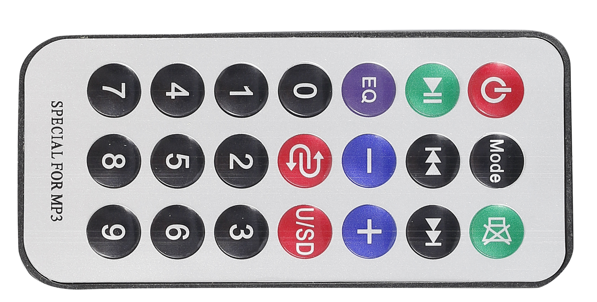
.. |E:\Basic Kits\Arduino\Sensor Kit V2.0 for Arduino\模块图片\sensor pisd 抠图\LCD 1602.pngLCD 1602| image:: media/image40.png
   :width: 2.725in
   :height: 1.23819in
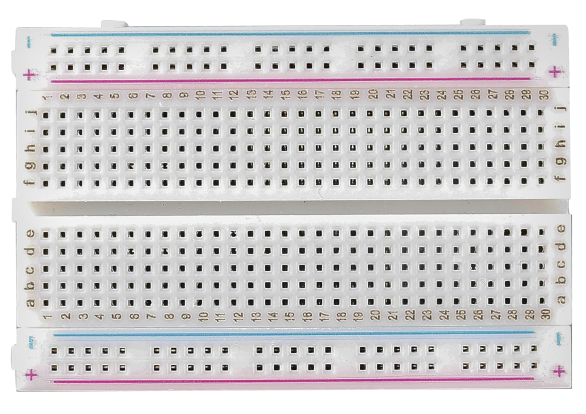
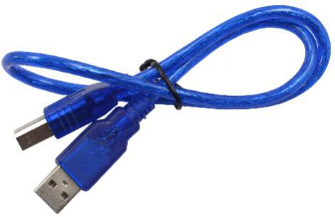
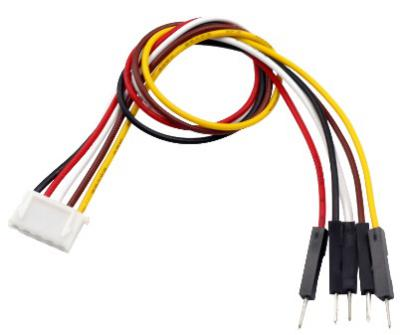
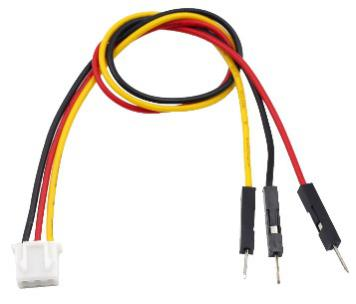
.. |G:\电路图sensor kit\2015-7-3\小零件 裁剪\_MG_9996.JPG| image:: media/image45.jpeg
   :width: 1.85347in
   :height: 1.25764in
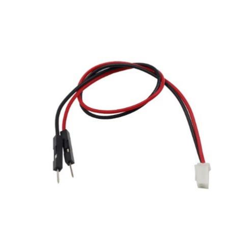
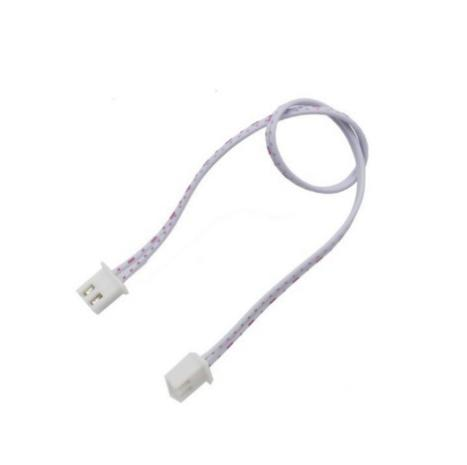
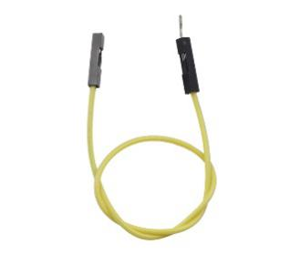
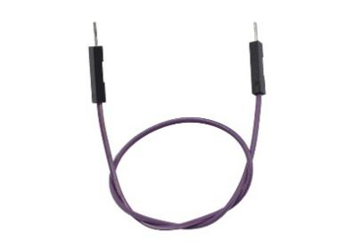
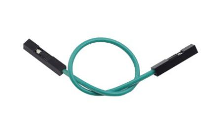

.. |image8| image:: media/image6.png
   :width: 1.86111in
   :height: 1.52917in
.. |image9| image:: media/image7.png
   :width: 2.00694in
   :height: 1.68472in
.. |image10| image:: media/image9.png
   :width: 2.04722in
   :height: 1.47431in
.. |image11| image:: media/image10.png
   :width: 2.37431in
   :height: 1.22014in
.. |image12| image:: media/image11.png
   :width: 2.09306in
   :height: 1.71875in
.. |image13| image:: media/image13.png
   :width: 1.63611in
   :height: 1.33889in
.. |image14| image:: media/image14.png
   :width: 1.77153in
   :height: 1.50556in
.. |image15| image:: media/image15.png
   :width: 1.8875in
   :height: 1.56528in
.. |\_MG_0479| image:: media/image113.jpeg
   :width: 6.01458in
   :height: 3.4625in
.. |image16| image:: media/image16.png
   :width: 1.675in
   :height: 1.36111in
.. |image17| image:: media/image17.png
   :width: 1.61944in
   :height: 1.30069in
.. |image18| image:: media/image118.emf
   :width: 3.77014in
   :height: 3.53681in
.. |image19| image:: media/image18.png
   :width: 1.59375in
   :height: 1.28889in
.. |image20| image:: media/image20.png
   :width: 2.72083in
   :height: 1.18333in
.. |image21| image:: media/image125.png
   :width: 3.96458in
   :height: 3.26597in
.. |\_MG_0492| image:: media/image127.jpeg
   :width: 6.25972in
   :height: 4.23125in
.. |image22| image:: media/image19.png
   :width: 1.79097in
   :height: 1.49861in
.. |image23| image:: media/image22.png
   :width: 1.73958in
   :height: 1.4375in

.. |image26| image:: media/image25.png
   :width: 1.80208in
   :height: 1.45347in
.. |image27| image:: media/image26.png
   :width: 1.78403in
   :height: 1.36597in

.. |image29| image:: media/image27.png
   :width: 1.52292in
   :height: 1.22431in
.. |image30| image:: media/image28.png
   :width: 1.95139in
   :height: 1.6125in
.. |image31| image:: media/image29.png
   :width: 1.90347in
   :height: 1.65486in
.. |image32| image:: media/image153.emf
   :width: 6.64375in
   :height: 3.61806in
.. |image33| image:: media/image30.png
   :width: 2.00833in
   :height: 1.56806in
.. |image34| image:: media/image33.png
   :width: 2.40417in
   :height: 1.475in
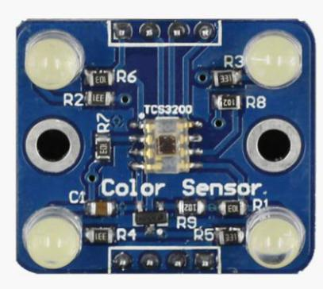
.. |image36| image:: media/image35.png
   :width: 2.07639in
   :height: 1.78403in
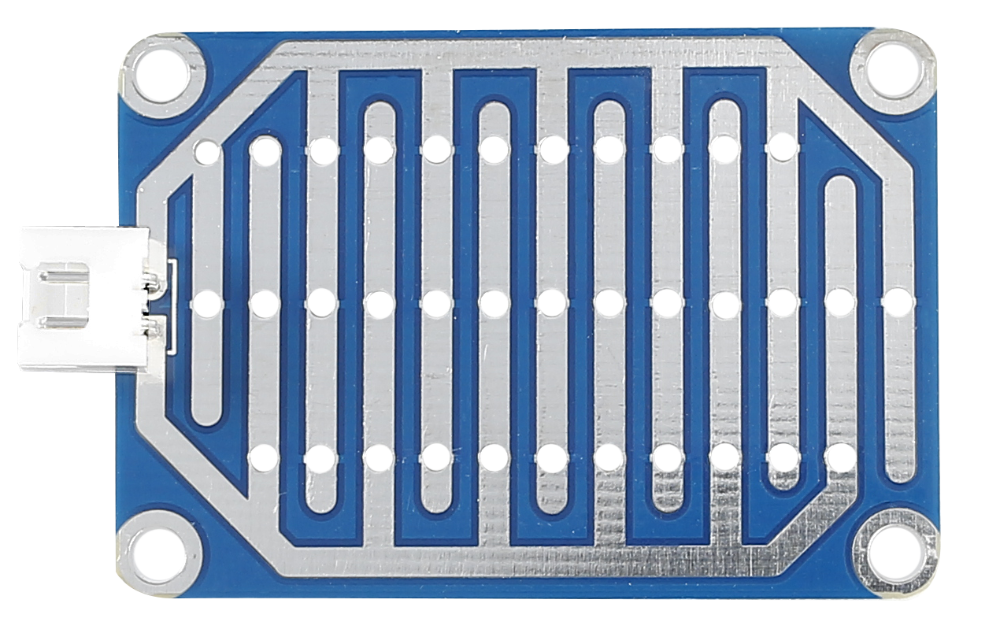
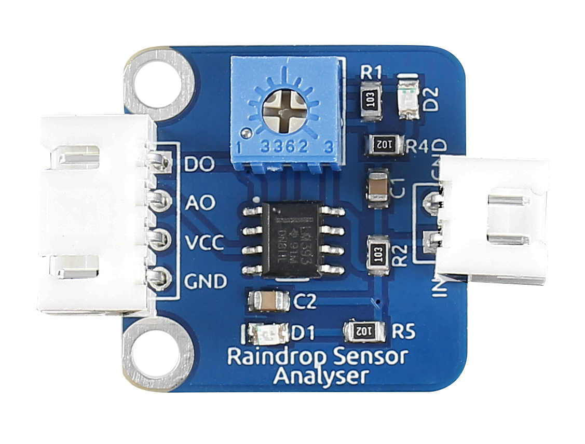
