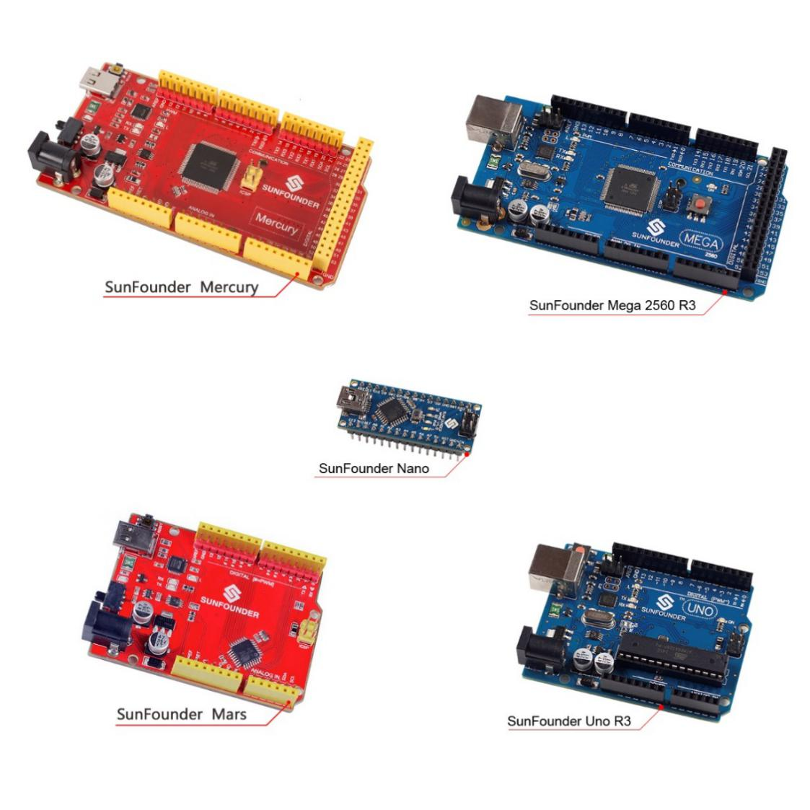
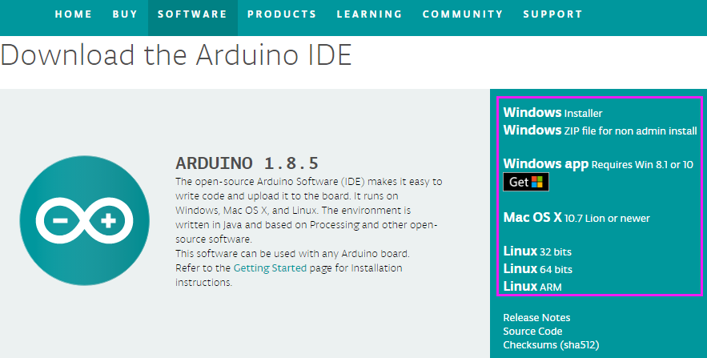
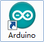
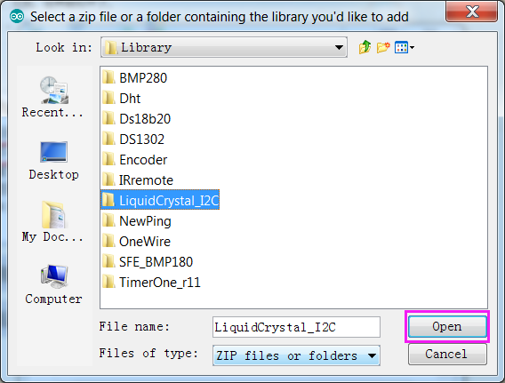
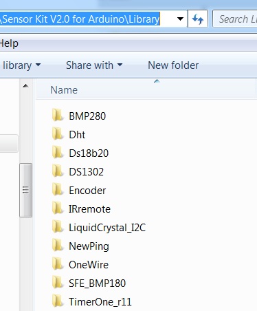
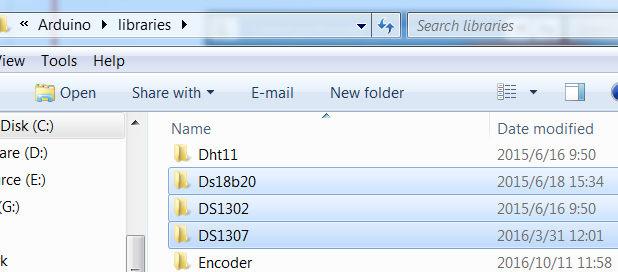

Get Started
=============

.. note::
    1) Before starting your own project, you must download the file `Sensor Kit V2.0 for Arduino.zip <https://drive.google.com/file/d/1Fy88ikH1sagteuxBZaaE4dZ7XdAdr1pf/view?usp=sharing>`_ on our official website by visiting LEARN -> Sensor Kit V2.0 for Arduino and unzip it.

    2) Besides, a visual programming language software-Mixly is also
       provided. It can help you to complete the lessons quicker and easier.
       Mixly is a graphical programming software with some blocks embedded
       in. You can program by dragging and dropping blocks to combine
       together like building blocks, thus enabling a complete process of
       the same sketch in IDE. Download the file: **How to use Sensor Kit
       with Mixly.zip** on our official website by visiting **LEARN** ->
       **Get Tutorials** -> **Sensor Kit V2.0 for Arduino** and unzip it.
	   
SunFounder Arduino Board 
---------------------------

Now, SunFounder has five Arduino boards: SunFounder Uno R3 Board, Mega 2560 Board, Nano Board, SunFounder Mars Board and SunFounder Mercury Board. The Uno Board and the Mars Board share the same kind of pins at the same position. And the pins of the first half part on the Mega 2560 are the same as those on the Uno. The difference lies in that on the Mega 2560 board, the I2C pin (SDA) and pin SCL don’t correspond to pin A4 and A5 but to pin 20 and 21. On the other hand, the Nano and the Uno also share the same kind of pins at the same position. Though the Nano is in a smaller size, making it applicable for projects.

The following is the parameters of the four boards:

+--------------+----------+----------+----------+---------+----------+
| Board        | Uno R3   | Mars     | Nano     | Mega    | Mercury  |
|              |          |          |          | 2560    |          |
| Parameters   |          |          |          |         |          |
+--------------+----------+----------+----------+---------+----------+
| Mic          | AT       | AT       | AT       | ATm     | AT       |
| rocontroller | mega328P | mega328P | mega328P | ega2560 | mega2560 |
+--------------+----------+----------+----------+---------+----------+
| USB          | Type B   | Type C   | Mini-B   | Type B  | Type C   |
| connection   |          |          |          |         |          |
+--------------+----------+----------+----------+---------+----------+
| U            | MEGA16U2 | FT232R   | PL2303   | M       | FT232R   |
| SB-to-Serial |          |          |          | EGA16U2 |          |
| Chip         |          |          |          |         |          |
+--------------+----------+----------+----------+---------+----------+
| Power jack?  | Y        | Y        | N        | Y       | Y        |
+--------------+----------+----------+----------+---------+----------+
| Operating    | 5V       | 5V       | 5V       | 5V      | 5V       |
| Voltage      |          |          |          |         |          |
+--------------+----------+----------+----------+---------+----------+
| Input        | 7-12V    | 7-12V    | 7-12V    | 7-12V   | 7-12V    |
| Voltage      |          |          |          |         |          |
+--------------+----------+----------+----------+---------+----------+
| Digital I/O  | 14 (of   | 14 (of   | 14 (of   | 54 (of  | 54 (of   |
| Pins         | which 6  | which 6  | which 6  | which   | which 15 |
|              | provide  | provide  | provide  | 15      | provide  |
|              | PWM      | PWM      | PWM      | provide | PWM      |
|              | output)  | output)  | output)  | PWM     | output)  |
|              |          |          |          | output) |          |
+--------------+----------+----------+----------+---------+----------+
| Analog Input | 6        | 6        | 8        | 16      | 16       |
| Pins         |          |          |          |         |          |
+--------------+----------+----------+----------+---------+----------+
| DC Current   | 20 mA    | 20mA     | 20 mA    | 20 mA   | 20 mA    |
| per I/O Pin  |          |          |          |         |          |
+--------------+----------+----------+----------+---------+----------+

Install Arduino IDE 
----------------------

The code in this kit is written based on Arduino, so you need to install the IDE first. Skip it if you have done this.

Now go to `arduino.cc <http://www.arduino.cc>`__ and click **DOWNLOAD**.
On the page, check the software list on the right side under **Download
the Arduino Software**.

Find the one that suits your operation system and click to download.
There are two versions of Arduino for Windows: Installer or ZIP file.
You're recommended to download the former. Just download the package,
and run the executable file to start installation. It will download the
driver needed to run Arduino IDE. After downloading, follow the prompts
to install. For the details of installing steps, you can refer to the
guide on **Learning**->\ **Getting Started with Arduino**, scroll down
and see **Install the Arduino Software**.

After installing, you will see Arduino icon on your desktop and double
click to open it.

Plug in the Board
-------------------

Connect the control board to your computer with a USB cable. If you use
Uno, Mega2560 or Mars as the control board, the system will
automatically install the driver when you plug it in. After a while, a
prompt will show up at the bottom right corner telling you which port
the board locates at.

Add libraries
----------------

-  **What is Library?**

A library, gathering some function definitions and header files, usually
contains two files: .h (header file, including function statement, Macro
definition, constructor definition, etc.) and .cpp (execution file, with
function implementation, variable definition, and so on). When you need
to use a function in some library, you just need to add a header file
(e.g. #include <LiquidCrystal_I2C.h>), and then call that function. This
can make your code more concise. If you don't want to use the library,
you can also write that function definition directly. Though as a
result, the code will be long and inconvenient to read.

-  **How to add libraries?**

Some libraries are already built in the Arduino IDE, when some others
may need to be added. So now let's see how to add one. There are two
methods for that.

**Method 1**

Directly import the library in Arduino IDE (take LiquidCrystal_I2C as an
example below). The advantage of this method is easy to understand and
operate, but on the other hand, only one library can be imported at a
time. So it is inconvenient when you need to add quite a lot of
libraries.

**Step 1:** Select **Sketch** -> **Include Library** -> **Add ZIP
Library**.

.. image:: media/image54.png

**Step 2:** Find *Sensor Kit V2.0 for
Arduino\Library\LiquidCrystal_I2C*, Click **Open**.

**Step 3:** When you see \"Library added to your libraries. Check
\"Include library\" menu\", it means you have added the library
successfully. Please use the same method to add other libraries then.

.. image:: media/image56.png

**Method 2**

Directly copy the library to libraries/Arduino path. This method can
copy all libraries and add them at a time, but the drawback is that it
is difficult to find libraries/Arduino.

**Step 1:** Click **File** -> **Preferences** and on the pop-up window
you can see the path of the libraries folder in the textbox as shown
below.

.. image:: media/image57.png

**Step 2:** Copy all Libraries in the path *Sensor* Kit *V2.0 for
Arduino\Library\\*.

**Step 3:** Go to the path above and you will see there is a *Libraries*
folder, click to open it.

.. image:: media/image59.png

**Step 4:** Paste the libraries copied to the folder. Then you can see
them in libraries.

For more details about Arduino IDE, go to **Learning**->\ **Getting**
**started**->\ **Foundation** on the arduino.cc and click **Arduino
Software (IDE)** on the page:

http://www.arduino.cc/en/Guide/Environment.

If your sketch fails the upload, on the same page click
**Troubleshooting**

http://www.arduino.cc/en/Guide/Troubleshooting.

.. note:: 
   -  If your computer is running on the Windows XP system, the new version
      IDE will prompt errors when running the code. You are recommended to
      download the Arduino 1.0.5 or Arduino 1.0.6. Or you can also upgrade
      your Window system.

   -  All the experiments in this kit are done with SunFounder Uno R3
      board, but they are also compatible with SunFounder Mega 2560,
      SunFounder Mars, SunFounder Nano and all official Arduino Boards. All
      the code included in this kit works with these boards.

So what does COMPATIBLE mean here? It means you can use any of the
three boards to do the same experiment with the same wiring. Simply
put, if the wire is connected to Pin 12 of Uno in the user manual,
likewise, you can connect it to Pin 12 on any other official Arduino
boards you are using. Then open the corresponding sketch and upload
them.

**Now let’s begin!**