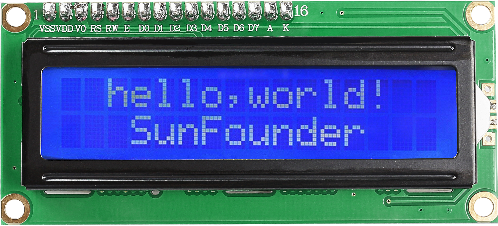
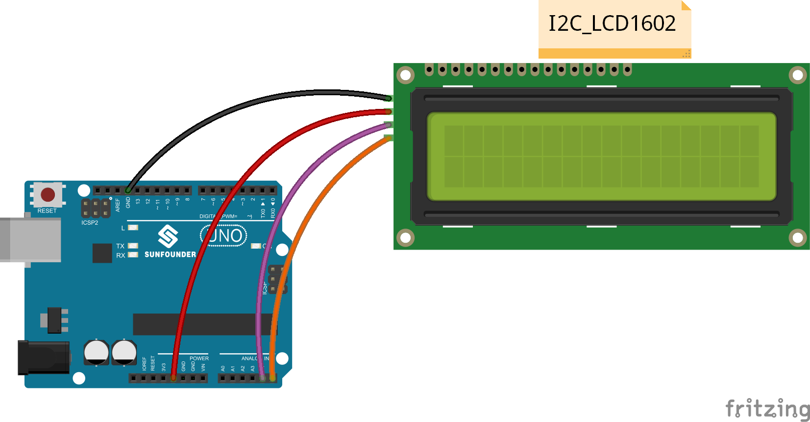
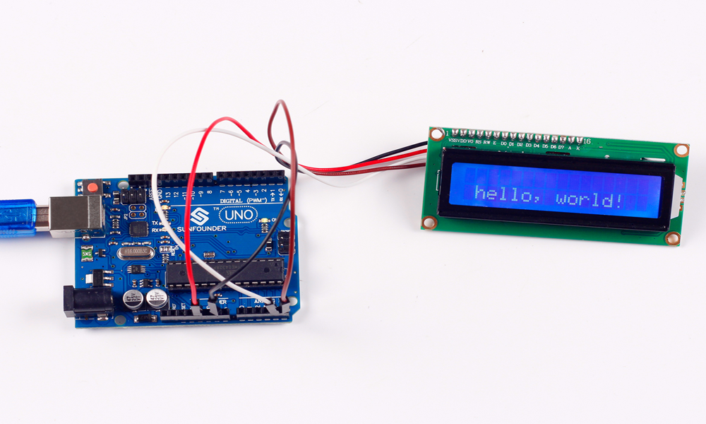

Lesson 1 Display by I2C LCD1602
===============================

**Introduction**

As we all know, though LCD and some other displays greatly enrich the
man-machine interaction, they share a common weakness. When they are
connected to a controller, multiple IOs will be occupied of the
controller which has no so many outer ports. Also it restricts other
functions of the controller. Therefore, LCD1602 with an I2C bus is
developed to solve the problem.

The blue potentiometer on the I2C LCD1602 (see the figure below) is used
to adjust the backlight for better display. I²C uses only two
bidirectional open-drain lines, Serial Data Line (SDA) and Serial Clock
Line (SCL), pulled up with resistors. Typical voltages used are +5 V or
+3.3 V although systems with other voltages are permitted.

**Components**

- 1 \* SunFounder Uno board

- 1 \* I2C LCD1602 module

- 1 \* USB cable

- 1 \* 4-Pin Dupont wire (M to F)

**Principle**

In this experiment, we will let I2C LCD1602 display \"SunFounder\" and
\"hello, world\" by programming.

**Experimental Procedures**

**Step 1:** Build the circuit

+---------------------------+------------------------------------------+
| **I2C LCD1602**           | **SunFounder Uno/ Mega2560**             |
+---------------------------+------------------------------------------+
| GND                       | GND                                      |
+---------------------------+------------------------------------------+
| VCC                       | 5V                                       |
+---------------------------+------------------------------------------+
| SDA                       | A4 (Uno)/Pin 20 (Mega2560)               |
+---------------------------+------------------------------------------+
| SCL                       | A5 (Uno)/Pin 21 (Mega2560)               |
+---------------------------+------------------------------------------+

.. note:: 
    The I2C LCD1602 is connected to Mega2560 differently compared with being done to Uno. PLEASE follow the wiring above.

**Step 2:** Open the code file

In the folder **Sensor Kit V2.0 for Arduino** you just downloaded and
unzipped, you can see the folder for the corresponding lesson which
includes two folders: *code* (the sketch) and *circuit* (Fritzing file).
Go to the *code* folder and find the *.ino* file (.ino is the format of
the sketch). Then double click to open it. You can also open an empty
*.ino* file and type in the code we provide.

**Step 3:** Select the **Board** and **Port**

Before uploading the code, you need to select the Board and Port.

Click **Tools ->Board** and select **Arduino/Genuino Uno**. If your
board is Mega2560, then select Arduino/Genuino Uno Mega or Mega2560.

.. image:: media/image62.png

Then select Tools ->Port. Your port should be different from mine.

.. image:: media/image63.png

**Step 4:** Upload the sketch to the SunFounder Uno board

Click the **Upload** icon to upload the code to the control board.

.. image:: media/image64.png

If \"**Done uploading**\" appears at the bottom of the window, it means
the sketch has been successfully uploaded.

.. image:: media/image65.png

**Code**

.. raw:: html

    <iframe src=https://create.arduino.cc/editor/sunfounder01/22519a4e-fe11-46ad-8b5a-da8f2db6601e/preview?embed style="height:510px;width:100%;margin:10px 0" frameborder=0></iframe>

You should now see your I2C LCD1602 display the flowing characters:
\"SunFounder\" and \"hello, world\".

