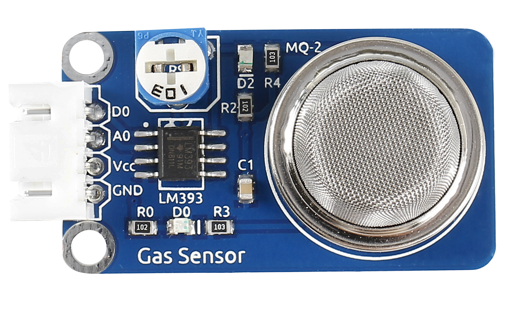
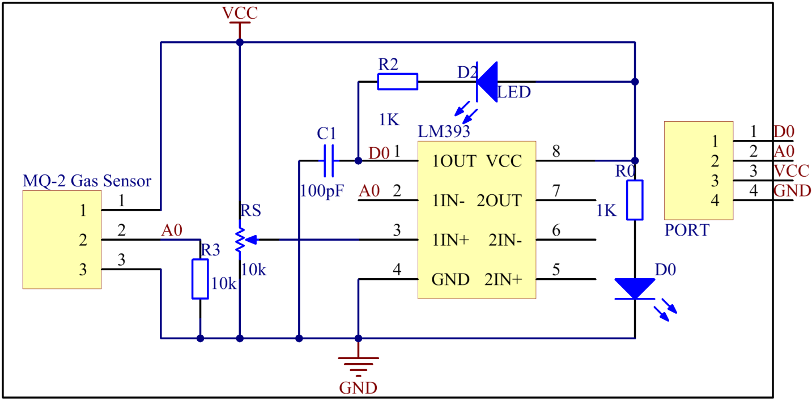
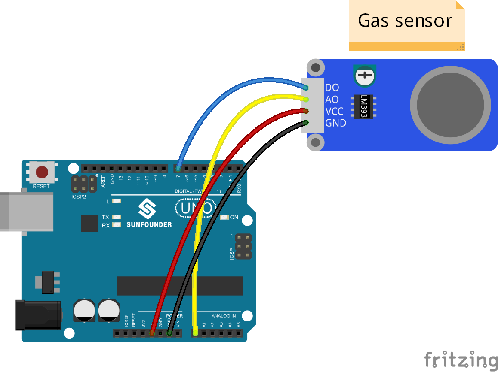
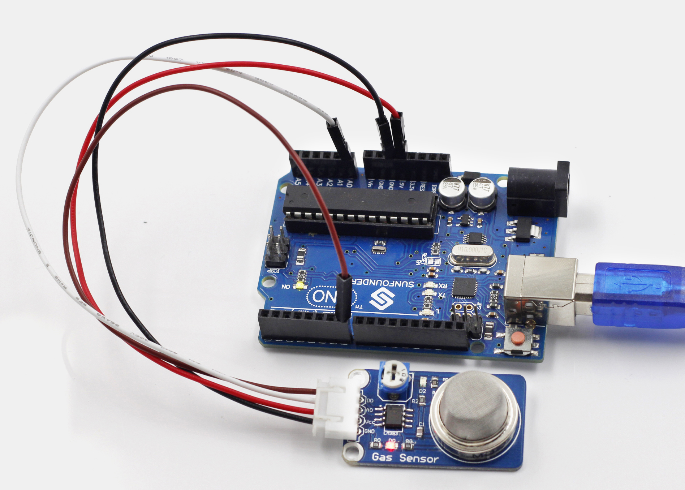

Lesson 10 Flammable Gas Detection
=================================

**Introduction**

Gas Sensor MQ-2 is a sensor for flammable gas and smoke by
detecting the concentration of combustible gas in the air. They are
often used in gas detecting equipment for smoke and flammable gasses
such as LPG, i-butane, propane, methane and alcohol in household,
industry or automobile.

**Components**

- 1 \* SunFounder Uno board

- 1 \* USB data cable

- 1 \* MQ-2 gas sensor module

- 1 \* 4-Pin anti-reverse cable

**Principle**

MQ-2 gas sensor applies SnO2 (an oxygen-deficient n-type semiconductor)
which has a lower conductivity in the clear air as a gas-sensing
material. In an atmosphere where there may be inflammable gases, the
conductivity of the gas sensor raises along with the inflammable gas
concentration increases. MQ-2 performs a good detection to different
inflammable gases such as natural gas, especially sensitive to liquefied
gas, propane and hydrogen.

In this experiment, release some combustible gas around the sensor and
the value at A0 increases. Once the concentration of the gas exceeds a
limit, D0 outputs low level and the corresponding LED will light up.
Please note that the sensor needs burn-in time so the readings can be
more consistent and reliable.

**Experimental Procedures**

**Step 1:** Build the circuit

**Step 2:** Open the code file

**Step 3:** Select correct Board and Port

**Step 4:** Upload the sketch to the SunFounder Uno board

**Code**

.. raw:: html

    <iframe src=https://create.arduino.cc/editor/sunfounder01/58a12339-b00b-40fa-ad2a-82e67a36c847/preview?embed style="height:510px;width:100%;margin:10px 0" frameborder=0></iframe>

Now, ignite a lighter. Then the sensor detects the gas emitted. Thus,
the LED on the gas sensor and that attached to pin 13 on the SunFounder
Uno board will light up. Also you can see the value at A0 and D0 printed
on Serial Monitor.

.. note:: 
    It is normal that the gas sensor generates heat. Actually, the higher the temperature is, the sensor is more sensitive.

