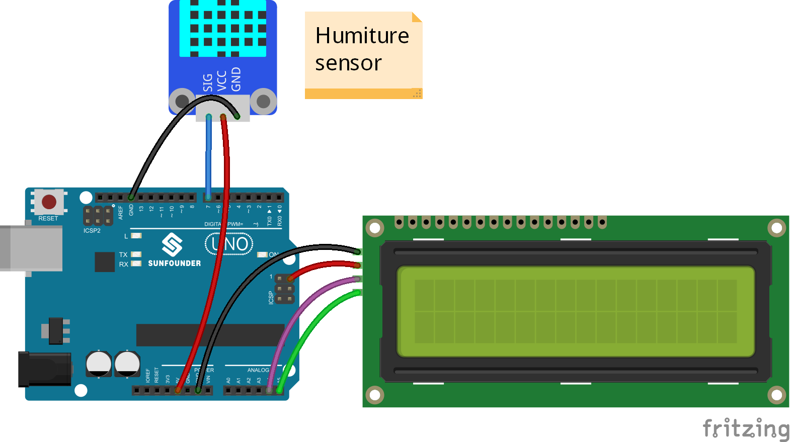
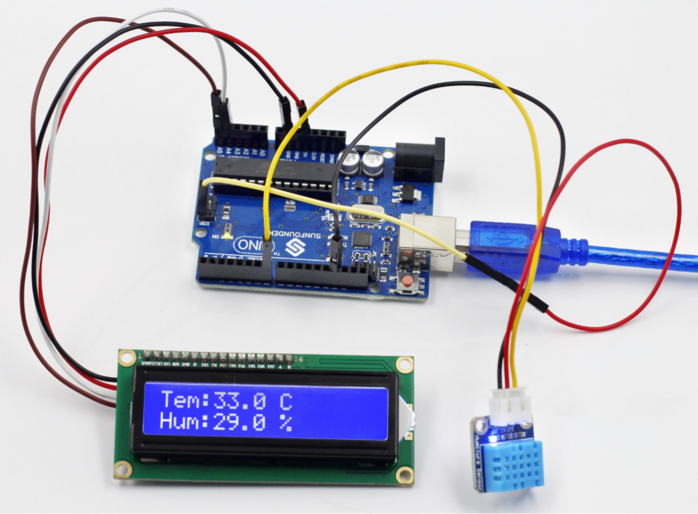

Lesson 11 Humiture Detection
============================

**Introduction**

.. image:: media/image11.png
  :width: 250

The digital temperature and humidity sensor DHT11 is a
composite sensor that contains a calibrated digital signal output of
temperature and humidity. The technology of a dedicated digital modules
collection and the temperature and humidity sensing technology are
applied to ensure that the product has high reliability and excellent
long-term stability.

The sensor includes a resistive sense of wet component and an NTC
temperature measurement device, and is connected with a high-performance
8-bit microcontroller.

**Components**

- 1 \* SunFounder Uno board

- 1 \* USB data cable

- 1 \* Humiture sensor module

- 1 \* I2C LCD1602

- 1 \* 3-Pin anti-reverse cable

- 1 \* 4-Pin anti-reverse cable

- 1 \* Dupont wire (F to F)

**Principle**

Only three pins are available for use: VCC, GND, and DATA. The
communication process begins with the DATA line sending start signals to
DHT11, and DHT11 receives the signals and returns an answer signal. Then
the host receives the answer signal and begins to receive 40-bit
humiture data (8-bit humidity integer + 8-bit humidity decimal + 8-bit
temperature integer + 8-bit temperature decimal + 8-bit checksum).

.. image:: media/image98.png
   :width: 2.99861in
   :height: 2.20833in

For more information, please refer to the datasheet of DHT11.

The schematic diagram

.. image:: media/image99.png
   :width: 4.93056in
   :height: 3.46806in

**Experimental Procedures**

**Step 1:** Build the circuit

**Step 2:** Open the code file

**Step 3:** Select correct Board and Port

**Step 4:** Upload the sketch to the SunFounder Uno board

Now, you can see the value of current humidity and temperature displayed
on the LCD.

