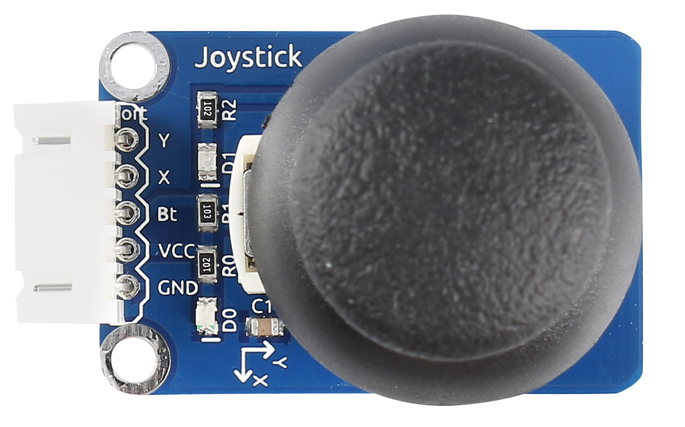
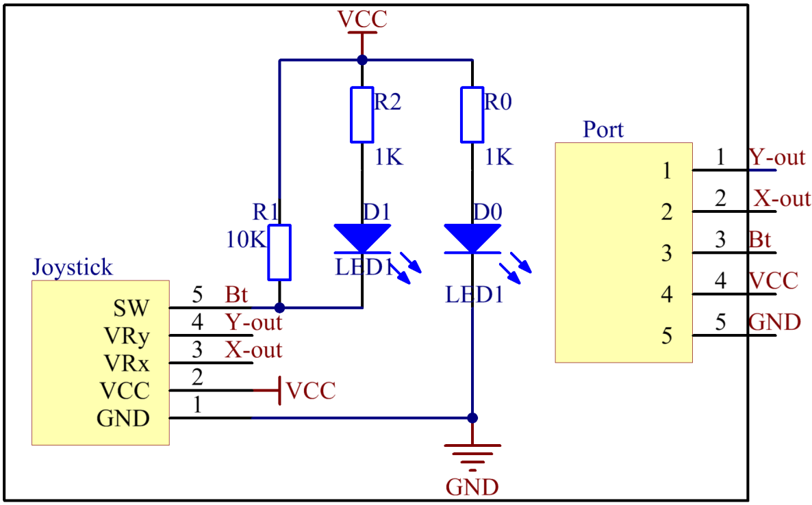
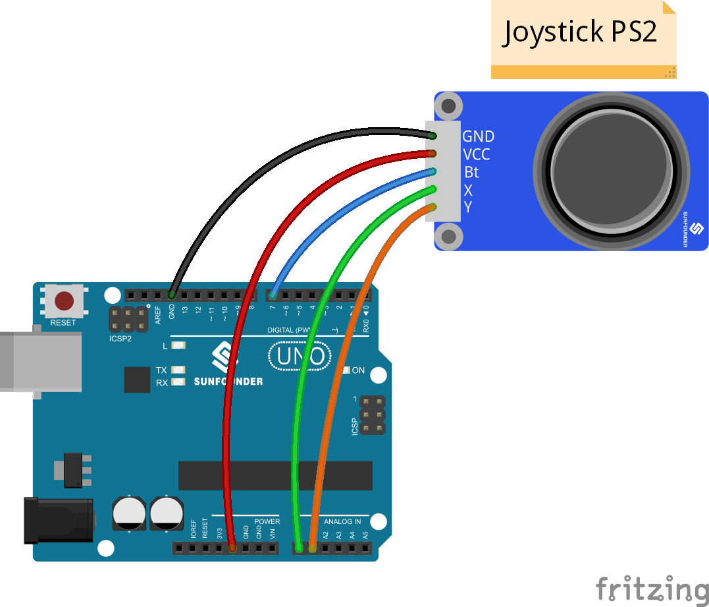
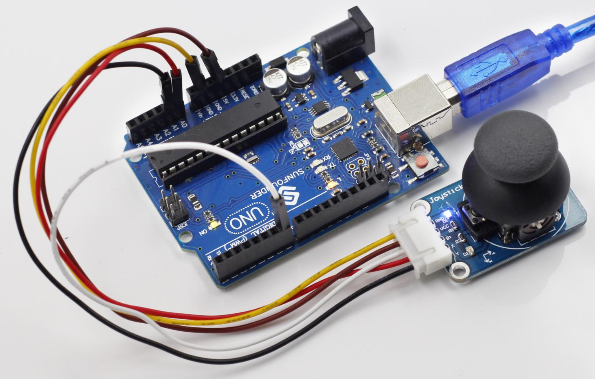

Lesson 12 Joystick PS2
======================

**Introduction**

A joystick is an input device consisting of a stick that pivots on a
base and reports its angle or direction to the device it is controlling.
Joysticks are often used to control video games and robots. A Joystick
PS2 is used here.

**Components**

- 1 \* SunFounder Uno board

- 1 \* USB data cable

- 1 \* Joystick PS2 module

- 1 \* 5-Pin anti-reverse cable

**Principle**

This module has two analog outputs (corresponding to X and Y
coordinates) and one digital output representing whether it is pressed
on Z axis.

**Experimental Procedures**

**Step 1:** Build the circuit

The wiring between the Joystick PS2 and SunFounder Uno board:

+----------------------------------+-----------------------------------+
| Joystick PS2                     | SunFounder Uno                    |
+----------------------------------+-----------------------------------+
| GND                              | GND                               |
+----------------------------------+-----------------------------------+
| VCC                              | 5V                                |
+----------------------------------+-----------------------------------+
| Bt                               | 7                                 |
+----------------------------------+-----------------------------------+
| x                                | A0                                |
+----------------------------------+-----------------------------------+
| y                                | A1                                |
+----------------------------------+-----------------------------------+

**Step 2:** Open the code file

**Step 3:** Select correct Board and Port

**Step 4:** Upload the sketch to the SunFounder Uno board

Now, push the rocker and the coordinates of X and Y axes displayed on
Serial Monitor will change accordingly; press the button, and the
coordinate of Z=0 will also be displayed.

