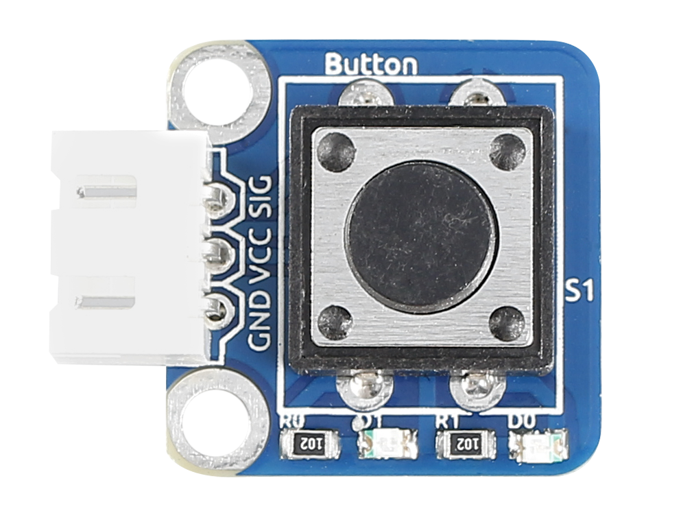
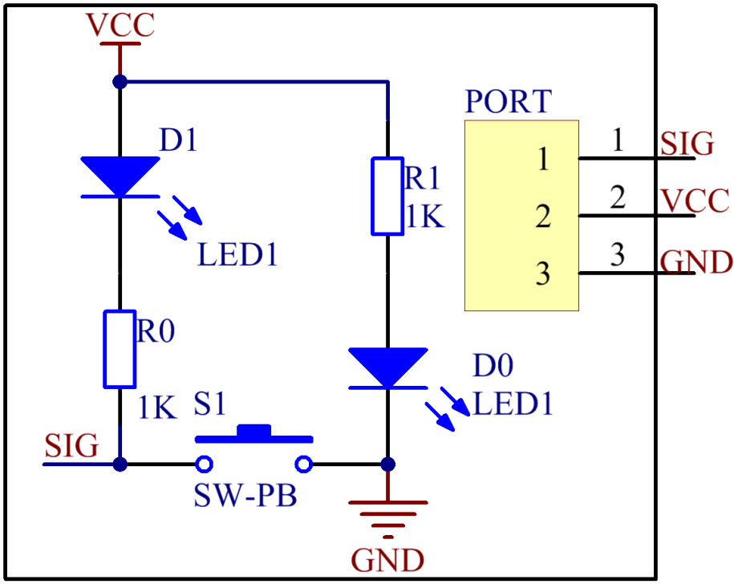
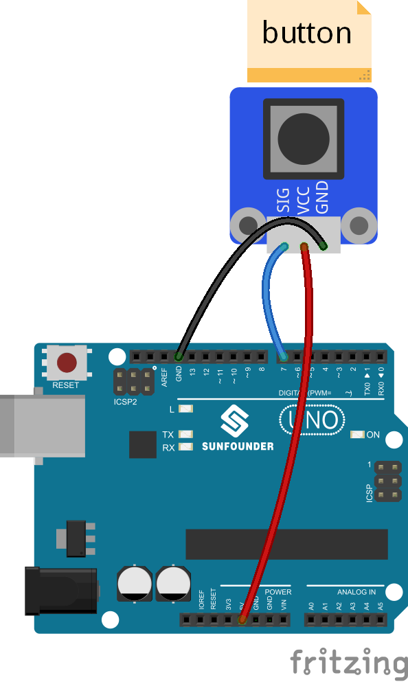

Lesson 13 Controlling an LED by Button
======================================

**Introduction**

As you can see, an LED has been attached to pin 13 on most of the
SunFounder boards already. So just a button module can be used to build
a simple circuit to make the LED light up.

**Components**

- 1 \* SunFounder Uno board

- 1 \* USB data cable

- 1 \* Button module

- 1 \* 3-Pin anti-reverse cable

**Principle**

Since the LED has been attached to pin 13, just connect the button
module to digital pin 7. When the button module identifies inductive
button-pressing signals, the LED will be on. Otherwise it will be off.

**Experimental Procedures**

**Step 1:** Build the circuit

**Step 2:** Open the code file

**Step 3:** Select correct Board and Port

**Step 4:** Upload the sketch to the SunFounder Uno board

Now, press the button, and then the LED on the button module and that
hooked up with pin 13 of the SunFounder Uno board will light up.

.. image:: media/image107.jpeg
   :width: 5.41528in
   :height: 3.79583in