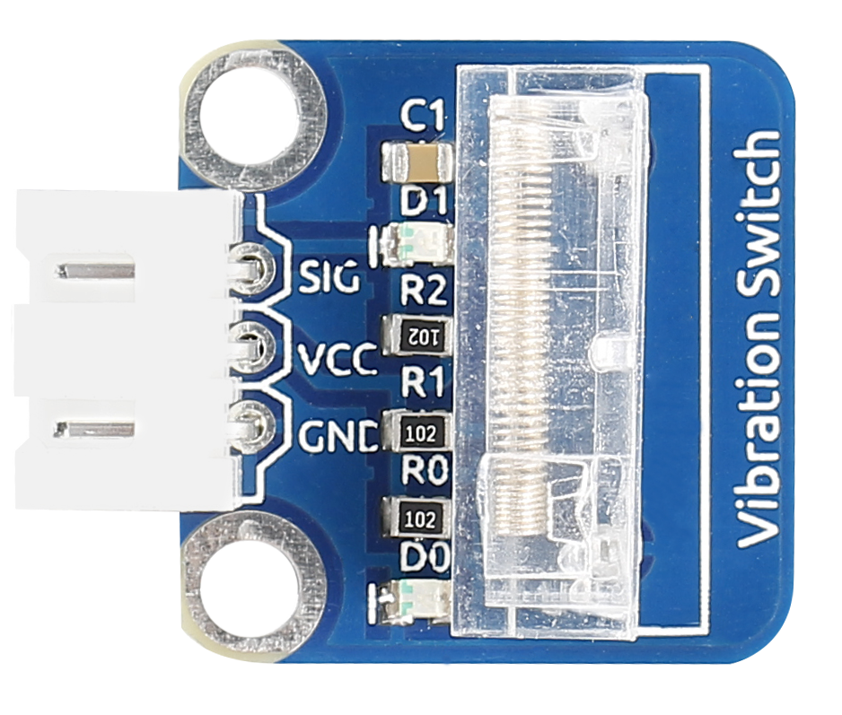
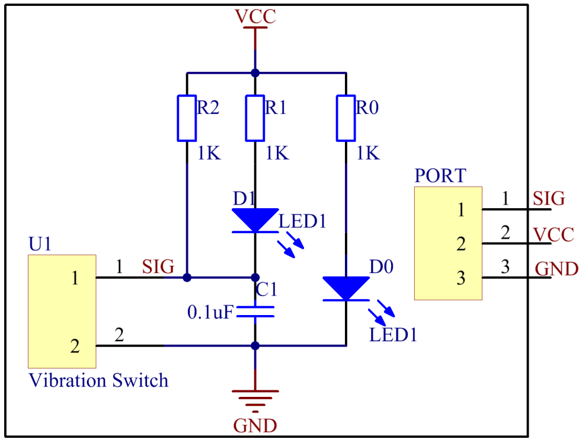
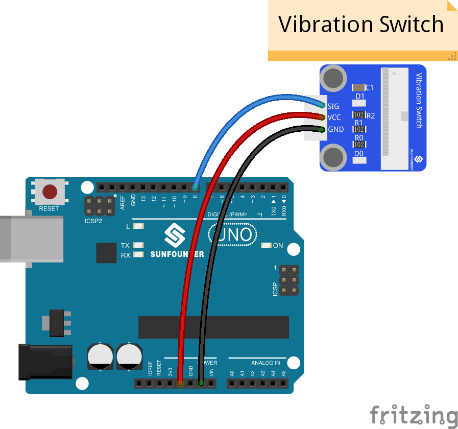
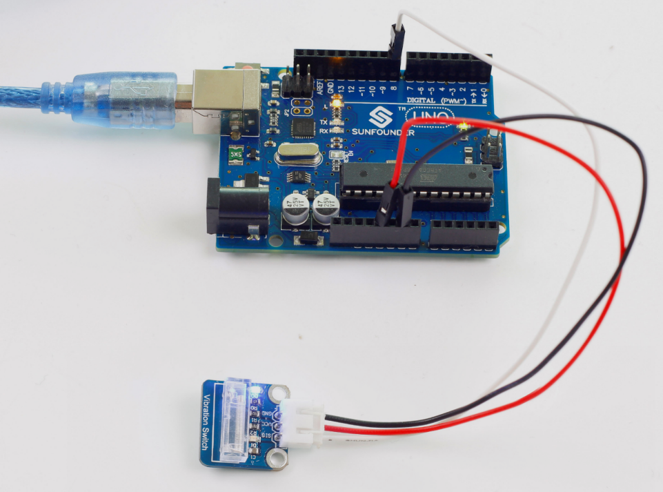

Lesson 14 Vibration Switch
==========================

**Introduction**

A vibration switch, also called spring switch or shock
sensor, is an electronic switch which senses vibration amplitude and
transfers the signals to a circuit device thus switching on the circuit.
It composes of conductive vibration spring, switch, trigger pin, and
packaging agent.

**Components**

- 1 \* SunFounder Uno board

- 1 \* USB data cable

- 1 \* Vibration switch module

- Jumper wires

**Principle**

In a vibration switch module, the conductive vibration spring and
trigger pin are precisely placed in the switch and fixed by adhesive.
Normally, the spring and the trigger pin are separated. Once the sensor
detects shock, the spring will vibrate and contact with the trigger pin,
thus conducting and generating trigger signals. The schematic diagram:

**Experimental Procedures**

**Step 1:** Build the circuit

With the LED attached to pin 13 already, connect the vibration switch to
digital pin 8. When the vibration switch generates vibration signals,
pin SIG will output low level, and the LED on the module and that
attached to pin 13 will light up.

**Step 2:** Open the code file (Lesson 14 Vibration Switch)

**Step 3:** Select correct Board and Port

**Step 4:** Upload the sketch to the SunFounder Uno board

**Code**

.. raw:: html

    <iframe src=https://create.arduino.cc/editor/sunfounder01/85e67cf9-d540-47ba-bbb0-2225d5d55b91/preview?embed style="height:510px;width:100%;margin:10px 0" frameborder=0></iframe>

Now, shake the switch module, and you should see the LED attached to pin
13 on SunFounder Uno board and that on the module light up.

