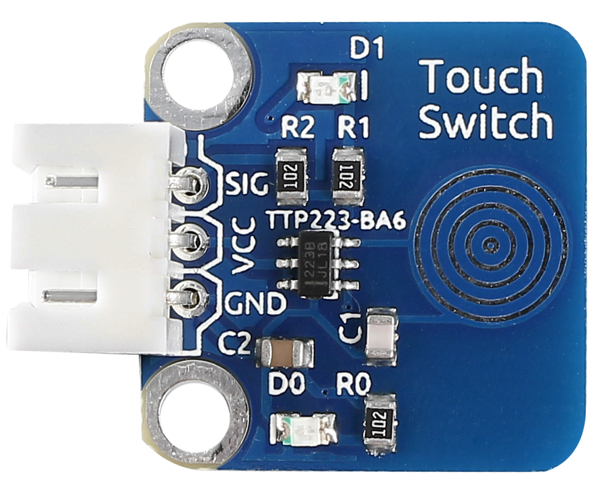
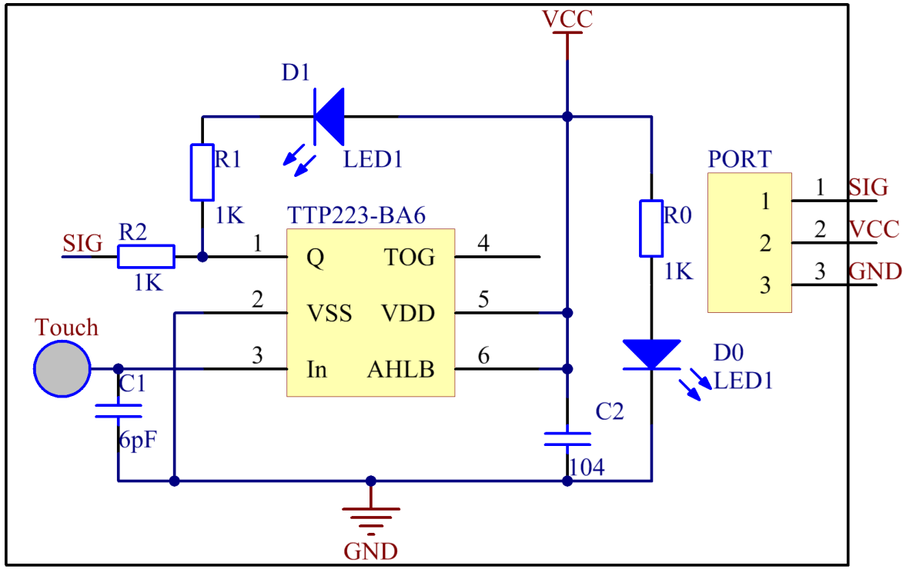
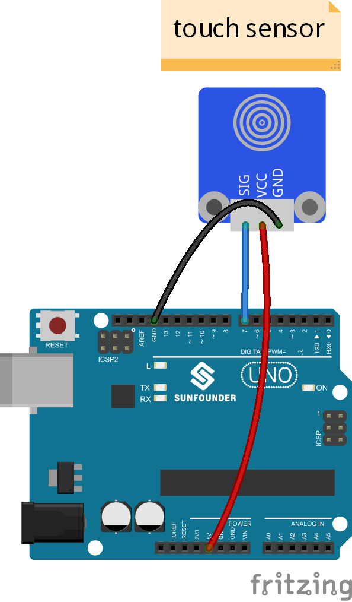
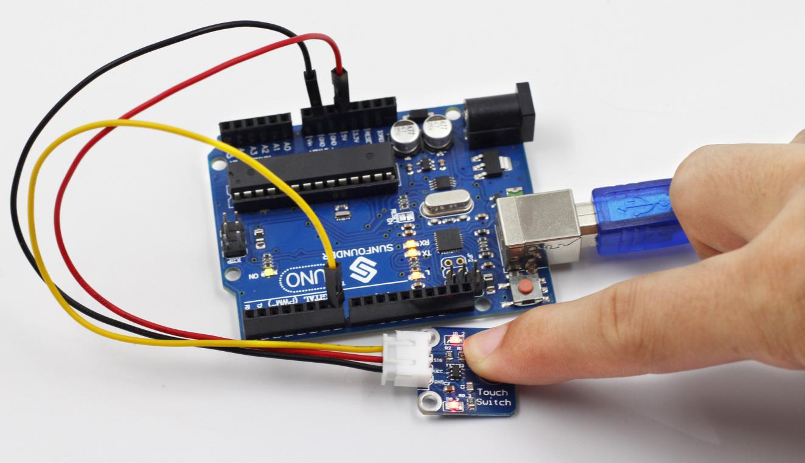

Lesson 15 Touch Switch
======================

**Introduction**

A metal touch sensor is a type of switch that only operates when it's
touched by a charged body. It has a high-frequency transistor which is
energized when receiving electromagnetic signals.

**Components**

- 1 \* SunFounder Uno board

- 1 \* USB data cable

- 1 \* Touch Switch module

- 1 \* 3-Pin anti-reverse cable

**Principle**

In this experiment, touch the base electrode of the transistor to make
it conduct electricity, for human body itself is a kind of conductor and
an antenna that can receive electromagnetic waves in the air.

**Experimental Procedures**

**Step 1:** Build the circuit

**Step 2:** Open the code file

**Step 3:** Select correct Board and Port

**Step 4:** Upload the sketch to the SunFounder Uno board

**Code**

.. raw:: html

    <iframe src=https://create.arduino.cc/editor/sunfounder01/e9cf2e4a-8ef2-4d44-814f-fc1acae6d0bf/preview?embed style="height:510px;width:100%;margin:10px 0" frameborder=0></iframe>

When the module is electrified, the original state of pin SIG is low and
the LED onside is on. Now, touch the electrode with your finger. Then it
outputs high and the LED on it and that attached to pin 13 on the
SunFounder Uno board will go out. Move away and touch it again, and
it'll output low with the LEDs turned on, and so forth. Thus, the output
level changes between high and low with each touch, together with LEDs
brightening and dimming.

