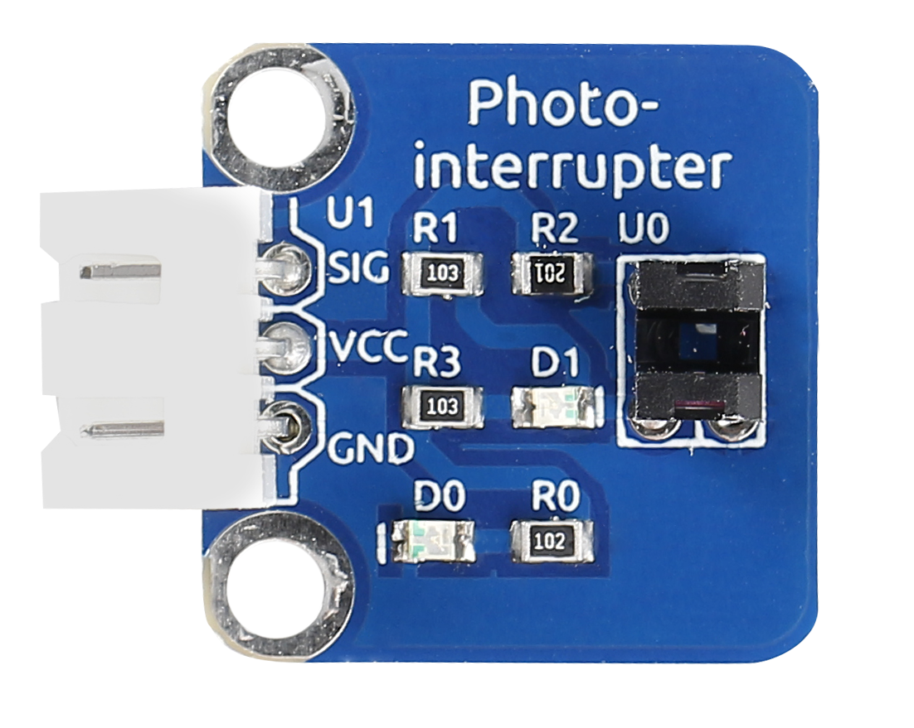
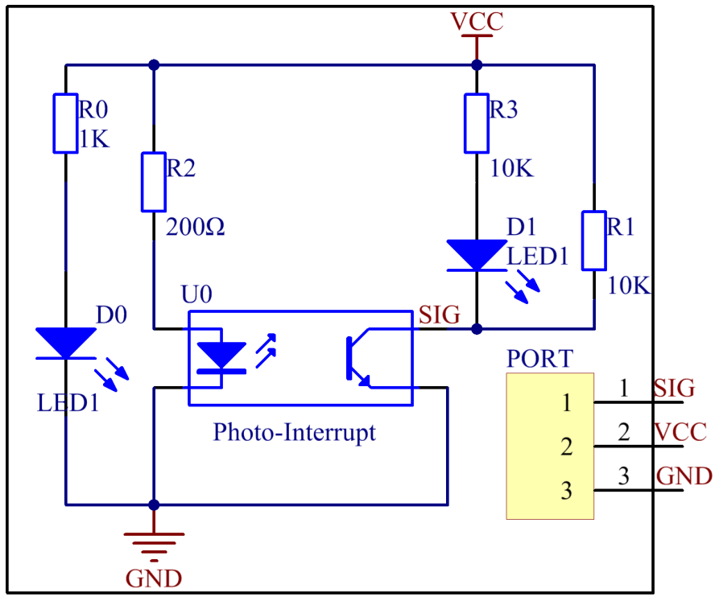
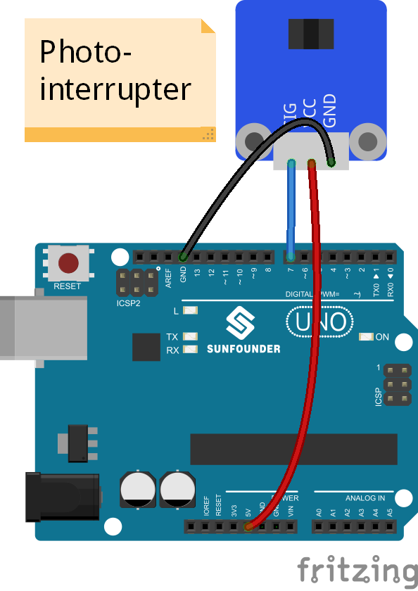
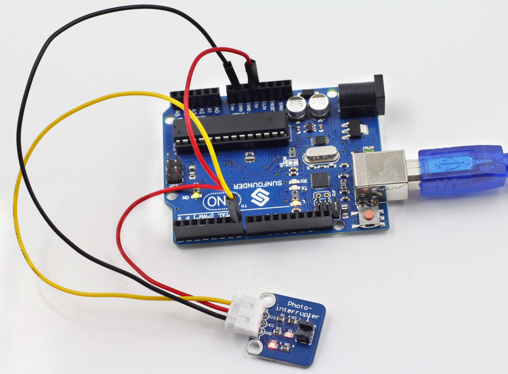
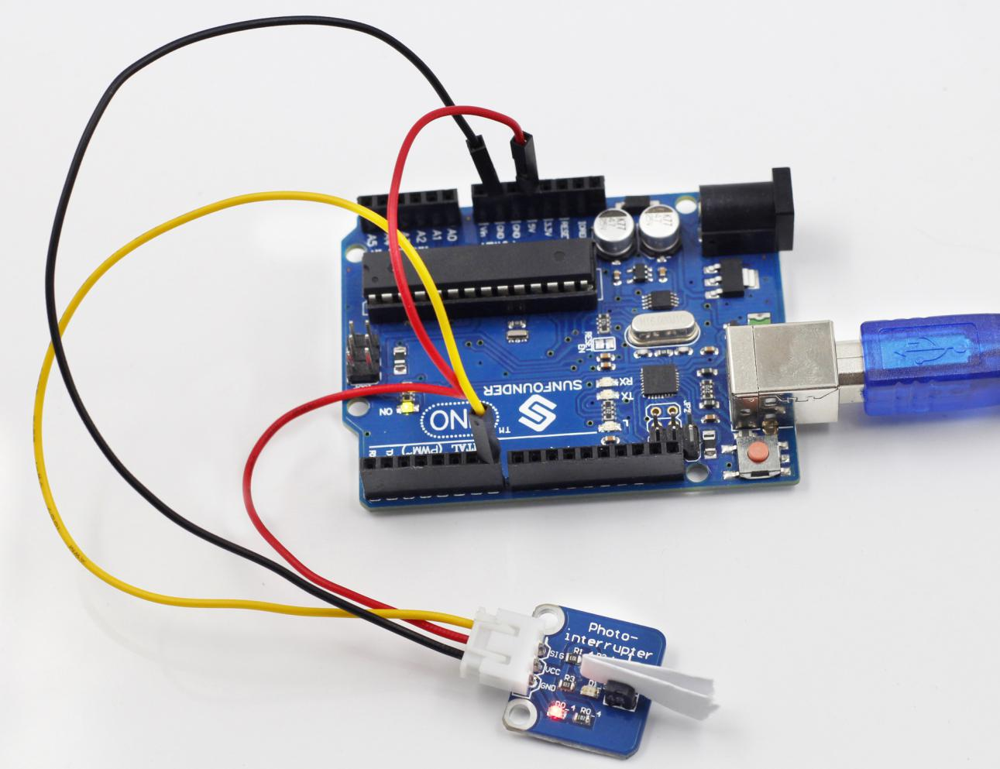

Lesson 16 Photo-interrupter
===========================

**Introduction**

A photo-interrupter is a sensor with a light-emitting
component and light-receiving component packaged face to face. It
applies the principle that light is interrupted when an object passes
through the sensor. Therefore, photo-interrupters are widely used in
speed measurement.

**Components**

- 1 \* SunFounder Uno board

- 1 \* USB data cable

- 1 \* Photo-interrupter module

- 1 \* 3-Pin anti-reverse cable

**Principle**

Basically a photo-interrupter consists of two parts: transmitter and
receiver. The transmitter (e.g., an LED or a laser) emits light and then
the light goes to the receiver. If the light beam between the
transmitter and receiver is interrupted by an obstacle, the receiver
will detect no incident light even for a moment and the output level
will change. In this experiment, we will turn an LED on or off by using
this change.

**Experimental Procedures**

**Step 1:** Build the circuit

**Step 2:** Open the code file

**Step 3:** Select correct Board and Port

**Step 4:** Upload the sketch to the SunFounder Uno board

Now, stick a piece of paper in the gap of the sensor, and the LED
attached to pin 13 on the SunFounder Uno will go out; remove the paper,
and then the LED will light up again.

Before

With paper interrupting