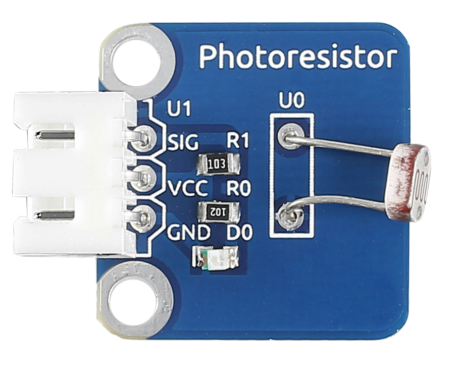
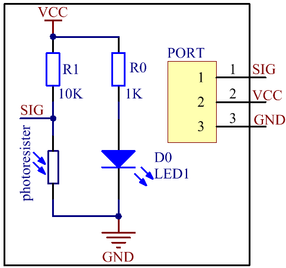
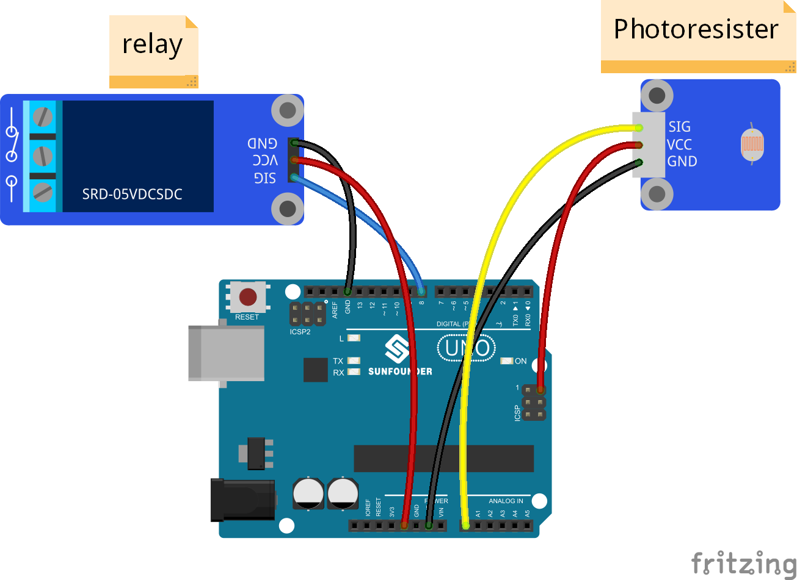
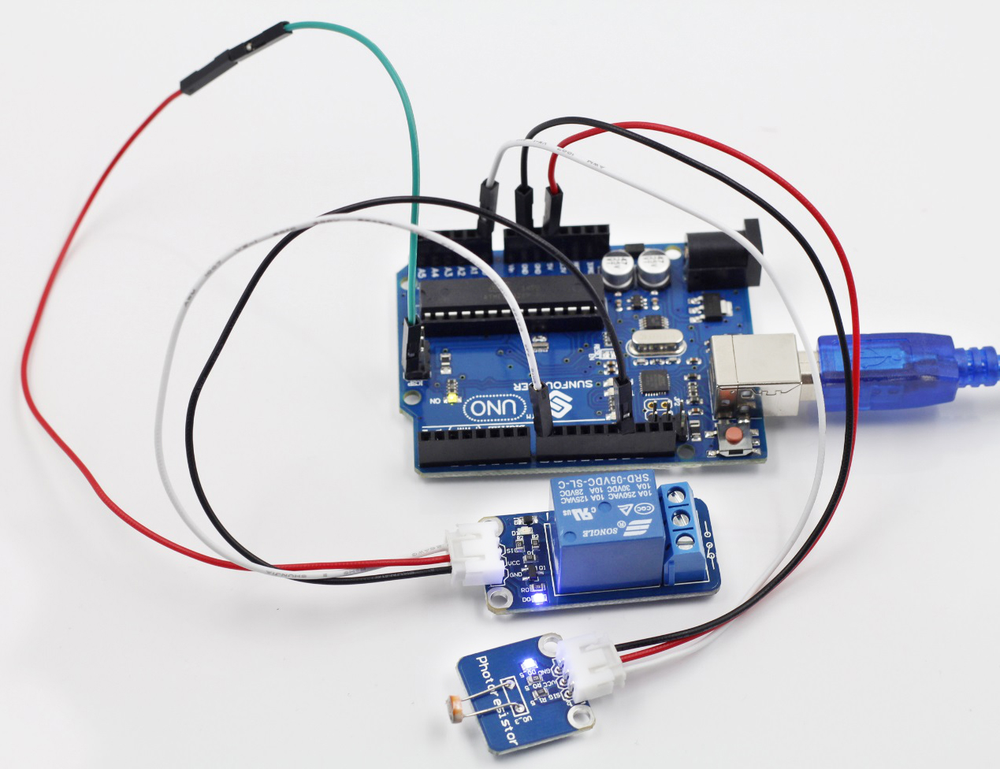

Lesson 17 Photoswitch
======================

**Introduction**

The sensor is in fact a photoresistor which changes its resistance with
varying light intensity. It can be used to make a photoswitch.

**Components**

- 1 \* SunFounder Uno board

- 1 \* USB data cable

- 1 \* Relay module

- 1 \* Photoresistor sensor module

- 2 \* 3-Pin anti-reverse cable

- 1 \* Dupont wire (F to F)

**Principle**

A photoresistor or light-dependent resistor (LDR) or photocell is a
light-controlled variable resistor. The resistance of a photoresistor
decreases with increasing incident light intensity; in other words, it
exhibits photoconductivity. A photoresistor can be applied in
light-sensitive detector circuits, and light- and dark-activated
switching circuits. In this experiment, hook up the photoresistor to A0
of the SunFounder board, and relay to pin 8. When the value reaches or
even exceeds 400, the normally open contact of the relay is closed and
the LED at pin 13 on the SunFounder Uno board will light up; otherwise,
it will be off. In this way you can make a photoswitch.

**Experimental Procedures**

**Step 1:** Build the circuit

The wiring between the relay and SunFounder Uno board:

+-----------------------------------+-----------------------------------+
| Relay                             | SunFounder Uno                    |
+-----------------------------------+-----------------------------------+
| GND                               | GND                               |
+-----------------------------------+-----------------------------------+
| VCC                               | 5V                                |
+-----------------------------------+-----------------------------------+
| SIG                               | 8                                 |
+-----------------------------------+-----------------------------------+

The wiring between the photoresistor and SunFounder Uno board:

+-----------------------------------+-----------------------------------+
| Photoresistor                     | SunFounder Uno                    |
+-----------------------------------+-----------------------------------+
| SIG                               | A0                                |
+-----------------------------------+-----------------------------------+
| VCC                               | 5V                                |
+-----------------------------------+-----------------------------------+
| SIG                               | A0                                |
+-----------------------------------+-----------------------------------+

**Step 2:** Open the code file

**Step 3:** Select correct Board and Port

**Step 4:** Upload the sketch to the SunFounder Uno board

**Code**

.. raw:: html

    <iframe src=https://create.arduino.cc/editor/sunfounder01/12406e4f-3942-45ef-9bfa-b33142cf0e98/preview?embed style="height:510px;width:100%;margin:10px 0" frameborder=0></iframe>

Now hold the photoresistor with your fingers and check the value at A0
on Serial Monitor. You can see when the resistance is up to 400ohm, the
normally open contact of the relay is closed and the LED connected to
pin 13 on the SunFounder Uno board lights up; or else, it keeps out.

**Summary**

In this experiment we've use the sensor making a photoswitch. You may
try other applications. For instance, connect a bulb to the relay module
based on the circuit. Then when it gets dimmer, the normally open
contact of the relay is closed and the bulb will light up. The same way
applies to the street light.