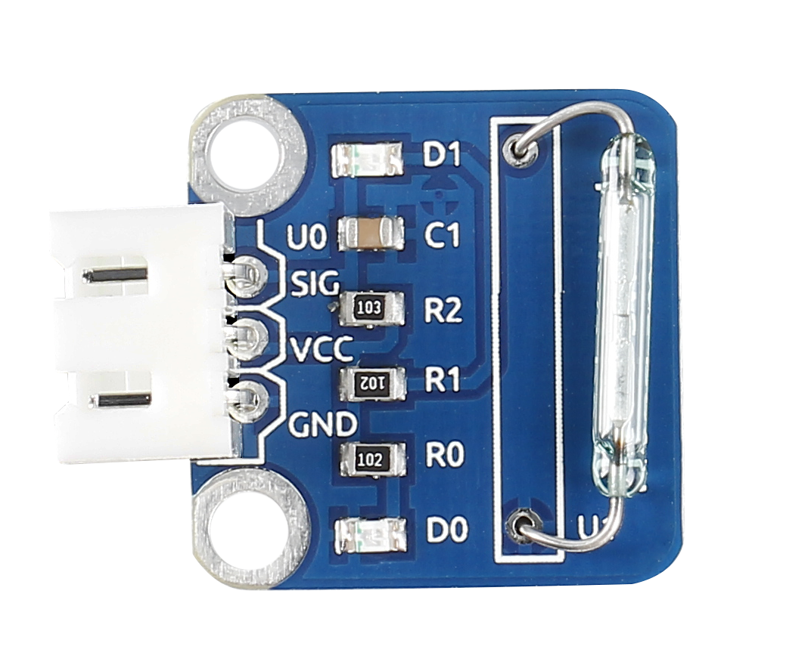
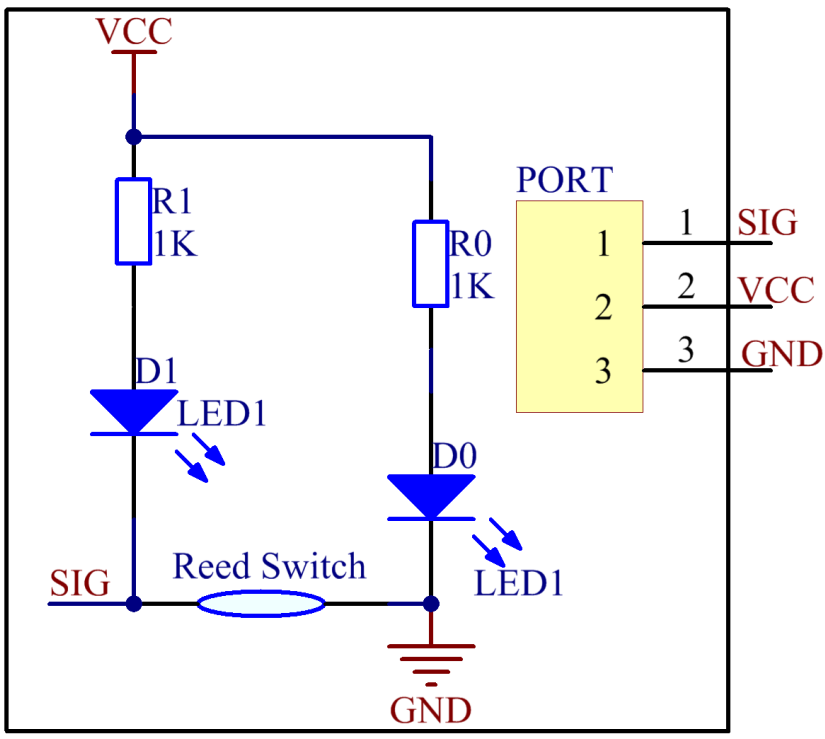
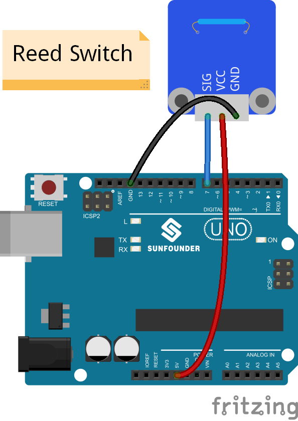
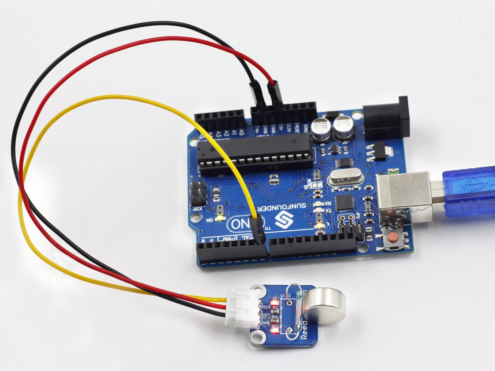

Lesson 18 Reed Switch
======================

**Introduction**

A reed switch is also a sensor used to detect the magnetic field. Hall
sensors are generally used to measure the speed of intelligent vehicles
and count assembly lines, while reed switches are often used to detect
the existence of a magnetic field.

**Components**

- 1 \* SunFounder Uno board

- 1 \* USB data cable

- 1 \* Reed Switch module

- 1 \* 3-Pin anti-reverse cable

- 1 \* Magnet

**Principle**

A reed switch is a type of line switch component that realizes control
by magnetic signals. It induces by a magnet. The “switch" here means dry
reed pipe, which is a kind of contact passive electronic switch
component with the advantage of simple structure, small size, and
convenient control. The shell of a reed switch is commonly a sealed
glass pipe in which two iron elastic reed electroplates are equipped and
inert gases are filled. Normally, the two reeds made of special
materials in the glass tube are separated. However, when a magnetic
substance approaches the glass tube, the two reeds in the glass tube are
magnetized to attract each other and contact under the function of
magnetic field lines. As a result, the two reeds will pull together to
connect the circuit connected with the nodes.

After external magnetic force disappears, the two reeds will be
separated with each other because they have the same magnetism, so the
circuit is also disconnected. Therefore, as a line switch component
controlling by magnetic signals, the dry reed pipe can be used as a
sensor to count, limit positions and so on. At the same time, it is
widely used in a variety of communication devices.

In this experiment, since an LED has been attached to pin 13, just
connect pin SIG of the reed switch to digital pin 7 of SunFounder Uno
board. When the reed switch identifies magnetic field signals, the LED
will be on. Otherwise it will be off.

The schematic diagram

**Experimental Procedures**

**Step 1:** Build the circuit

**Step 2:** Open the code file

**Step 3:** Select correct Board and Port

**Step 4:** Upload the sketch to the SunFounder Uno board

Now, use a magnet to approach the reed switch, and the LED on the reed
switch module and that on the SunFounder board light up. Move the magnet
farther and the LED will go out.

