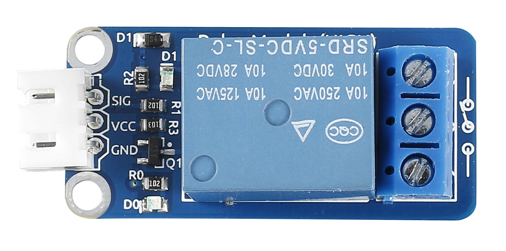
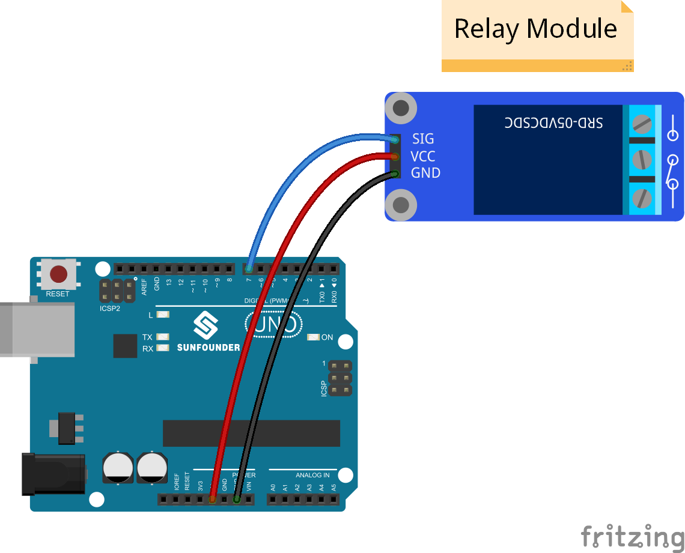
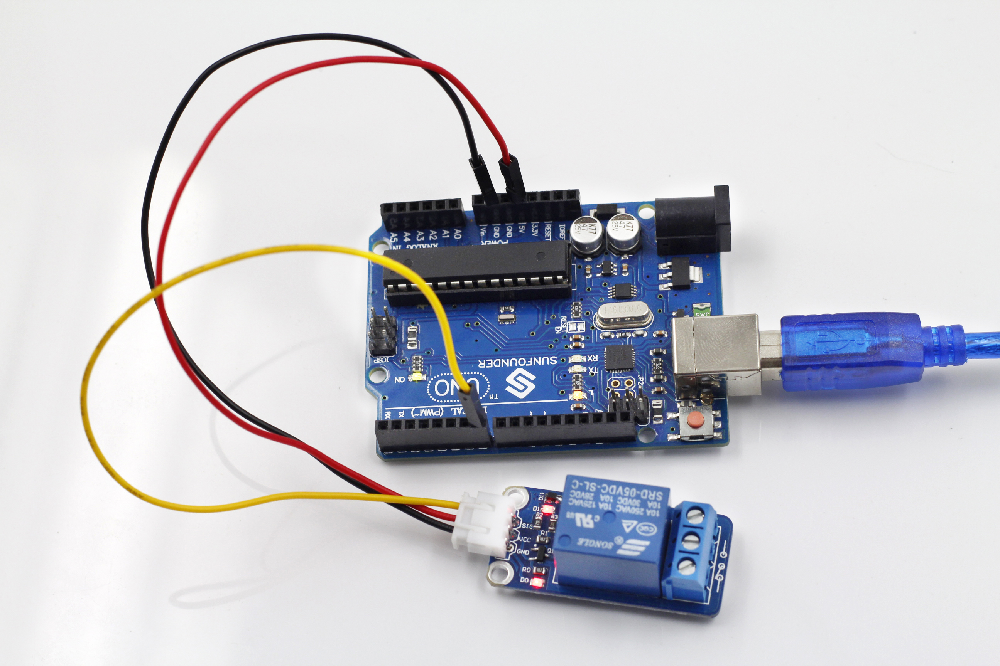

Lesson 19 Relay
===============

**Introduction**

As we know relay is a device which is used to provide
connection between two or more points or device in response to the input
signal applied. In another words relay provide isolation between the
controller and the device as we know devices may work on AC as well as
on DC. However, they receive signals from microcontroller which works on
DC hence we require a relay to bridge the gap. Relay is extremely useful
when you need to control a large amount of current or voltage with small
electrical signal.

**Components**

- 1 \* SunFounder Uno board

- 1 \* USB data cable

- 1 \* Relay module

- 1 \* 3-Pin anti-reverse cable

**Principle**

**Relay** – There are 5 parts in every relay:

1. **Electromagnet** – It consists of an iron core wounded by coil of
wires. When electricity is passed through, it becomes magnetic.
Therefore, it is called electromagnet.

2. **Armature** – The movable magnetic strip is known as armature. When
current flows through them, the coil is it energized thus producing a
magnetic field which is used to make or break the normally open (N/O) or
normally close (N/C) points. And the armature can be moved with direct
current (DC) as well as alternating current (AC).

3. **Spring** – When no currents flow through the coil on the
electromagnet, the spring pulls the armature away so the circuit cannot
be completed.

4. Set of electrical **contacts** – There are two contact points:

-  Normally open - connected when the relay is activated, and
   disconnected when it is inactive.

-  Normally close – not connected when the relay is activated, and
   connected when it is inactive.

5. Molded frame – Relays are covered with plastic for protection.

**Working of Relay**

The working principle of relay is simple. When power is supplied to the
relay, currents start flowing through the control coil; as a result, the
electromagnet starts energizing. Then the armature is attracted to the
coil, pulling down the moving contact together thus connecting with the
normally open contacts. So the circuit with the load is energized. Then
breaking the circuit would a similar case, as the moving contact will be
pulled up to the normally closed contacts under the force of the spring.
In this way, the switching on and off of the relay can control the state
of a load circuit.

.. image:: media/image124.jpeg
  :width: 500

So in this experiment, hook the SIG to the SunFounder Uno board. Send a
low level to SIG; the PNP transistor is energized and the coil of the
relay is electrified. Thus, the normally open contact of the relay is
closed, while the normally closed contact of the relay will be off the
public port. Send a high level to SIG; the transistor will be
de-energized and the relay will restore to the initial state.

.. image:: media/image125.png
  :width: 500

**Experimental Procedures**

**Step 1:** Build the circuit

**Step 2:** Open the code file

**Step 3:** Select correct Board and Port

**Step 4:** Upload the sketch to the SunFounder Uno board

**Code**

.. raw:: html

    <iframe src=https://create.arduino.cc/editor/sunfounder01/e2247a63-0181-4b78-9dd0-58162d773c39/preview?embed style="height:510px;width:100%;margin:10px 0" frameborder=0></iframe>

Now, you may hear the ticktock. That's the normally closed contact
opened and the normally open contact closed.

