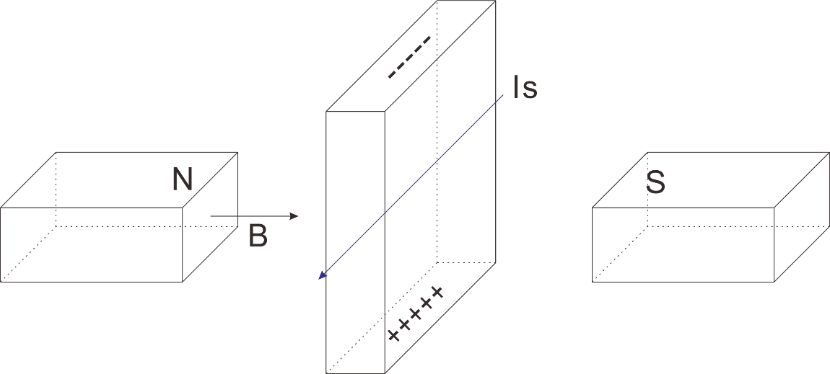
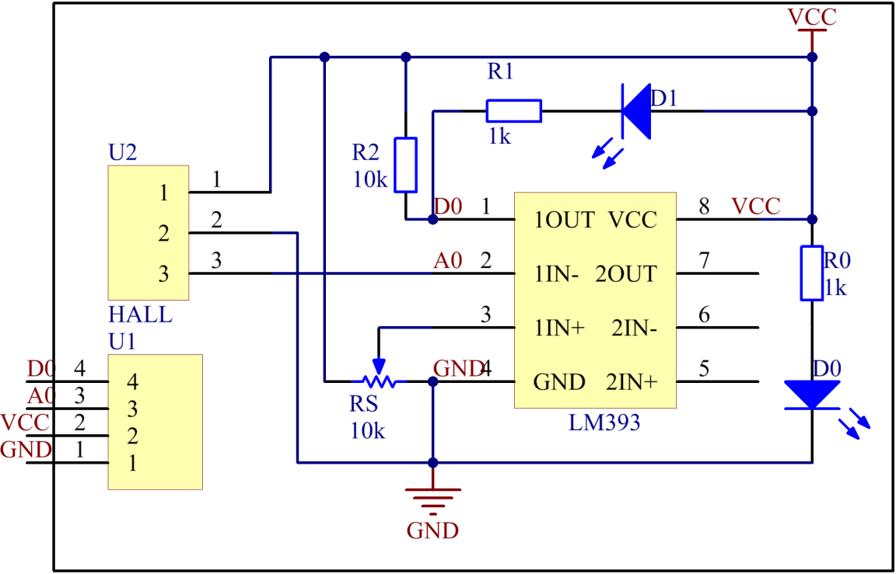
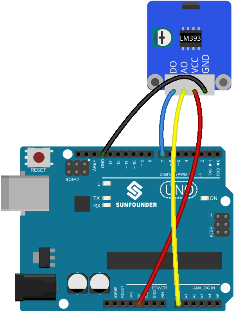
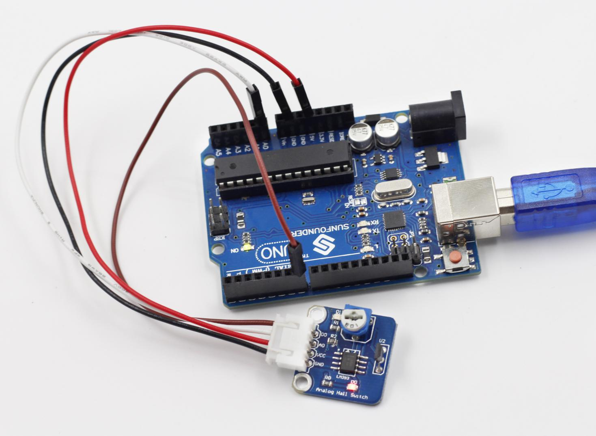
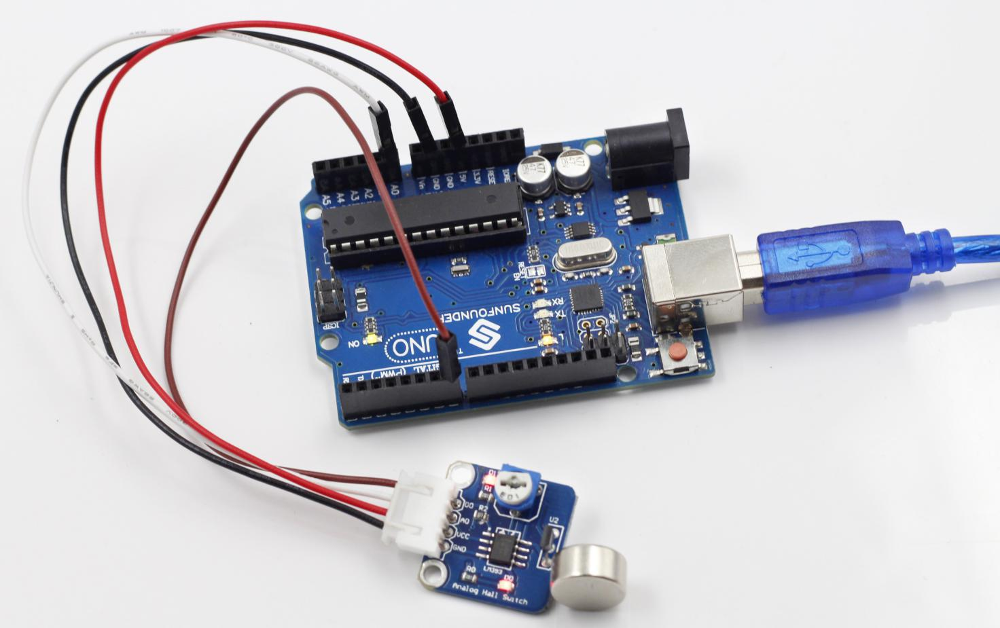

Lesson 2 Analog Hall Sensor
===========================

**Introduction**

.. image:: media/image5.png
  :width: 250

Based on the Hall Effect, a Hall sensor is a one that varies
its output voltage in response to a magnetic field. Hall sensors are
used for proximity switching, positioning, speed detection, and current
sensing applications.

Hall sensors can be categorized into linear (analog) Hall sensors and
switch Hall sensors. A switch Hall sensor consists of voltage regulator,
Hall element, differential amplifier, Schmitt trigger, and output
terminal and it outputs Boolean value (0/1). A linear Hall sensor
consists of Hall element, linear amplifier, and emitter follower and it
outputs analog values. If a comparator is added to a linear (analog)
Hall sensor, it can output both analog and digital signals.

**Components**

- 1 \* SunFounder Uno board

- 1 \* USB data cable

- 1 \* Analog Hall sensor module

- 1 \* 4-Pin anti-reverse cable

- 1 \* Magnet

**Principle**

**Hall Effect**

Hall Effect is a kind of electromagnetic effect. It was discovered by
Edwin Hall in 1879 when he was researching conductive mechanism about
metals. The effect is seen when a conductor is passed through a uniform
magnetic field. The natural electron drift of the charge carriers causes
the magnetic field to apply a Lorentz force (the force exerted on a
charged particle in an electromagnetic field) to these charge carriers.
The result is what is seen as a charge separation, with a buildup of
either positive or negative charges on the bottom or on the top of the
plate.

A Hall sensor is a magnetic field sensor based on it.

Electricity carried through a conductor will produce a magnetic field
that varies with current, and a Hall sensor can be used to measure the
current without interrupting the circuit. Typically, the sensor is
integrated with a wound core or permanent magnet that surrounds the
conductor to be measured.

In this experiment, when the sensor approaches the magnet, the value of
pin A0 will change. When the value exceeds the threshold set by the
potentiometer before, D0 will output low level and the corresponding LED
lights up.

The schematic diagram of the analog Hall sensor module:

**Experimental Procedures**

**Step 1:** Build the circuit

**Step 2:** Open the code file

**Step 3:** Select correct Board and Port

**Step 4:** Upload the sketch to the SunFounder Uno board

Now, put a magnet close to the Hall sensor. The voltage of D0 changes
from high to low, and then the LED on the sensor and that attached to
pin 13 of the SunFounder Uno light up. You can see the value of A0 and
D0 on Serial Monitor.

Before the experiment

After the experiment