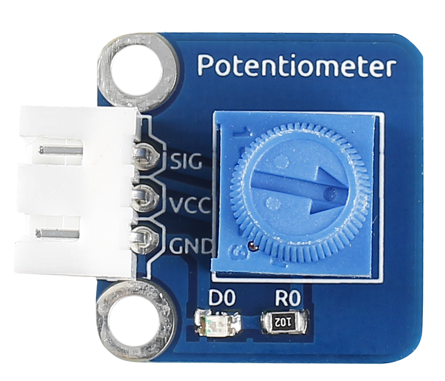
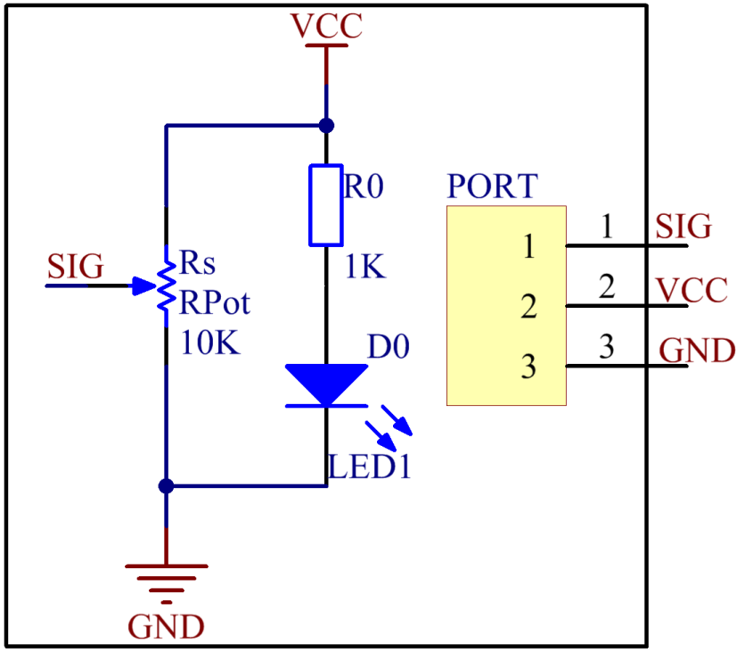
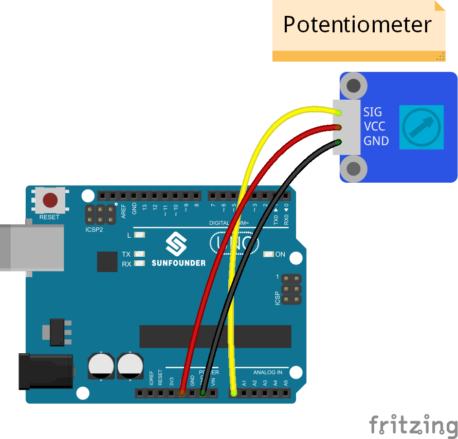
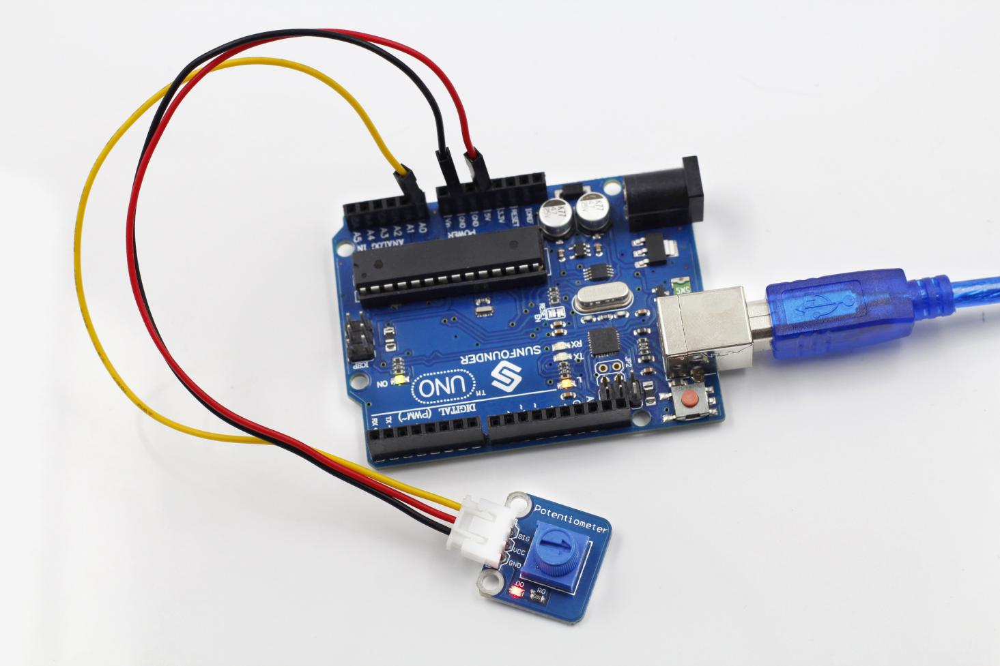

Lesson 20 Blinking an LED by Potentiometer
==========================================

**Introduction**

A potentiometer can help to control the interval at which the LED on the
SunFounder board blinks.

**Components**

- 1 \* SunFounder Uno board

- 1 \* 3-Pin anti-reverse cable

- 1 \* Potentiometer module

- 1 \* USB cable

**Principle**

An analog potentiometer is an analog electronic component. What’s the
difference between an analog one and a digital one? Simply put, a
digital potentiometer refers to just two states like on/off, high/low
levels, i.e. either 0 or 1, while a digital one supports analog signals
like a number from 1 to 1000. The signal value changes over time instead
of keeping an exact number. Analog signals include light intensity,
humidity, temperature, and so on.

In this experiment, hook up the pin SIG of the potentiometer module to
A0 of the SunFounder Uno board and check the value at A0. Then use the
value to control the interval at which the LED connected with pin 13 of
the Uno board blinks. Rotate the shaft of the potentiometer and the LED
blink interval will increases or decreases.

**Experimental Procedures**

**Step 1:** Build the circuit

**Step 2:** Open the code file

**Step 3:** Select correct Board and Port

**Step 4:** Upload the sketch to the SunFounder Uno board

Rotate the shaft of the potentiometer and the interval at which the LED
attached to pin 13 of the SunFounder Uno blinks will increase or
decrease.

