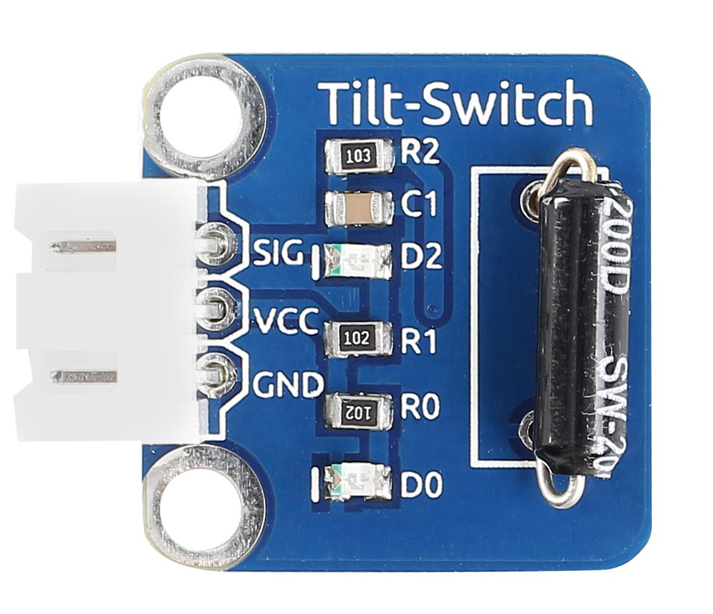
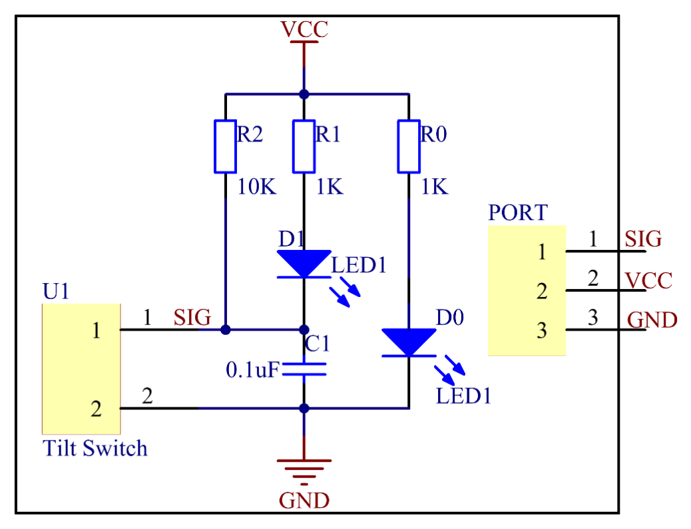
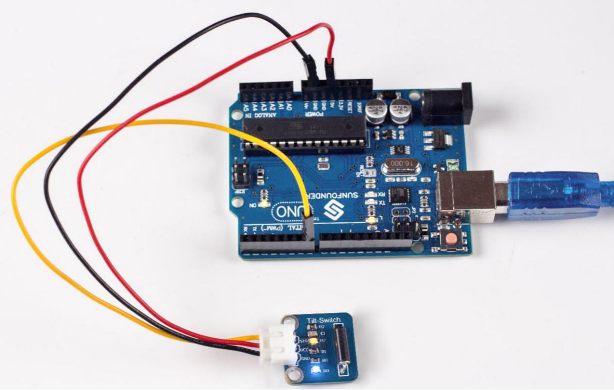

Lesson 21 Tilt Switch
=====================

**Introduction**

The tilt switch sensor module is a ball tilt switch with a metal ball
inside. It is used to detect inclinations of a small angle.

**Components**

- 1 \* SunFounder Uno board

- 1 \* USB data cable

- 1 \* Tilt switch module

- 1 \* 3-Pin anti-reverse cable

**Principle**

The principle is very simple. When the switch is tilted in a certain
angle, the ball inside rolls down and touches the two contacts connected
to the pins outside, thus triggering circuits. Otherwise the ball will
stay away from the contacts, thus breaking the circuits.

In this experiment, we use a tilt switch module and an LED that has been
attached to pin 13 of the SunFounder board to build a simple circuit.

With the LED attached to pin 13, connect pin SIG to digital pin 7 of the
SunFounder Uno board. Then the tilt switch outputs low signals and the
LED will be on. Otherwise it will be off.

**Experimental Procedures**

**Step 1:** Build the circuit

.. image:: media/image132.png
   :width: 3.38194in
   :height: 4.18681in

**Step 2:** Open the code file

**Step 3:** Select correct Board and Port

**Step 4:** Upload the sketch to the SunFounder Uno board

Now, tilt the switch and the LED attached to pin 13 on SunFounder Uno
board will light up.

