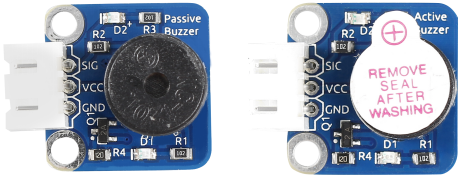
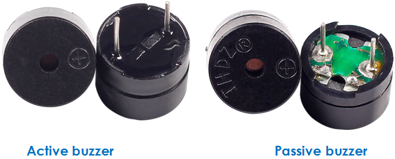
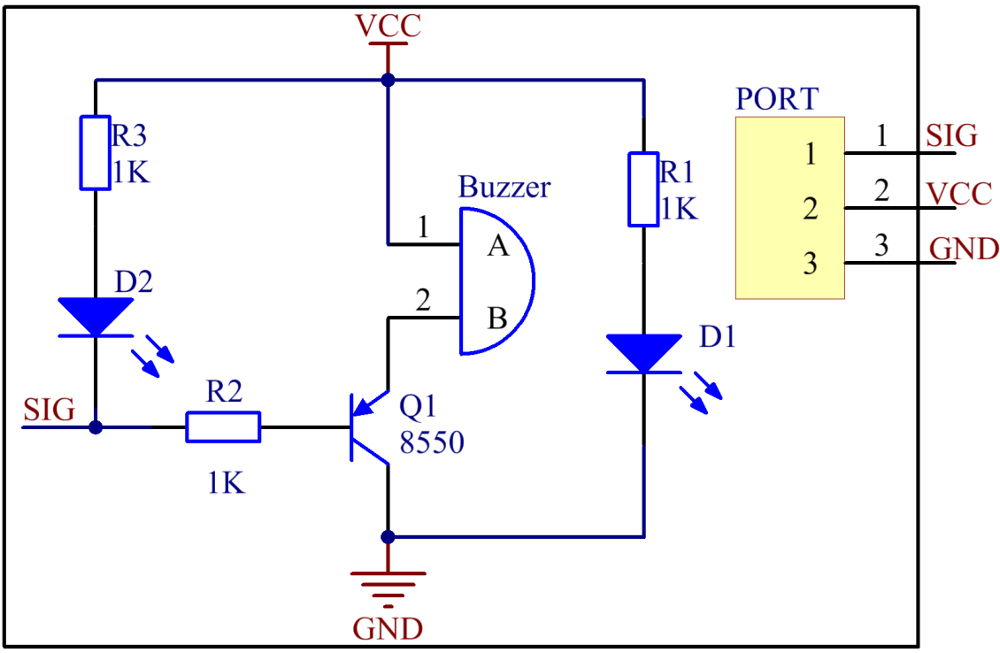
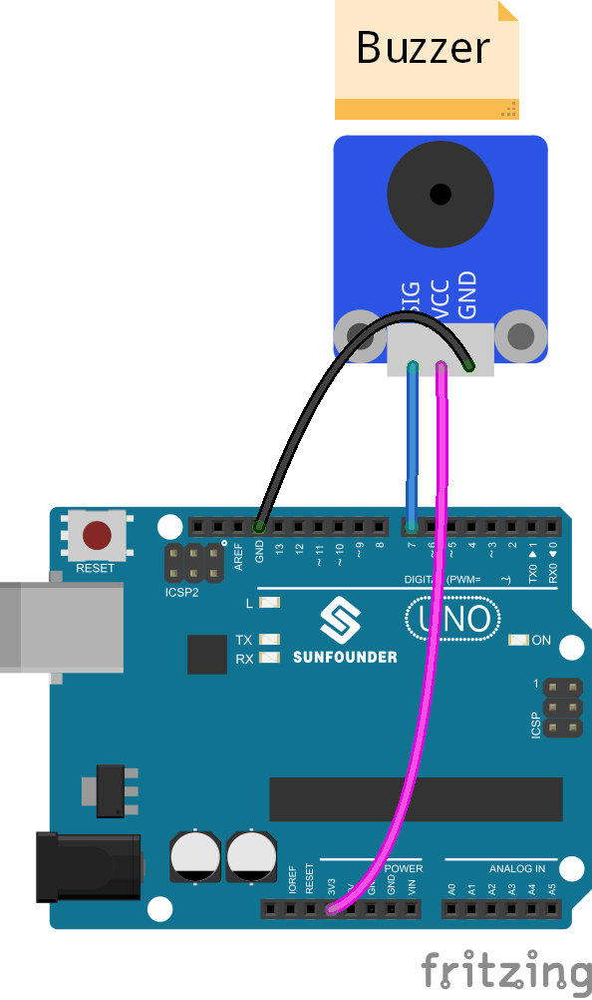
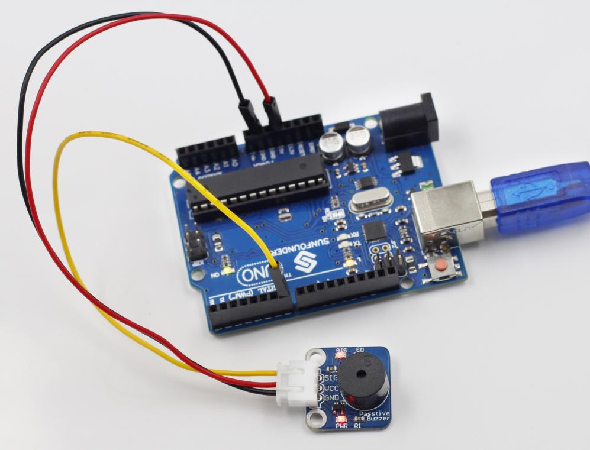
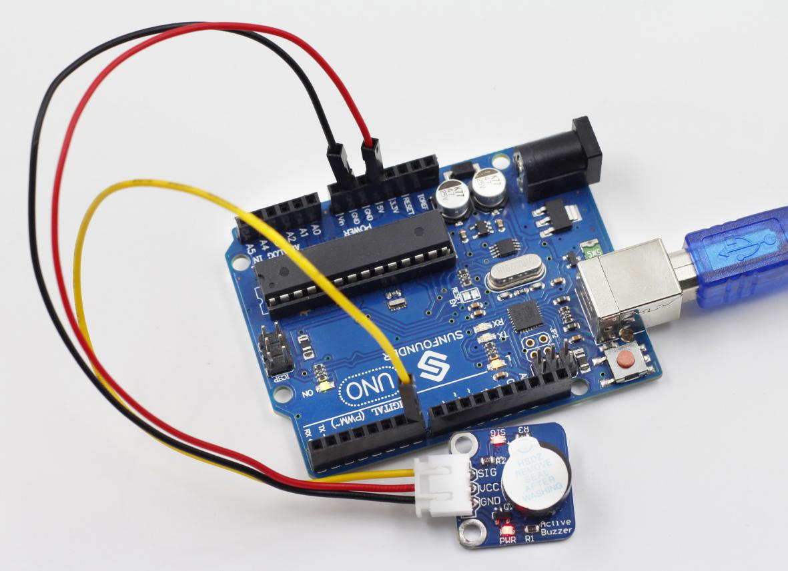

Lesson 22 Buzzer
================

**Introduction**

A buzzer is an audio signaling device. Buzzers can be categorized into
active and passive ones (see as below).

**Components**

- 1 \* SunFounder Uno board

- 1 \* USB data cable

- 1 \* Active buzzer

- 1 \* Passive buzzer

- 2 \* 3-Pin anti-reverse cable

**Principle**

Place the pins of two buzzers face up and you can see the one with a
green circuit board is a passive buzzer, while the other with a black
tape, instead of a board, is an active buzzer, as shown below.

**Active buzzer Passive buzzer**

An active buzzer has a built-in oscillating source, so it will make
sounds when electrified. But a passive buzzer does not have such source,
so it will not beep if DC signals are used; instead, you need to use
square waves whose frequency is between 2K and 5K to drive it. The
active buzzer is often more expensive than the passive one because of
multiple built-in oscillating circuits.

The schematic diagram:

**Experimental Procedures**

**Step 1:** Build the circuit

**Passive Buzzer**

**Step 2:** Open the code file (Passive)

**Step 3:** Select correct Board and Port

**Step 4:** Upload the sketch to the SunFounder Uno board

Now, you can hear the passive buzzer beeping. It also works in the same
way if you use an active one here.

**Active Buzzer**

.. note::
    The active buzzer has a built-in oscillating source, so it will beep as long as it is wired up.

**Step 2:** Open the code file (Active)

**Step 3:** Select correct Board and Port

**Step 4:** Upload the sketch to the SunFounder Uno board

Now, you can hear the active buzzer beeping. But it won't work if you
use a passive one here.

