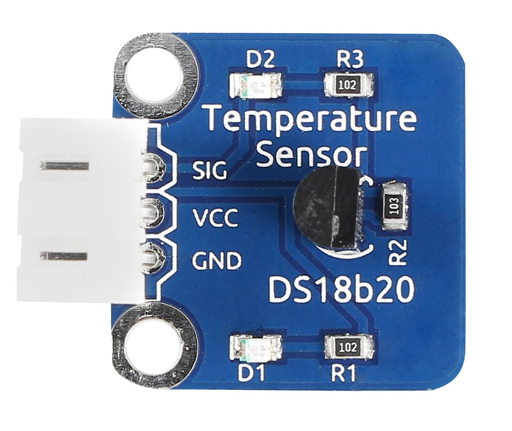
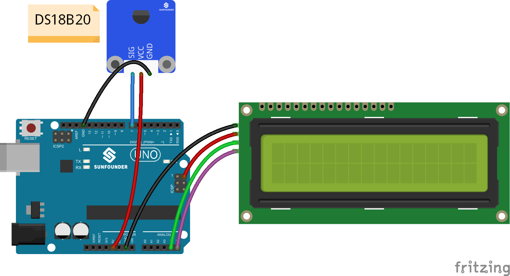
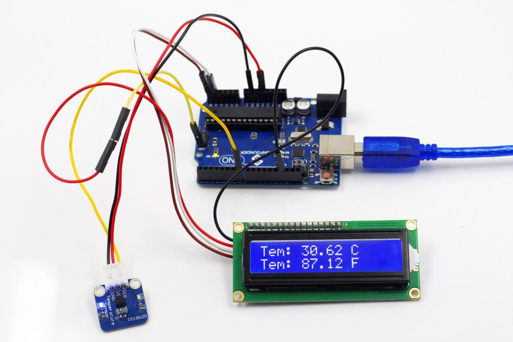

Lesson 23 Digital Temperature Sensor
====================================

**Introduction**

Temperature Sensor DS18B20 is a commonly used digital
temperature sensor featured with small size, low-cost hardware, strong
anti-interference capability and high precision. The digital temperature
sensor is easy to wire and can be applied a various occasions after
packaging. Different from conventional AD collection temperature
sensors, it uses a 1-wire bus and can directly output temperature data.

**Components**

- 1 \* SunFounder Uno board

- 1 \* USB data cable

- 1 \* DS18B20 Temperature Sensor module

- 1 \* I2C LCD1602

- 1 \* 3-Pin anti-reverse cable

- 1 \* 4-Pin anti-reverse cable

- 1 \* Dupont wire (F to F)

**Principle**

With a unique single-wire interface, DS18B20 requires only one pin for a
two-way communication with a microprocessor. It supports multi-point
networking to measure multi-point temperatures. Eight DS18B20s can be
connected at most, because too many of them will consume too much of the
power supply and cause low voltage thus instability of signal
transmission. The schematic diagram is as follows:

**Experimental Procedures**

**Step 1:** Build the circuit

**Step 2:** Open the code file

**Step 3:** Select correct Board and Port

**Step 4:** Upload the sketch to the SunFounder Uno board

**Code**

.. raw:: html

    <iframe src=https://create.arduino.cc/editor/sunfounder01/b497c846-e383-4680-8ae3-8ef3837c7ae4/preview?embed style="height:510px;width:100%;margin:10px 0" frameborder=0></iframe>

Now, you can see the value of current temperature displayed on the LCD.

