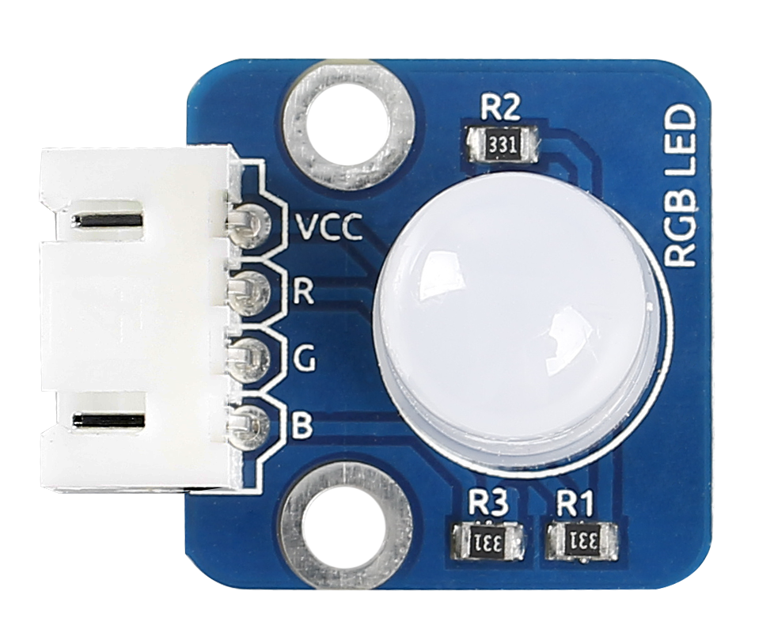
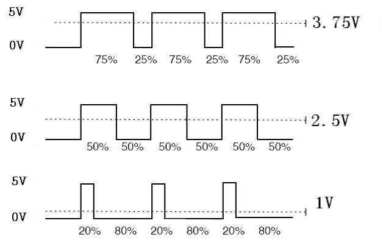
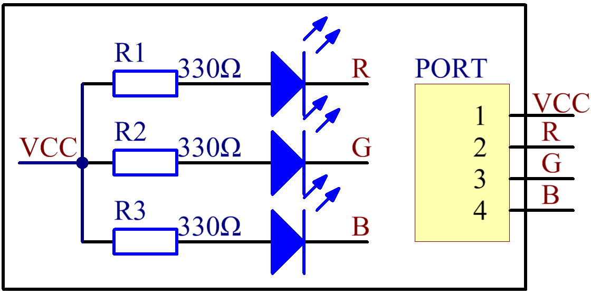
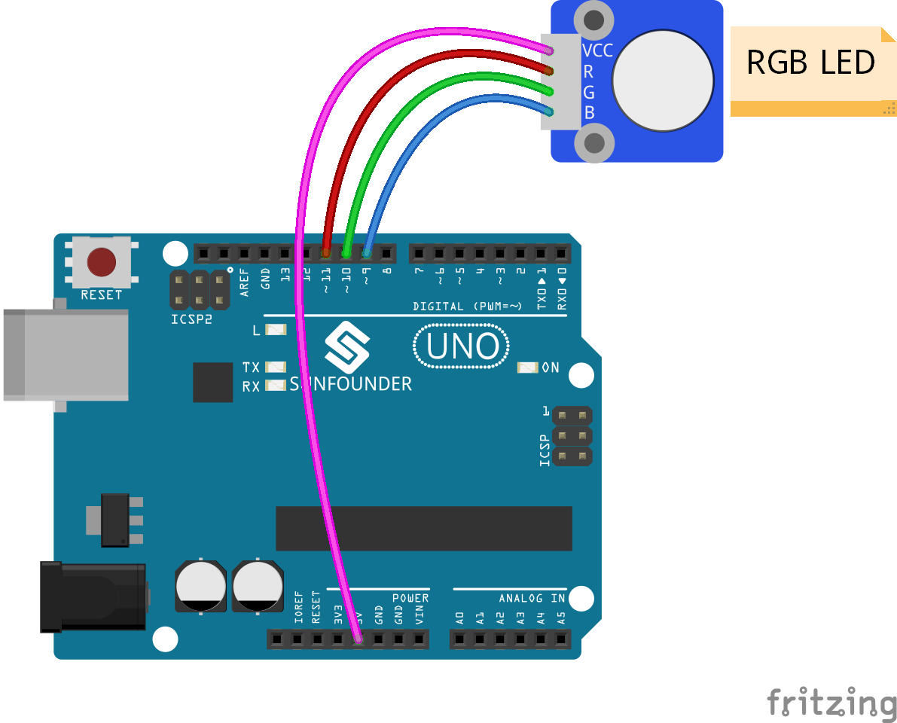

Lesson 24 Rainbow LED
=====================

**Introduction**

RGB LED modules can emit various colors of light. Three LEDs
of red, green, and blue are packaged into a transparent or
semitransparent plastic shell with four pins led out. The three primary
colors, red, green, and blue, can be mixed and compose all kinds of
colors by brightness, so you can make an RGB LED emit colorful light by
controlling the circuit.

**Components**

- 1 \* SunFounder Uno board

- 1 \* USB data cable

- 1 \* RGB LED module

- 1 \* 4-Pin anti-reverse cable

**Principle**

In this experiment, we will use PWM technology to the brightness of RGB.

Pulse Width Modulation, or PWM, is a technique for getting analog
results with digital means. Digital control is used to create a square
wave, a signal switched between on and off. This on-off pattern can
simulate voltages in between full on (5V) and off (0V) by changing the
portion of the time the signal spends on versus the time that the signal
spends off. The duration of \"on time\" is called the pulse width. To get
varying analog values, you change, or modulate, that pulse width. If you
repeat this on-off pattern fast enough with an LED for example, the
result is as if the signal is a steady voltage between 0 and 5v
controlling the brightness of the LED. (See the PWM description on the
official website of Arduino).

We can see from the oscillogram above that the amplitude of DC voltage
output is 5V. However, the actual voltage output is only 3.75V through
PWM, for the high level only takes up 75% of the total voltage within a
period.

Here are the three basic parameters of PWM:

.. image:: media/image143.png
   :width: 6.41667in
   :height: 3.61458in

1. The term **duty cycle** describes the proportion of \"on\" time to the
   regular interval or \"period\" of time

2. **Period** describes the reciprocal of pulses in one second.

3. The voltage amplitude is 0-5V.

Here we input any value between 0 and 255 to the three pins of the RGB
LED to make it display different colors.

RGB LEDs can be categorized into common anode LED and common cathode
LED. In this experiment, we use a common anode RGB LED.

**Experimental Procedures**

**Step 1:** Build the circuit

**Step 2:** Open the code file

**Step 3:** Select correct Board and Port

**Step 4:** Upload the sketch to the SunFounder Uno board

**Code**

.. raw:: html

    <iframe src=https://create.arduino.cc/editor/sunfounder01/14f563e3-d6f3-49f3-b923-b0cd52e6d8a7/preview?embed style="height:510px;width:100%;margin:10px 0" frameborder=0></iframe>

Now, you can see RGB LED flash red, green and blue first, and then
change to red, orange, yellow, green, blue, indigo and purple.

.. image:: media/image146.jpeg
   :alt: dsfdsh
   :width: 4.85417in
   :height: 3.57292in
