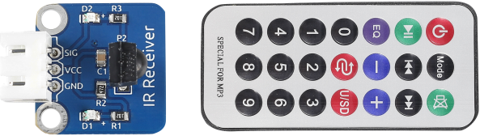
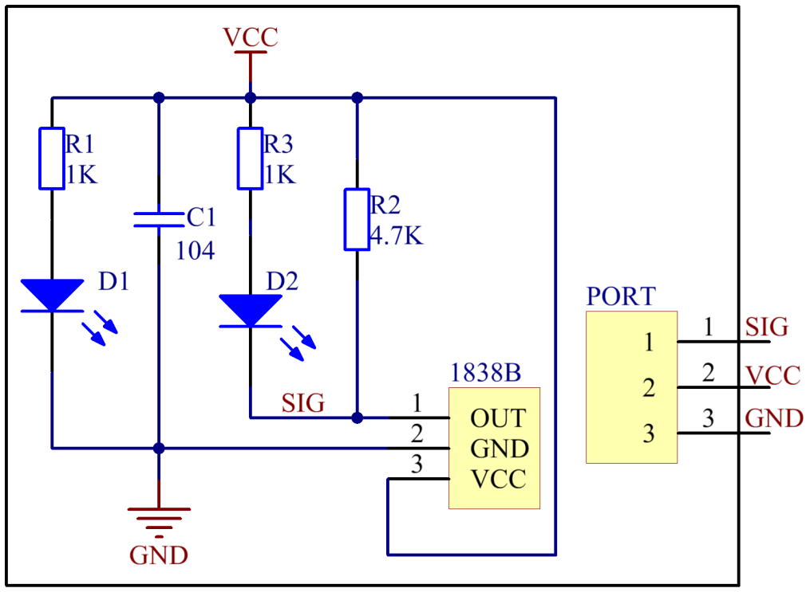
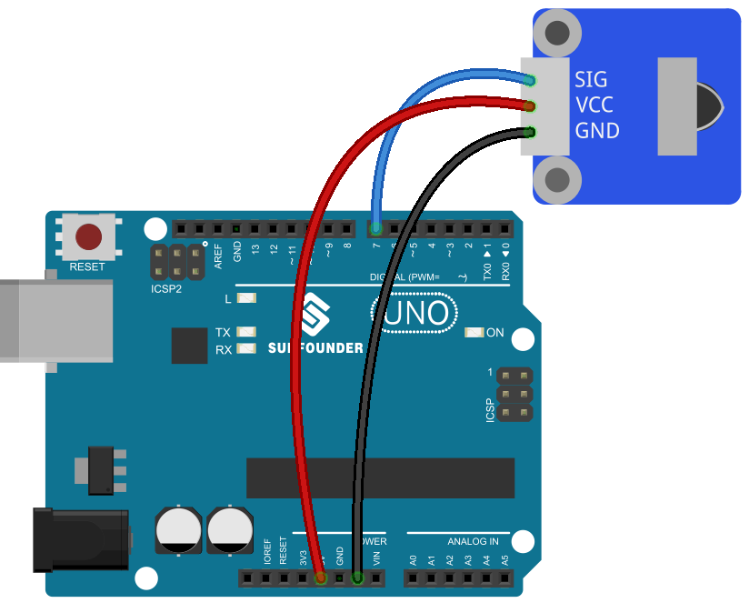
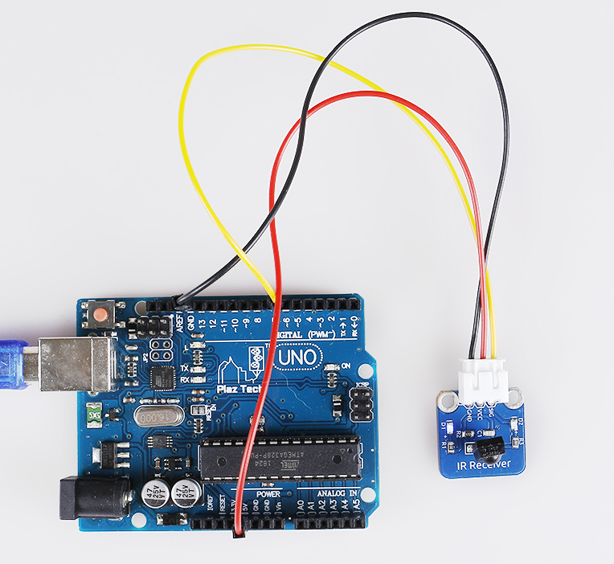

Lesson 25 Infrared Receiver
===========================

**Introduction**

An infrared-receiver is a component which receives infrared
signals and can independently receive infrared ray and output signals
compatible with TTL level. It's similar with a normal plastic-packaged
transistor in size and is suitable for all kinds of infrared remote
control and infrared transmission.

**Components**

- 1 \* SunFounder Uno board

- 1 \* USB data cable

- 1 \* Infrared-receiver module

- 1 \* Remote controller

- 1 \* 3-Pin anti-reverse cable

**Principle**

Control a certain key (for example, Power key) via a remote controller
by programming. When you press the key, infrared rays will be emitted
from the remote controller and received by the infrared receiver, and
the LED on the SunFounder Uno board will light up. Add an LED to connect
with pin 13 of the Uno board, so you can see remotely whether the Power
or another key is pressed down.

**Experimental Procedures**

**Step 1:** Build the circuit

**Step 2:** Open the code file

**Step 3:** Select correct Board and Port

**Step 4:** Upload the sketch to the SunFounder Uno board

**Code**

.. raw:: html

    <iframe src=https://create.arduino.cc/editor/sunfounder01/b4473d0a-978d-4b4d-a881-1f3963a22535/preview?embed style="height:510px;width:100%;margin:10px 0" frameborder=0></iframe>

Now, press the Power key of a remote controller, and the LED attached to
pin 13 on the SunFounder Uno board will light up. Then press any other
key, and the LED will go out.

