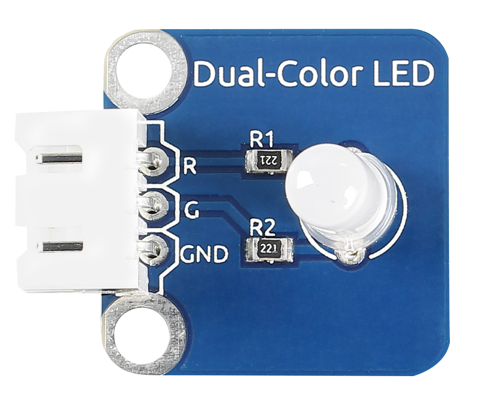
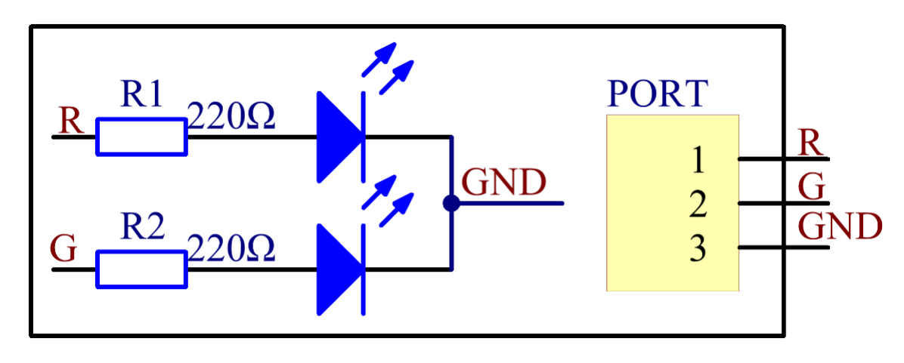
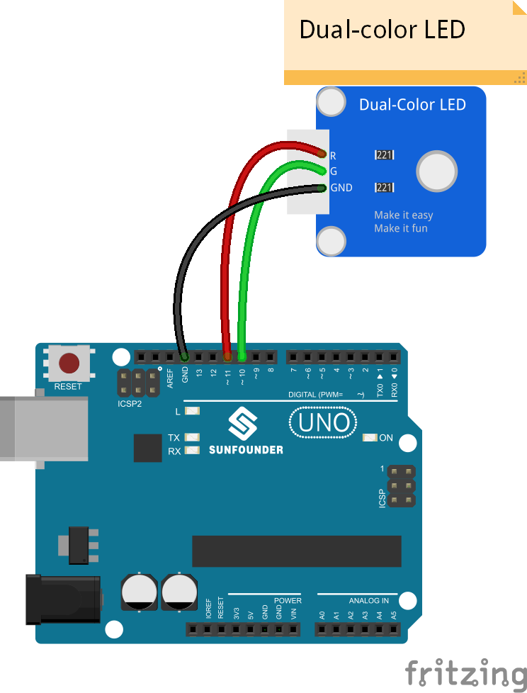
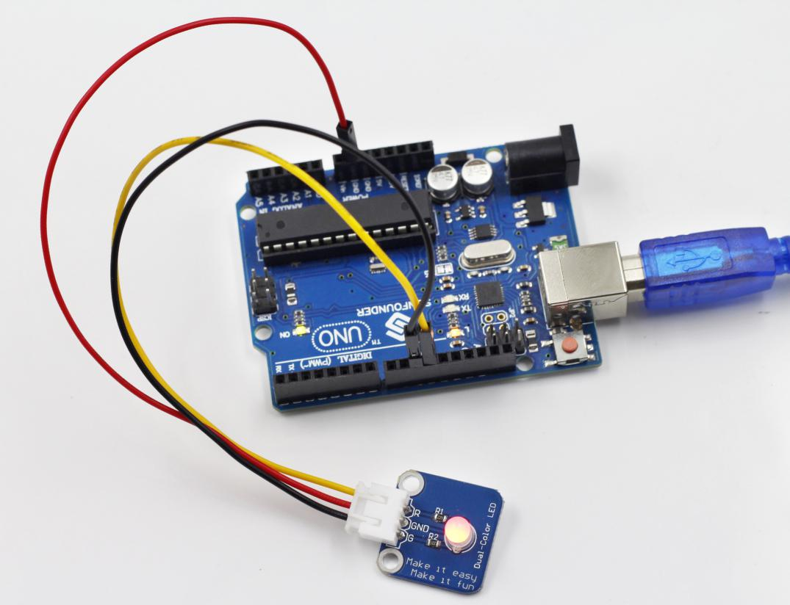

Lesson 26 Dual-color LED
========================

**Introduction**

A dual-color light emitting diode (LED) is capable of
emitting two different colors of light, typically red and green, rather
than only one color. It is housed in a 3mm or 5mm epoxy package. It has
3 leads; common cathode or common anode is available. A dual-color LED
features two LED terminals, or pins, arranged in the circuit in
anti-parallel and connected by a cathode/anode. Positive voltage can be
directed towards one of the LED terminals, causing that terminal to emit
light of the corresponding color; when the direction of the voltage is
reversed, the light of the other color is emitted. In a dual-color LED,
only one of the pins can receive voltage at a time. As a result, this
type of LED frequently functions as indicator lights for a variety of
devices, including televisions, digital cameras, and remote controls.

**Components**

- 1 \* SunFounder Uno board

- 1 \* USB data cable

- 1 \* Dual-color LED module

- 1 \* 3-Pin anti-reverse cable

**Principle**

Control the LED brightness by the digital port. The color of the LED
changes from red to green as well as flashes a mixed color.

**Experimental Procedures**

**Step 1:** Build the circuit

**Step 2:** Open the code file

**Step 3:** Select correct Board and Port

**Step 4:** Upload the sketch to the SunFounder Uno board

Now, you can see the dual-color LED changes from red to green
alternately, as well as flashing a mixed color during the alternation.

