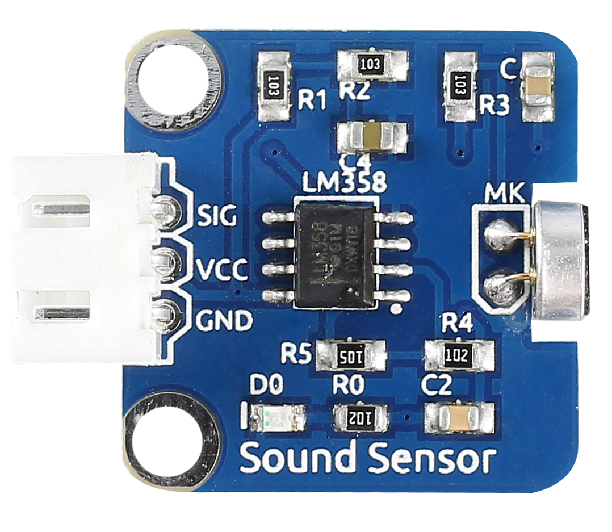
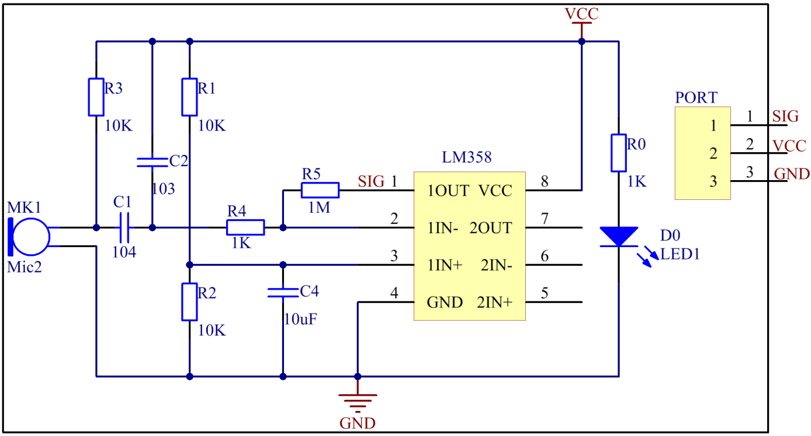
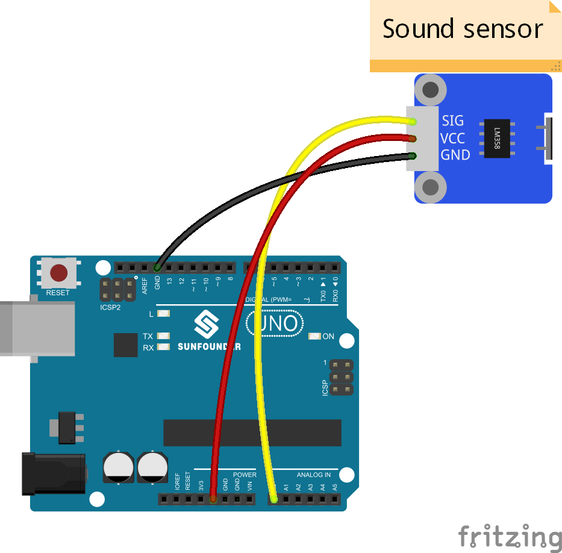
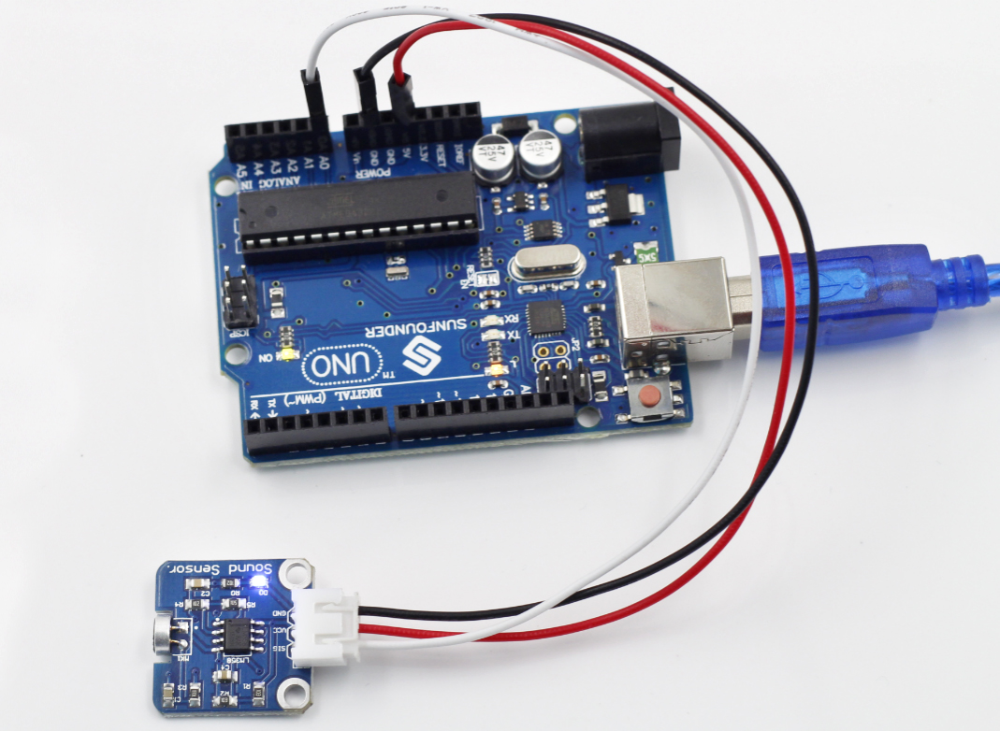

Lesson 27 Sound Sensor
======================

**Introduction**

Sound Sensor is a component that receives sound waves and converts them
into electrical signals. It detects the sound intensity in ambient
environment like a microphone.

**Components**

- 1 \* SunFounder Uno board

- 1 \* USB data cable

- 1 \* Sound Sensor module

- 1 \* 3-Pin anti-reverse cable

**Principle**

The sensor has a capacitive electret microphone which is sensitive to
sound. Sound waves cause the thin film of the electret to vibrate and
then the capacitance changes, thus producing the corresponding changed
voltage. Since the voltage change is extremely weak, it needs to be
amplified. LM358 here is a power amplifier of 100 times gain. Connect
the SIG output pin of the sound sensor to A0 of the SunFounder Uno
board. Then you can see the value of sound intensity on Serial Monitor,
or display the wave forms on an oscilloscope if you have connected one.
The schematic diagram:

**Experimental Procedures**

**Step 1:** Build the circuit

**Step 2:** Open the code file

**Step 3:** Select correct Board and Port

**Step 4:** Upload the sketch to the SunFounder Uno board

Now you can see the value of sound intensity on Serial Monitor. When the
volume reaches to a certain value, the LED attached to pin 13 on the
SunFounder Uno will light up.

