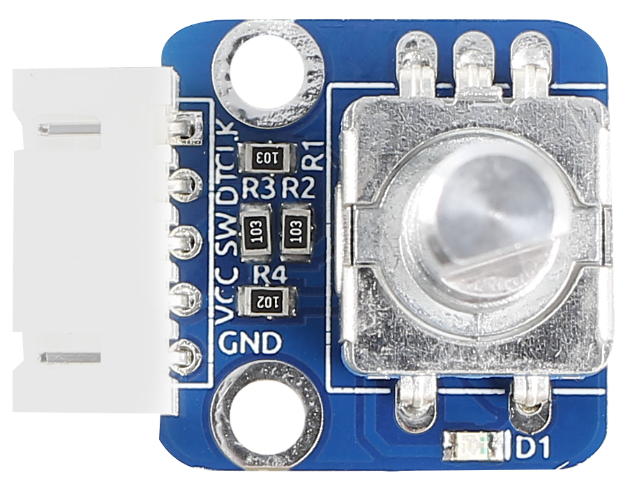
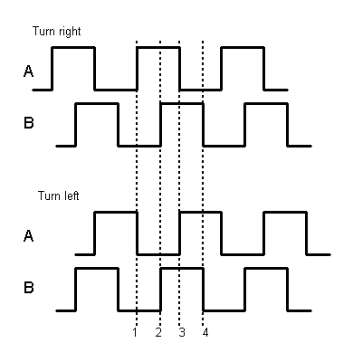
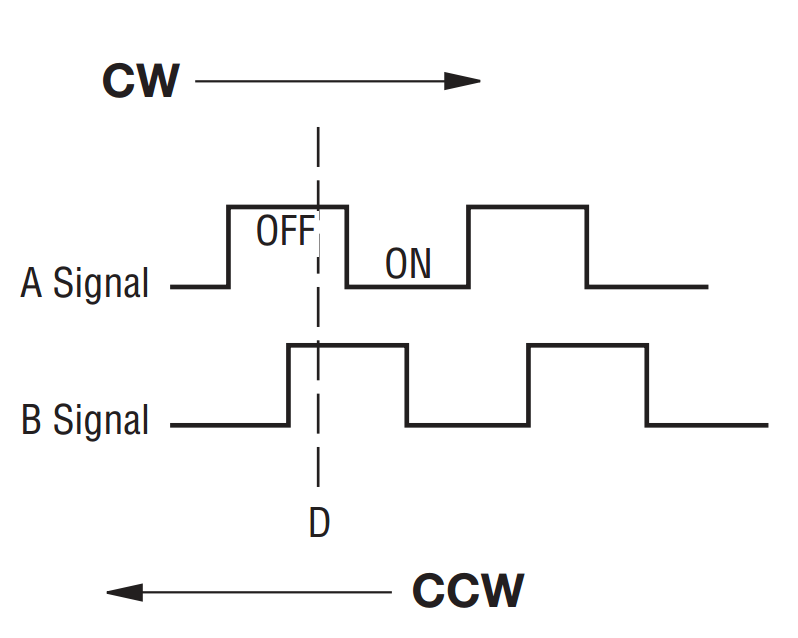
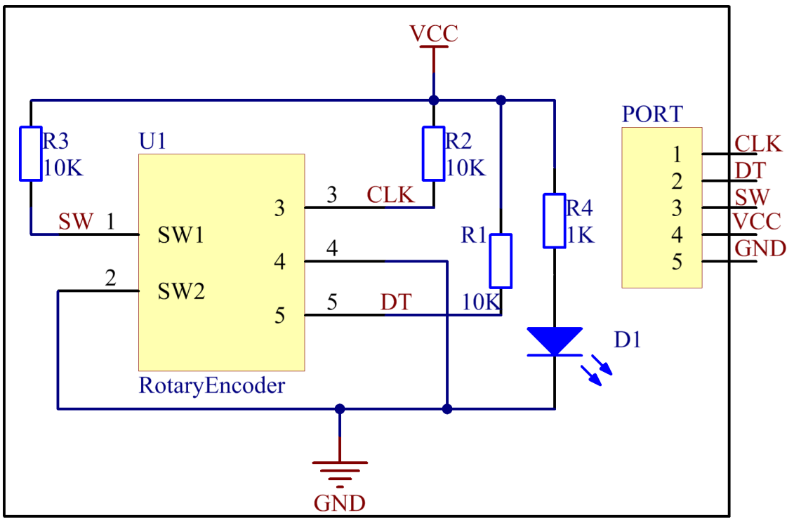
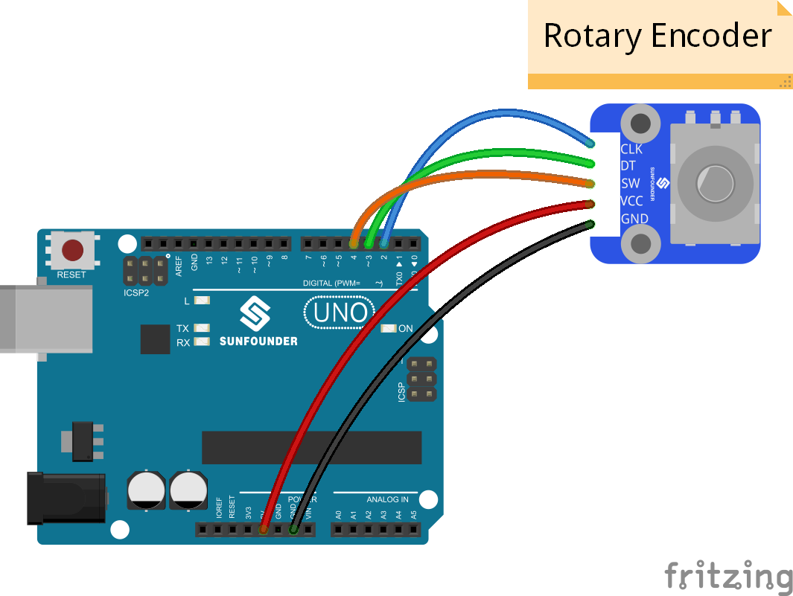
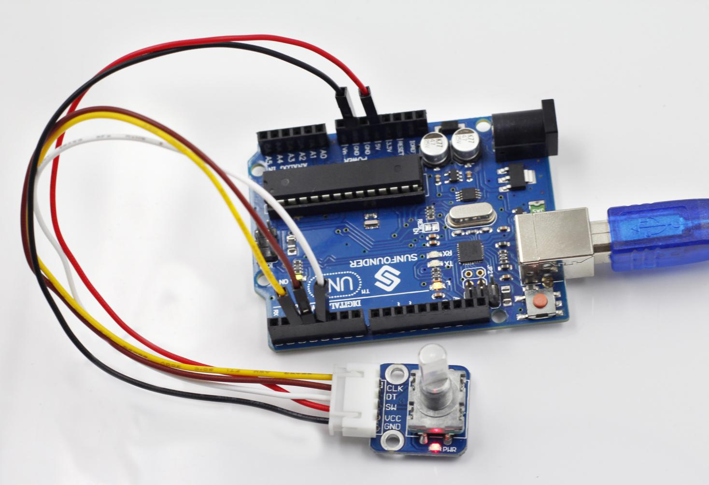

Lesson 28 Rotary Encoder
========================

**Introduction**

A rotary encoder is an electro-mechanical device that
converts the angular position or motion of a shaft or axle to an analog
or digital code. Rotary encoders are usually placed at the side which is
perpendicular to the shaft. Rotary encoders act as sensors for detecting
angle, speed, length, position and acceleration in automation field.

**Components**

- 1 \* SunFounder Uno board

- 1 \* USB data cable

- 1 \* Rotary Encoder module

- 1 \* 5-Pin anti-reverse cable

**Principle**

There are mainly two types of rotary encoder: absolute and incremental
(relative) ones. The output of absolute encoders indicates the current
position of the shaft, making them angle transducers. The output of
incremental encoders provides information about the motion of the shaft,
which is typically further processed elsewhere into information such as
speed, distance, and position.

In this experiment, we will use the latter. An incremental encoder is a
rotary sensor to turn rotational displacement into a series of digital
pulse signals which are then used to control the angular displacement.
It generates two-phase square waves whose phase difference is 90°.
Usually the two-phase square waves are called channel A and channel B as
shown below.

It is difficult to distinguish between the left turn and right turn
during SCM programming. However, when using an oscilloscope to observe
the left turn and right turn of a switch, you will find a phase
difference between the signals of the two output pins as shown below.

It shows that if output 1 is high and output 2 is high, then the switch
rotates clockwise; if output 1 is high and output 2 is low, then the
switch rotates counterclockwise. As a result, during SCM programming, if
output 1 is high, then you can tell whether the rotary encoder rotates
left or right as long as you know the state of output 2.

**Experimental Procedures**

**Step 1:** Build the circuit

The wiring between the rotary encoder and SunFounder Uno board:

+-----------------------------------+-----------------------------------+
| Rotary Encoder                    | SunFounder Uno                    |
+-----------------------------------+-----------------------------------+
| CLK                               | 2                                 |
+-----------------------------------+-----------------------------------+
| DT                                | 3                                 |
+-----------------------------------+-----------------------------------+
| SW                                | 4                                 |
+-----------------------------------+-----------------------------------+
| VCC                               | 5V                                |
+-----------------------------------+-----------------------------------+
| GND                               | GND                               |
+-----------------------------------+-----------------------------------+

**Step 2:** Open the code file

**Step 3:** Select correct Board and Port

**Step 4:** Upload the sketch to the SunFounder Uno board

Now, you can see the angular displacement of the rotary encoder printed
on Serial Monitor. When the rotary encoder rotates clockwise, the
angular displacement increases; when it does counterclockwise, the value
decreases. Press the switch on the rotary encoder, the value will return
to zero.

