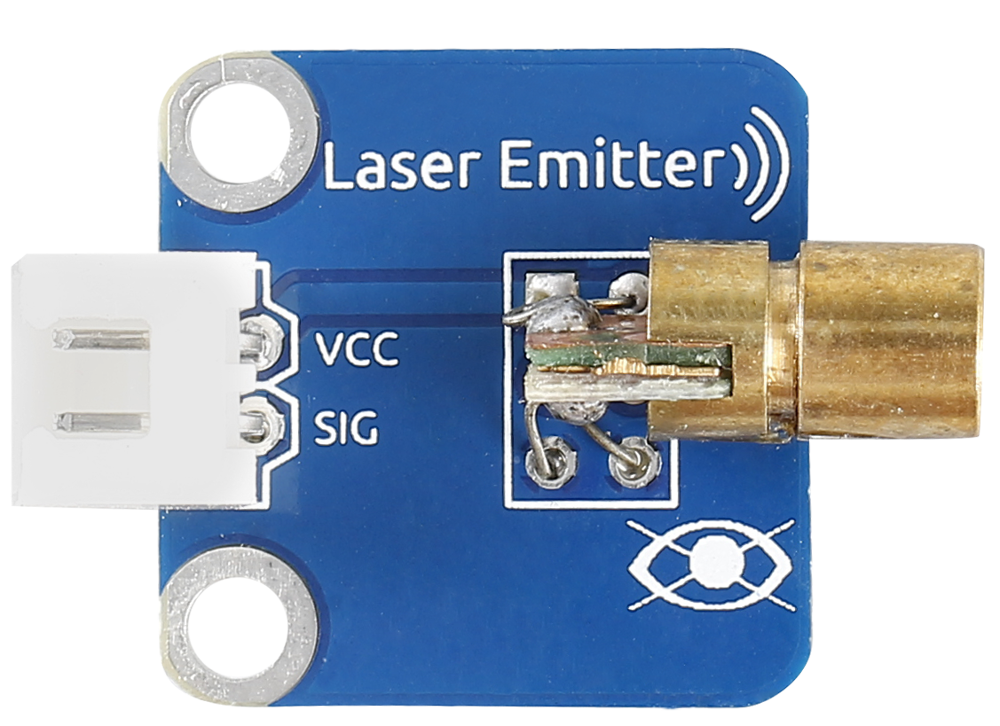
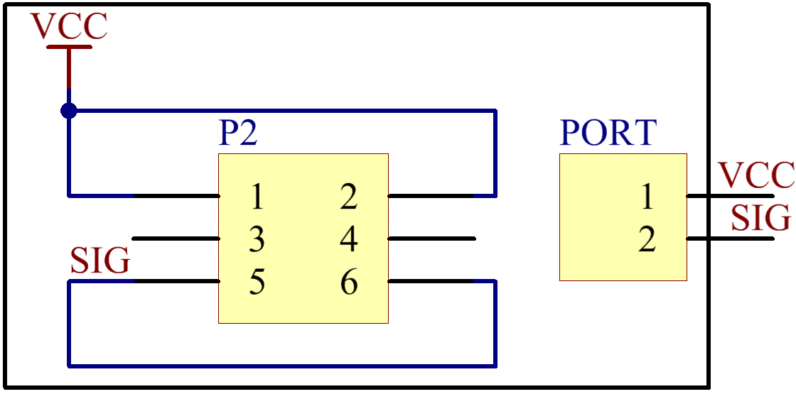
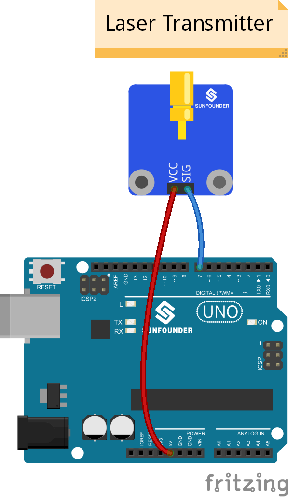
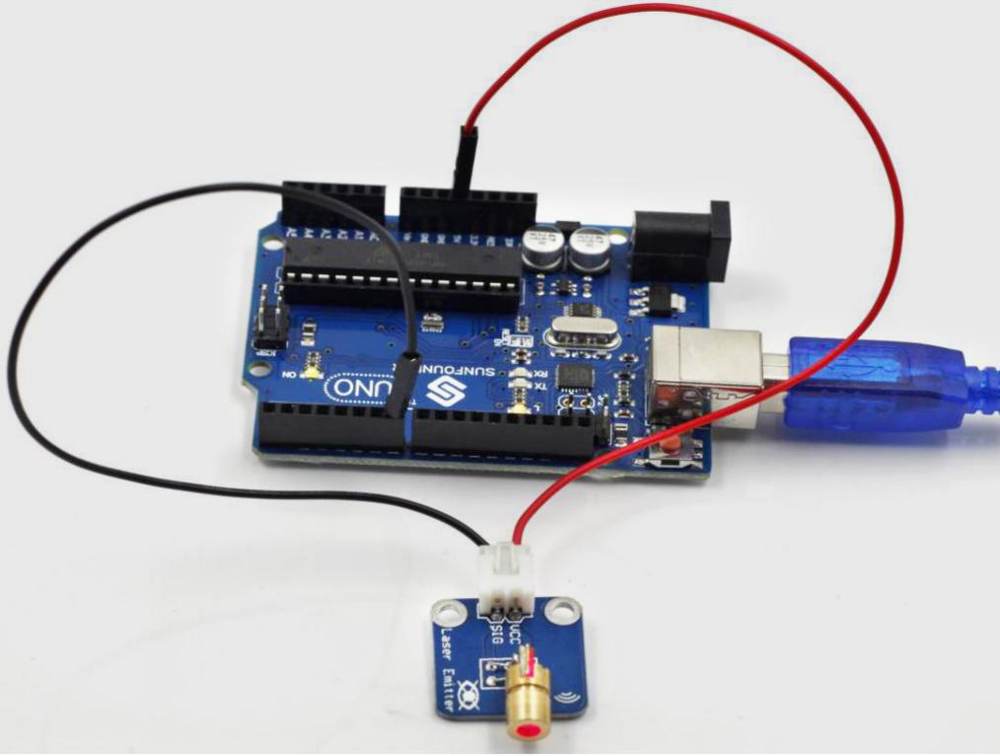

Lesson 29 Laser Transmitter
===========================

**Introduction**

Laser is widely used in medical treatment, military, and other fields
due to its good directivity and energy concentration. The Laser
Transmitter module, as the name suggests, is a one that can emit laser.

**Components**

- 1 \* SunFounder Uno board

- 1 \* USB data cable

- 1 \* Laser transmitter module

- 1 \* 2-Pin anti-reverse cable

**Principle**

A laser is a device that emits light through a process of optical
amplification based on the stimulated emission of electromagnetic
radiation. Lasers differ from other sources of light because they emit
light coherently.

Spatial coherence allows a laser to be focused to a tight spot, enabling
applications like laser cutting and lithography, and a laser beam to
stay narrow over long distances (collimation), enabling applications
such as laser pointer. Lasers can also have high temporal coherence
which allows them to have a very narrow spectrum, i.e., they only emit
light of a single color. And its temporal coherence can be used to
produce pulses of light—as short as a femtosecond.

**Experimental Procedures**

**Step 1:** Build the circuit

**Step 2:** Open the code file

**Step 3:** Select correct Board and Port

**Step 4:** Upload the sketch to the SunFounder Uno board

**Code**

.. raw:: html

    <iframe src=https://create.arduino.cc/editor/sunfounder01/1d3bfc6b-6785-4359-b62b-85570b06c9da/preview?embed style="height:510px;width:100%;margin:10px 0" frameborder=0></iframe>

Now, you can see the Laser Transmitter module send out Morse signals.

.. note:: 
    DO NOT look directly at the laser head. It can cause great harm to your eyes.