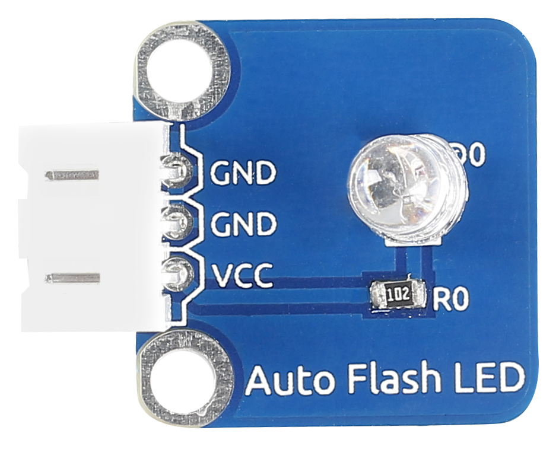
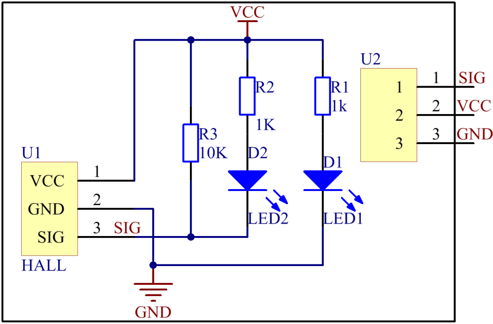
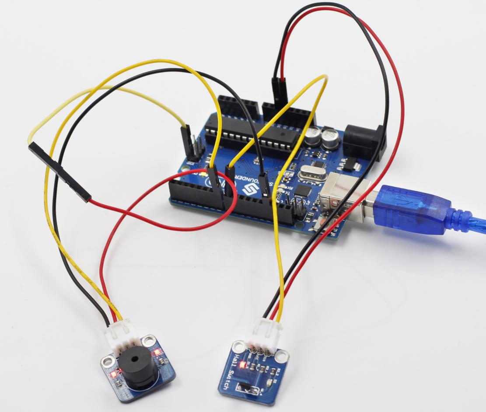
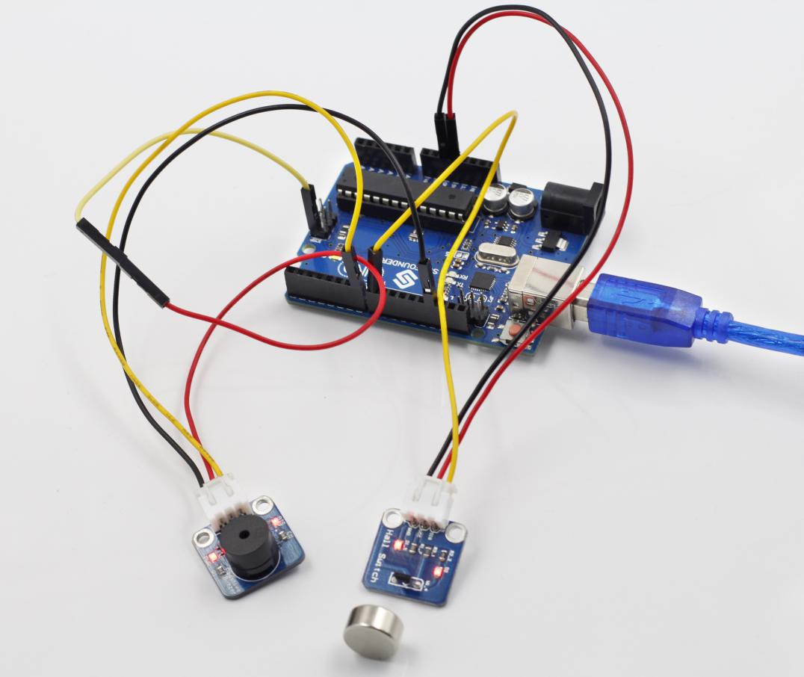

Lesson 3 Switch Hall Sensor
===========================

**Introduction**

A switch Hall sensor consists of voltage regulator, Hall element,
differential amplifier, Schmitt trigger, and output terminal. It outputs
digital values.

**Components**

- 1 \* SunFounder Uno board

- 1 \* USB data cable

- 1 \* Switch Hall sensor module

- 2 \* 3-Pin anti-reverse cable

- 1 \* Passive buzzer

- 1 \* Magnet

**Principle**

Hook up the switch Hall sensor module with pin 8 of the SunFounder Uno,
and the buzzer to pin 7. When an energized conductor approaches the
module, the output terminal SIG outputs low level; the buzzer beeps and
at the same time the corresponding LED lights up.

**Experimental Procedures**

**Step 1:** Build the circuit

The wiring between the switch Hall sensor and SunFounder Uno board:

+-----------------------------------+-----------------------------------+
| Switch Hall Sensor                | SunFounder Uno                    |
+-----------------------------------+-----------------------------------+
| SIG                               | 8                                 |
+-----------------------------------+-----------------------------------+
| VCC                               | 5V                                |
+-----------------------------------+-----------------------------------+
| GND                               | GND                               |
+-----------------------------------+-----------------------------------+

The wiring between the passive buzzer and SunFounder Uno board:

+-----------------------------------+-----------------------------------+
| Passive Buzzer                    | SunFounder Uno                    |
+-----------------------------------+-----------------------------------+
| SIG                               | 7                                 |
+-----------------------------------+-----------------------------------+
| VCC                               | 5V                                |
+-----------------------------------+-----------------------------------+
| GND                               | GND                               |
+-----------------------------------+-----------------------------------+

.. image:: media/image73.png
   :width: 500

**Step 2:** Open the code file

**Step 3:** Select correct Board and Port

**Step 4:** Upload the sketch to the SunFounder Uno board

**Code**

.. raw:: html

    <iframe src=https://create.arduino.cc/editor/sunfounder01/a2791786-da30-47cb-b3de-8c38e6abd7b6/preview?embed style="height:510px;width:100%;margin:10px 0" frameborder=0></iframe>

Now, if a magnet approaches the switch Hall sensor, the indicator light
on the sensor will light up and the buzzer will beep. At the same time,
the LED attached to pin 13 on the SunFounder Uno board will also light
up.

Before

After
