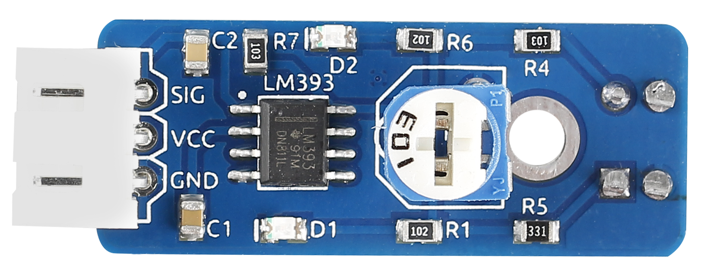
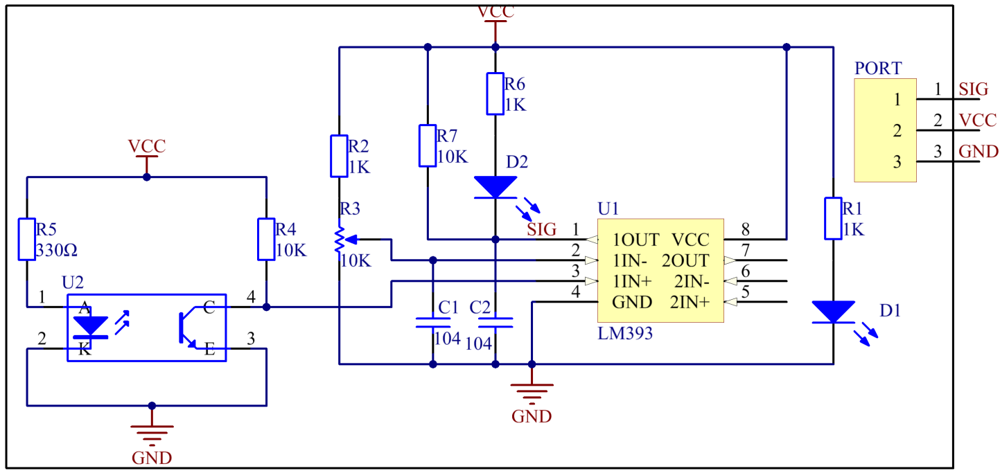
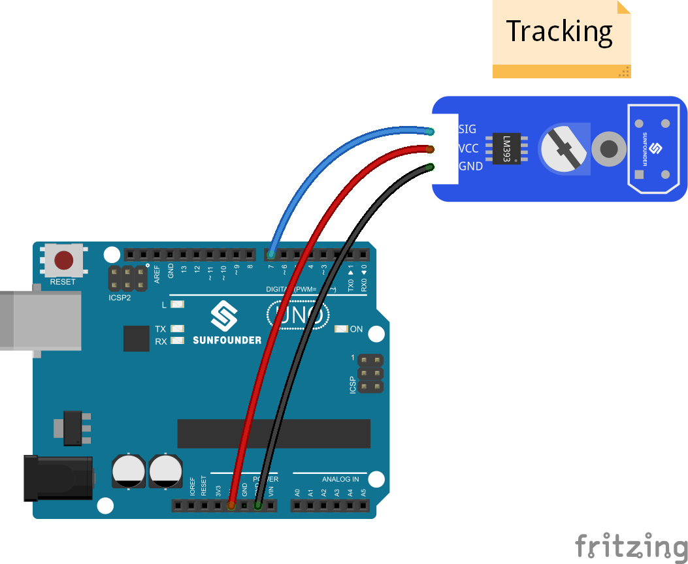

Lesson 30 IR Tracking Sensor
============================

**Introduction**

The infrared tracking sensor uses a TRT5000 sensor. The blue LED of
TRT5000 is the emission tube and after electrified it emits infrared
light invisible to human eye. The black part of the sensor is for
receiving; the resistance of the resistor inside changes with the
infrared light received.

**Components**

- 1 \* SunFounder Uno board

- 1 \* USB data cable

- 1 \* Tracking sensor module

- 1 \* 3-Pin anti-reverse cable

**Principle**

The IR emission tube of TCRT5000 sensor constantly emits infrared light.
Since the black absorbs light, when the IR emission tube shines on a
black surface, the reflected light is less and so less IR rays are
received by the receiving tube. It indicates the resistance is large;
then the comparator outputs high and the indicator LED goes out.
Similarly, when it shines on a white surface, the reflected light
becomes more. So the resistance of the receiving tube is lower; thus,
the comparator outputs low and the indicator LED lights up.

In this experiment, use a tracking sensor module and the LED attached to
pin 13 on the SunFounder Uno board to build a simple circuit. Since the
LED has been attached to pin 13, connect the pin SIG to digital pin 7 of
the Uno board. When the module gets on a black line, it output high and
the corresponding LED stays off; when it meets a white line, it outputs
low and the LED lights up. See the schematic diagram below.

**Experimental Procedures**

**Step 1:** Build the circuit

**Step 2:** Open the code file

**Step 3:** Select correct Board and Port

**Step 4:** Upload the sketch to the SunFounder Uno board

**Code**

.. raw:: html

    <iframe src=https://create.arduino.cc/editor/sunfounder01/bfbb7bbd-71d0-499b-852d-2e23d27bd2ec/preview?embed style="height:510px;width:100%;margin:10px 0" frameborder=0></iframe>

Now, draw two black bold lines on the paper. If the rays emitted by the
sensor encounter the black lines, the LED attached to pin 13 on the
SunFounder Uno board will light up; otherwise, it is off.

.. note:: 
    The black line should be wider than the TCRT5000 sensor.

.. image:: media/image166.jpeg
   :alt: \_MG_0547
   :width: 6.65972in
   :height: 4.44028in