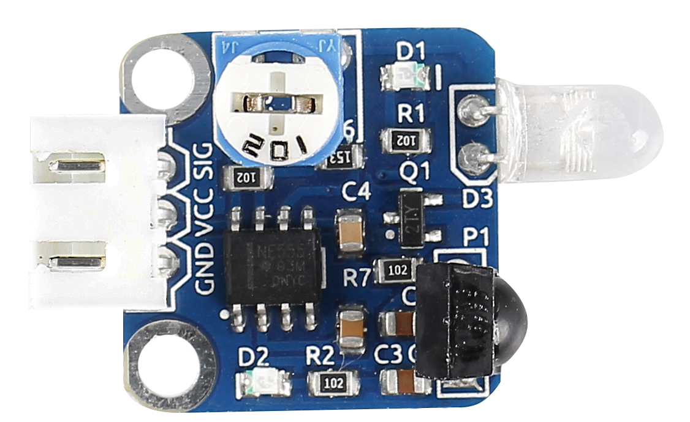
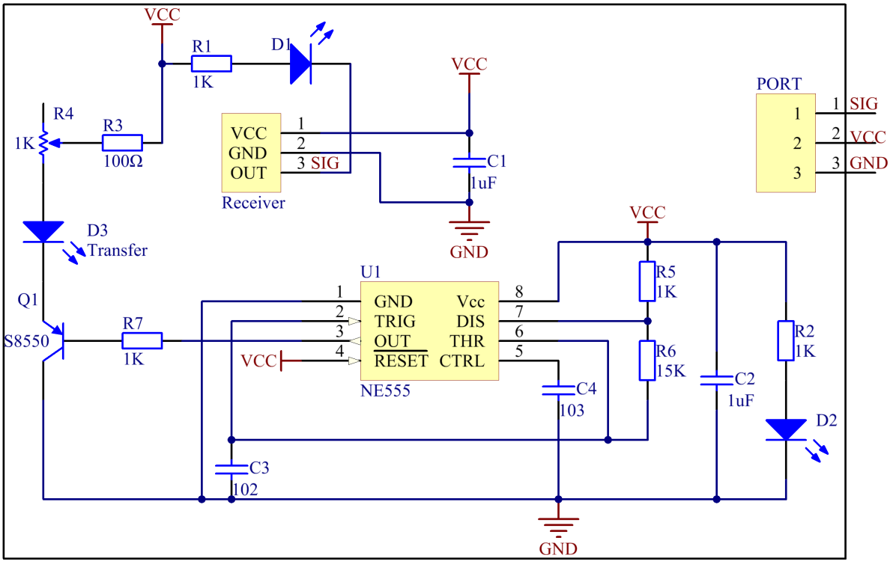
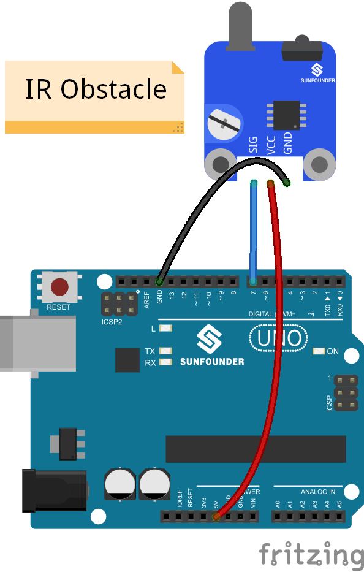
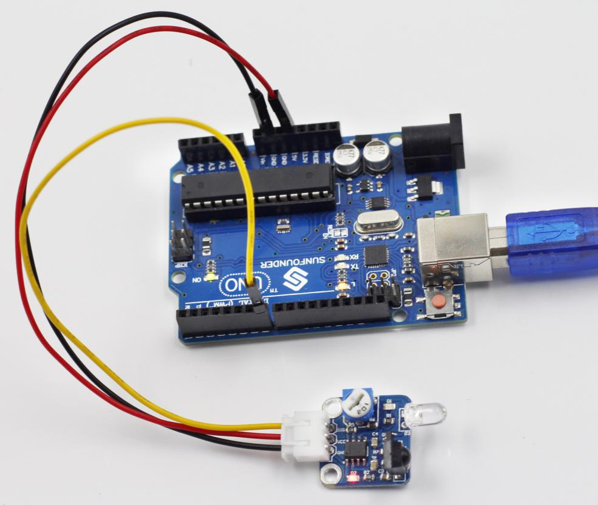
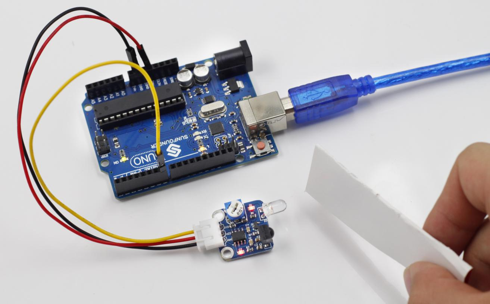

Lesson 31 IR Obstacle Avoidance Sensor
======================================

**Introduction**

An IR Obstacle Sensor works in accordance with the infrared
reflection principle to detect obstacles. When there is no object, the
infrared receiver receives no signals; when there is an object ahead
which blocks and reflects the infrared light, the infrared receiver will
receive signals.

**Components**

- 1 \* SunFounder Uno board

- 1 \* USB data cable

- 1 \* Obstacle avoidance sensor module

- 1 \* 3-Pin anti-reverse cable

**Principle**

An obstacle avoidance sensor mainly consists of an infrared transmitter,
an infrared receiver and a potentiometer. According to the reflecting
character of an object, if there is no obstacle, the emitted infrared
ray will weaken with the distance it spreads and finally disappear. If
there is an obstacle, when the infrared ray encounters it, the ray will
be reflected back to the infrared receiver. Then the infrared receiver
detects this signal and confirms an obstacle in front.

In this experiment, we will use an Obstacle Avoidance Sensor module and
the LED attached to pin 13 of the SunFounder Uno board to build a simple
circuit.

Since the LED has been attached to pin 13, connect the pin SIG to
digital pin 7 of the Uno board. When the Obstacle Avoidance Sensor
detects an obstacle, the LED will be on. Otherwise it will be off.

.. note:: 
    The detection distance of the infrared sensor is adjustable - you may adjust it by the potentiometer.

The schematic diagram is as follows:

**Experimental Procedures**

**Step 1:** Build the circuit

**Step 2:** Open the code file

**Step 3:** Select correct Board and Port

**Step 4:** Upload the sketch to the SunFounder Uno board

Now, place a piece of paper in front of the Obstacle Avoidance Sensor,
and the LED attached to pin 13 on the SunFounder Uno board will light
up.

.. note:: 
    The obstacle should better be white.

Before

With obstacle