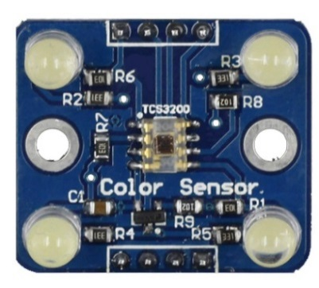
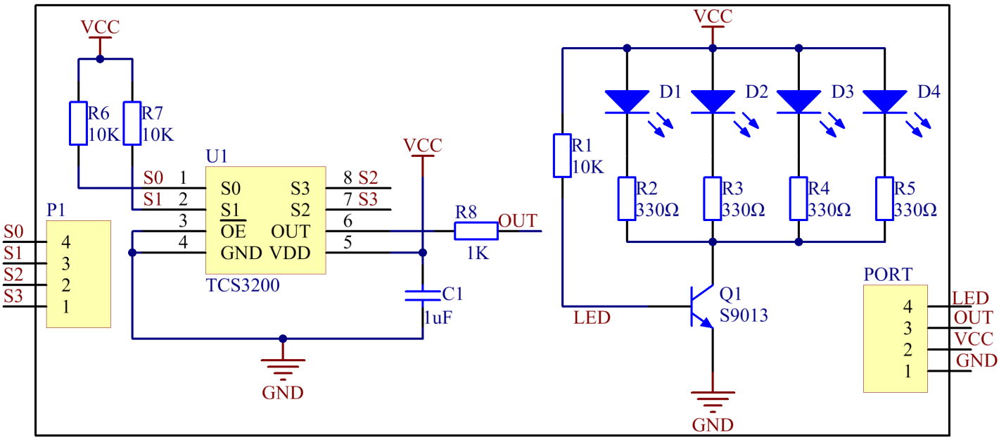
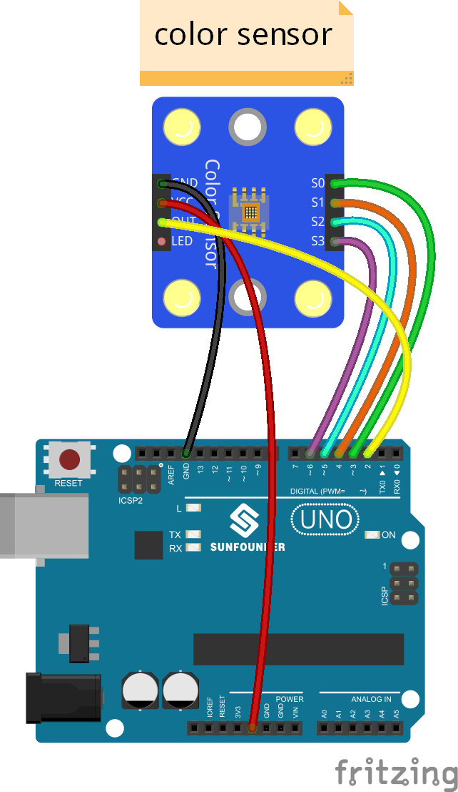
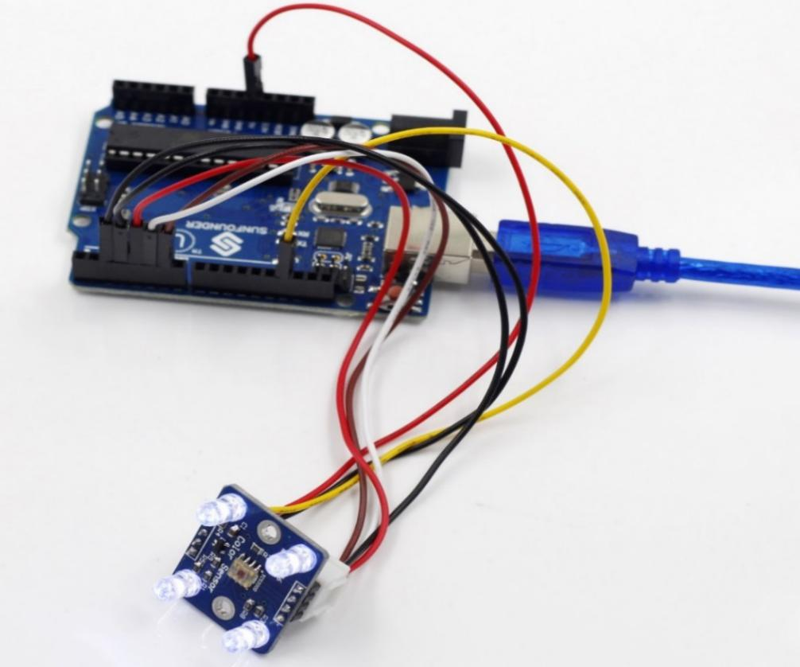

Lesson 32 Color Detection
=========================

**Introduction**

The Color Sensor is a complete color detector. It consists of a TAOS
TCS3200 RGB sensor chip and 4 white LEDs. It can detect and measure a
nearly limitless range of visible colors to a certain degree.

**Components**

- 1 \* SunFounder Uno board

- 1 \* USB data cable

- 1 \* Color sensor

- 1 \* 4-Pin anti-reverse cable

- 1 \* 3-Pin anti-reverse cable

**Principle**

The color of an object we can see in fact is the chromatic light the
object reflects in the white light (sunlight) after it absorbs the rest
ones. The white color is a mixture of various visible colors, which
means it includes each colored light like red (**R**), yellow (**Y**),
green (**G**), blue (**B**), and purple (**P**). Based on the theory of
three primary colors, any color is made by mixing the three primary
colors (red, green, and blue) in a certain proportion.

Thus, knowing the proportion you can get the color of the tested object.
For TCS3200, when a color filter is selected, it only allows a specific
primary color to pass through and blocks the other two colors. With the
light intensity value of the three primary colors, by analysis we can
know the color of light reflected to TCS3200D.

The TCS3200D sensor has 4 types of filter: red filter, green filter,
blue filter, and clear with no filter. The filter is selected based on
the high/low of pin S2 and S3 on the module (see the table below):

+-------------+---------------+---------------------------------------+
| S2          | S3            | Photo Diode Type                      |
+-------------+---------------+---------------------------------------+
| L           | L             | Red                                   |
+-------------+---------------+---------------------------------------+
| L           | H             | Blue                                  |
+-------------+---------------+---------------------------------------+
| H           | L             | Clear (no filter)                     |
+-------------+---------------+---------------------------------------+
| H           | H             | Green                                 |
+-------------+---------------+---------------------------------------+

The module contains a programmable converter which transforms colorlight
to frequency. When the part of RGB colors in the light reflected by the
object passes through the filter selected to the TAOS TCS3200RGB chip,
the built-in oscillator outputs square waves. The frequency of the waves
is directly proportional to the light intensity – the more intense the
light is, the higher is the frequency. Also, the frequency of the OUT
pin on the sensor module is proportional to that of the oscillator; the
proportion depends on the high/low of pin S0 and S1, as shown in the
table.

+-------------+---------------+----------------------------------------+
| S0          | S1            | OUTPUT Frequency Scaling (f0)          |
+-------------+---------------+----------------------------------------+
| L           | L             | Power Down                             |
+-------------+---------------+----------------------------------------+
| L           | H             | 2%                                     |
+-------------+---------------+----------------------------------------+
| H           | L             | 20%                                    |
+-------------+---------------+----------------------------------------+
| H           | H             | 100%                                   |
+-------------+---------------+----------------------------------------+

The schematic diagram of the module:

**Experimental Procedures**

**Step 1:** Build the circuit

The wiring between the color sensor and SunFounder Uno board:

+-------------------------------+--------------------------------------+
| Color Sensor                  | SunFounder Uno                       |
+-------------------------------+--------------------------------------+
| GND                           | GND                                  |
+-------------------------------+--------------------------------------+
| VCC                           | 5V                                   |
+-------------------------------+--------------------------------------+
| OUT                           | 2                                    |
+-------------------------------+--------------------------------------+
| S0                            | 3                                    |
+-------------------------------+--------------------------------------+
| S1                            | 4                                    |
+-------------------------------+--------------------------------------+
| S2                            | 5                                    |
+-------------------------------+--------------------------------------+
| S3                            | 6                                    |
+-------------------------------+--------------------------------------+

**Step 2:** Open the code file

**Step 3:** Select correct Board and Port

**Step 4:** Upload the sketch to the SunFounder Uno board

Now you may check the RGB value of the color on Serial Monitor.

