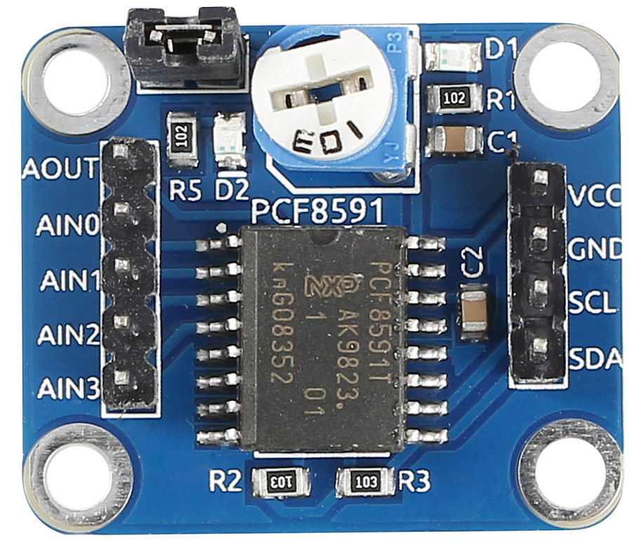
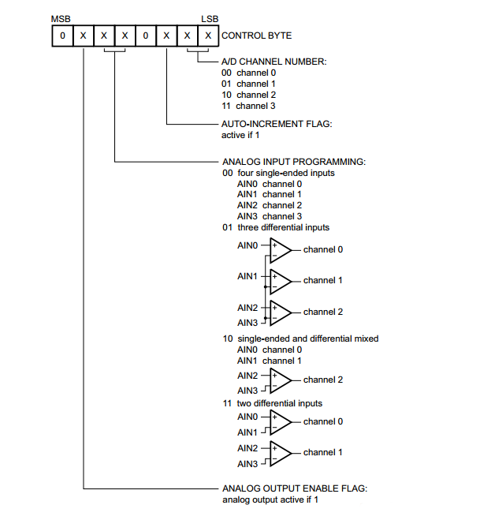
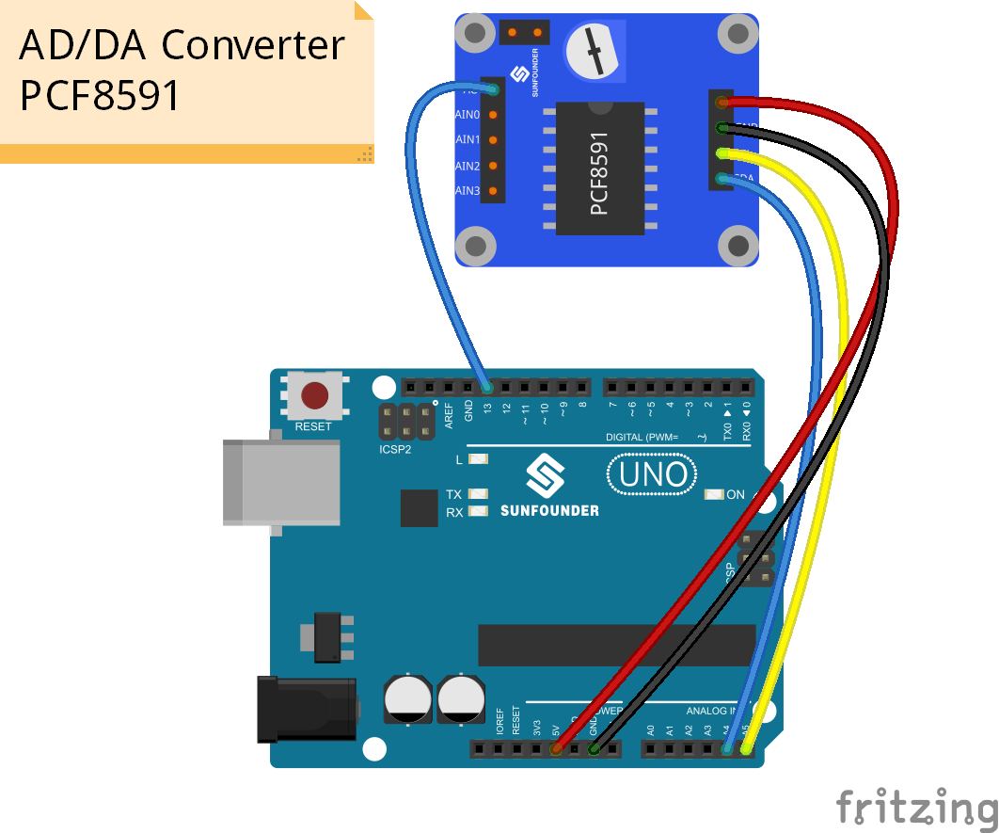
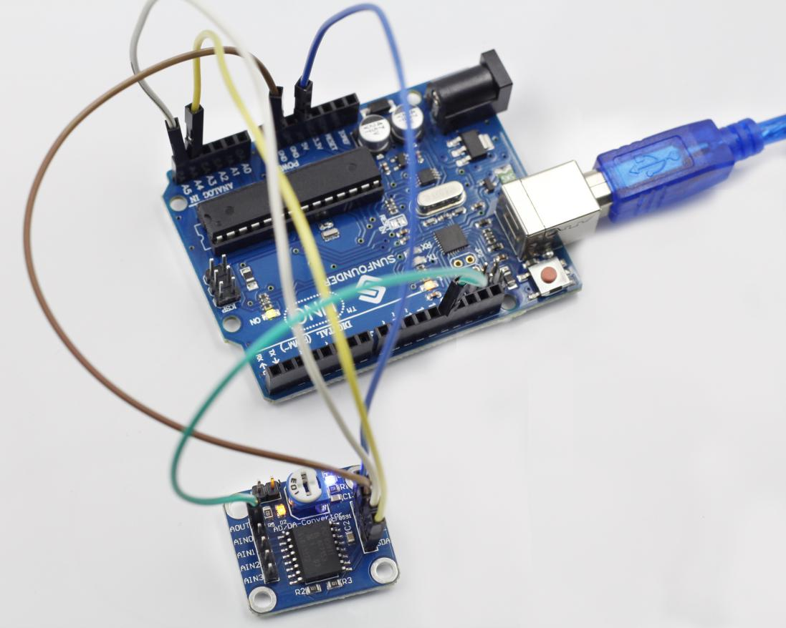

Lesson 33 Analog-Digital Converter
==================================

**Introduction**

The PCF8591 is a single-chip, single-supply and low-power
8-bit CMOS data acquisition device with four analog inputs, one analog
output and a serial I2C-bus interface. Three address pins A0, A1 and A2
are used for programming the hardware address, allowing the use of up to
eight devices connected to the I2C-bus without additional hardware.
Address, control and data to and from the device are transferred
serially via the two-line bidirectional I2C-bus.

**Components**

- 1 \* SunFounder Uno board

- 1 \* USB data cable

- 1 \* AD/DA Converter PCF8591

- 5 \* DuPont wires (M to F)

**Principle**

**Addressing**

Each PCF8591 device in an I2C-bus system is activated by sending a valid
address to the device. The address consists of a fixed part and a
programmable part. The programmable part must be set according to the
address pins A0, A1 and A2. The address always has to be sent as the
first byte after the start condition in the I2C-bus protocol. The last
bit of the address byte is the read/write-bit which sets the direction
of the following data transfer (see the figure below).

.. image:: media/image175.png
   :width: 4.11042in
   :height: 1.23611in

**Control byte**

The second byte sent to a PCF8591 device will be stored in its control
register and is required to control the device function. The upper
nibble of the control register is used for enabling the analog output,
and for programming the analog inputs as single-ended or differential
inputs. The lower nibble selects one of the analog input channels
defined by the upper nibble (see Fig.5). If the auto-increment flag is
set, the channel number is incremented automatically after each A/D
conversion. See the figure below.

In this experiment, set the second byte sent to a PCF8591 device as
high, so as to enable the analog output – make AOUT output an analog
quantity which changes gradually. The indicator light D2 on the AD/DA
converter PCF8591 gradually lights up and goes out alternately. The same
happens to the LED attached to pin 13 of the SunFounder Uno board if it
is hooked up with AOUT.

.. image:: media/image177.png
   :width: 6.65556in
   :height: 3.39583in

**Experimental Procedures**

**Step 1:** Build the circuit

The wiring between PCF8591 and SunFounder Uno board:

+-------------------------------+--------------------------------------+
| PCF8591                       | SunFounder Uno                       |
+-------------------------------+--------------------------------------+
| VCC                           | 5V                                   |
+-------------------------------+--------------------------------------+
| GND                           | GND                                  |
+-------------------------------+--------------------------------------+
| SDA                           | A4                                   |
+-------------------------------+--------------------------------------+
| SCL                           | A5                                   |
+-------------------------------+--------------------------------------+
| AOUT                          | 13                                   |
+-------------------------------+--------------------------------------+

**Step 2:** Open the code file

**Step 3:** Select correct Board and Port

**Step 4:** Upload the sketch to the SunFounder Uno board

**Code**

.. raw:: html

    <iframe src=https://create.arduino.cc/editor/sunfounder01/8fc9569a-6c79-4983-a556-5d4b096eb029/preview?embed style="height:510px;width:100%;margin:10px 0" frameborder=0></iframe>

We can see the indicator light D2 on the AD/DA converter PCF8591
gradually lights up and goes out alternately. The same happens to the
LED attached to pin 13 of the SunFounder Uno board

