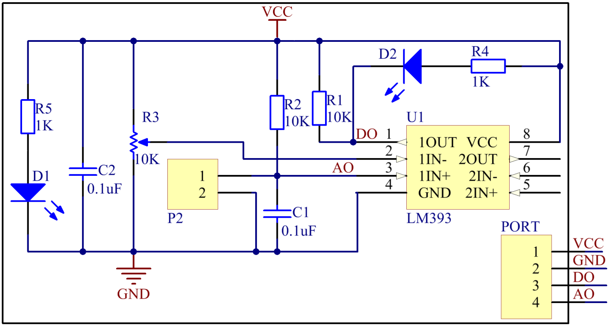
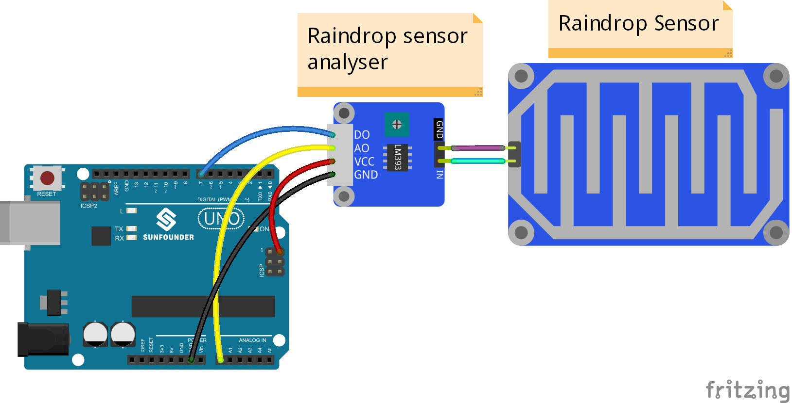
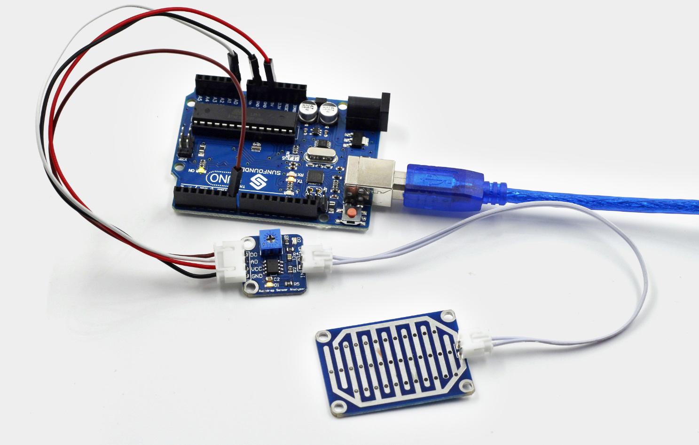

Lesson 34 Raindrop Detection
============================

**Introduction**

.. image:: media/lesson34.png
  :width: 400

A raindrop sensor, or raindrop detection sensor, is used to
detect whether it is raining and also the rainfall. It is widely used in
the automatic wiper system, smart lighting system and sunroof system of
automobiles.

**Components**

- 1 \* SunFounder Uno board

- 1 \* USB data cable

- 1 \* Raindrop Sensor

- 1 \* Raindrop Sensor Analyser

- 1 \* 4-Pin anti-reverse cable

- 1 \* 2-Pin ribbon cable

**Principle**

In a raindrop/water wiper system, detect the rainfall with the raindrop
sensor and convert the signals detected by a controller. Then the
interval of the wiper scraping will be set automatically based on the
signals, so as to control the motor of the wiper conveniently. In a
smart lighting system, detect the driving environment and adjust the
lighting mode automatically, to improve the driving safety in a severe
environment. In a smart sunroof system, detect whether it is raining –
to close the sunroof automatically if raindrops are detected.

In this experiment, we use the module and the LED attached to pin 13 of
the SunFounder Uno board to build a circuit. Hook up A0 of the raindrop
sensor module with A0 of the Uno board, D0 to pin 7. Drop some water
onto the sensor. The more drops, the lower value at A0. When the
quantity of the raindrops exceeds the threshold set, D0 will change from
high to low and the corresponding LED will light up.

The schematic diagram is shown as below:

**Experimental Procedures**

**Step 1:** Build the circuit

**Step 2:** Open the code file

**Step 3:** Select correct Board and Port

**Step 4:** Upload the sketch to the SunFounder Uno board

Now drop some water onto the sensor, When the quantities of the
raindrops exceeds the threshold, the LED on the raindrop sensor module
and that hooked up with pin 13 of the SunFounder Uno board light up;
otherwise, they stay turned off. You may adjust the sensitivity of the
sensor by the potentiometer on it, which means to set the threshold for
it.

