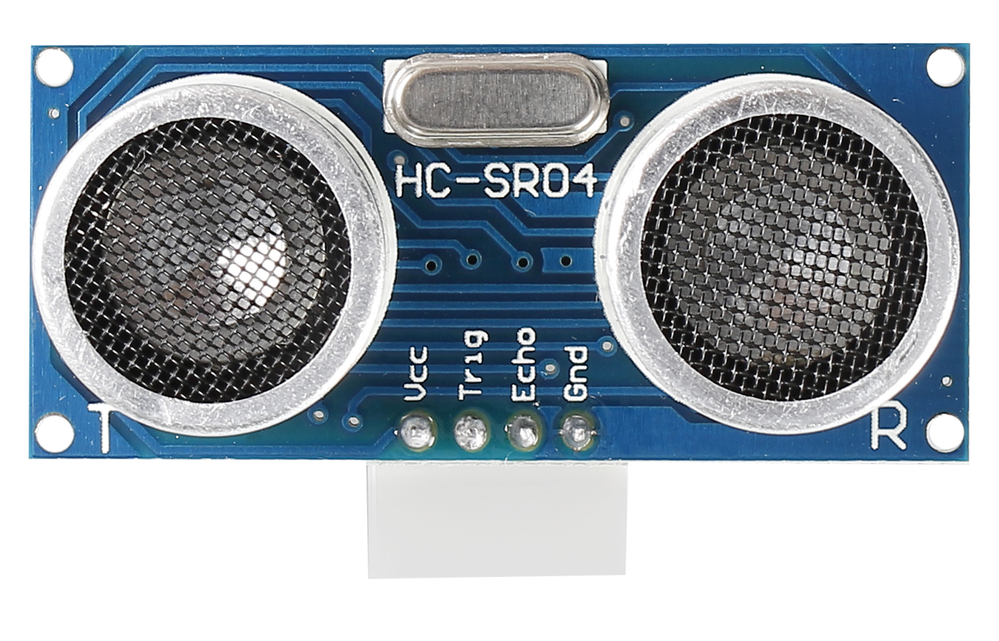
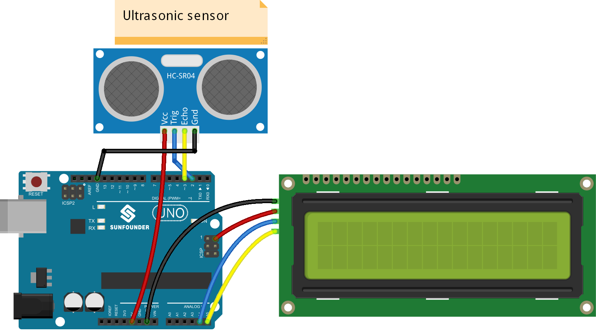
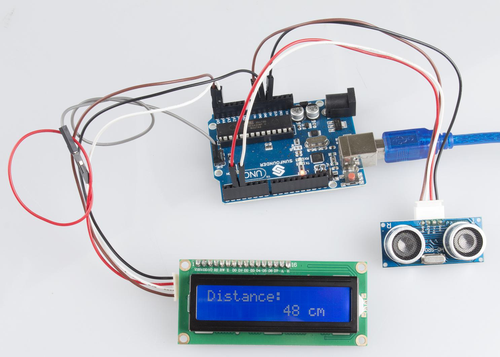

Lesson 35 Distance Detection by Ultrasonic
==========================================

**Introduction**

The ultrasonic sensor uses sound to accurately detect objects and
measure distances. It sends out ultrasonic waves and converts them into
electronic signals.

**Components**

- 1 \* SunFounder Uno board

- 1 \* USB data cable

- 1 \* Ultrasonic sensor

- 1 \* I2C LCD1602

- 2 \* 4-Pin anti-reverse cable

- 1 \* Dupont wire (F to F)

**Principle**

The sensor works by sending a sound wave out and calculating the time it
takes for the sound wave to get back to the ultrasonic sensor. By doing
this, it can tell us how far away objects are relative to the ultrasonic
sensor.

**Experimental Procedures**

**Step 1:** Build the circuit

The wiring between the ultrasonic sensor and SunFounder Uno board:

+-----------------------------------+-----------------------------------+
| Ultrasonic Sensor                 | SunFounder Uno                    |
+-----------------------------------+-----------------------------------+
| VCC                               | 5V                                |
+-----------------------------------+-----------------------------------+
| Trig                              | 2                                 |
+-----------------------------------+-----------------------------------+
| Echo                              | 3                                 |
+-----------------------------------+-----------------------------------+
| GND                               | GND                               |
+-----------------------------------+-----------------------------------+

**Step 2:** Open the code file

**Step 3:** Select correct Board and Port

**Step 4:** Upload the sketch to the SunFounder Uno board

Now, move a piece of paper close to the sensor or remove it farther. You
can see the value displayed on the LCD changes accordingly; it indicates
the distance between the paper and the ultrasonic sensor.

