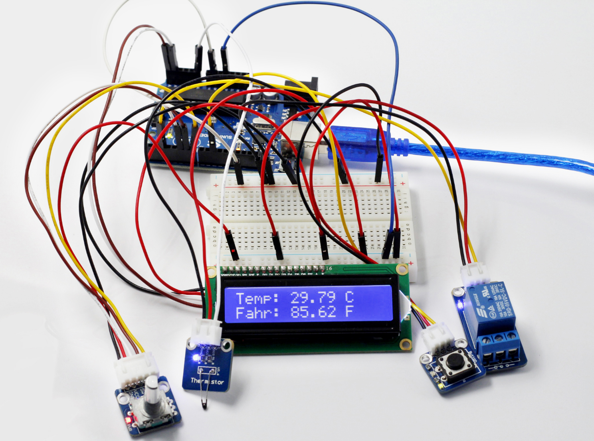

Lesson 36 Thermostatic Water Tank
=================================

**Introduction**

After having learnt so many modules independently, let’s combine these
modules together to make some funny interactive works. In this lesson,
we will use a Rotary Encoder module, a Thermistor module, a Relay
module, a Button module and an I2C LCD1602, all of which we have learnt
previously, to assemble a Thermostatic Water Tank. The tank can be used
in the test department of medical organizations and colleges, scientific
research, chemical industry, printing and dyeing industry to distil,
dry, inspissate and heat chemical medicines and cultivate biological
products in constant temperature, as well as to boil and disinfect
equipment.

**Components**

- 1 \* SunFounder Uno board

- 1 \* USB data cable

- 1 \* Rotary Encoder module

- 1 \* Thermistor module

- 1 \* I2C LCD1602

- 1 \* Relay module

- 1 \* Button module

- 3 \* 3-Pin anti-reverse cable

- 1 \* 5-Pin anti-reverse cable

- 1 \* 4-Pin anti-reverse cable

- 2 \* Dupont wire (M to M)

- 1 \* Breadboard

**Principle**

**How a thermostatic water tank works**

Set a temperature value for the tank. When the temperature is lower than
that set, the tank gets heated and is power off till the temperature
reaches the set value. Thus, the tank can keep a constant temperature
all the time.

Based on the principle, in this experiment, use an LCD screen and a
thermistor module to both display value of the current temperature and
the value set. Also use a rotary encoder to allow the set temperature
value adjustable.

When the temperature is lower than that set, the normally open contact
of the relay is closed and the characters on the LCD blur. Touch the
thermistor with fingers and the temperature gets higher. When it reaches
or is higher than the value set, the contact is open and the characters
will become clear again.

For more about each component in the experiment, please see the previous
experiments.

**Experimental Procedures**

**Step 1:** Build the circuit

The wiring between the Button module and SunFounder Uno board:

+---------------------------------+------------------------------------+
| Button                          | SunFounder Uno                     |
+---------------------------------+------------------------------------+
| SIG                             | 10                                 |
+---------------------------------+------------------------------------+
| VCC                             | 5V                                 |
+---------------------------------+------------------------------------+
| GND                             | GND                                |
+---------------------------------+------------------------------------+

The wiring between the Thermistor module and SunFounder Uno is as shown
below:

+---------------------------------+------------------------------------+
| Thermistor                      | SunFounder Uno                     |
+---------------------------------+------------------------------------+
| SIG                             | A0                                 |
+---------------------------------+------------------------------------+
| VCC                             | 5V                                 |
+---------------------------------+------------------------------------+
| GND                             | GND                                |
+---------------------------------+------------------------------------+

The wiring between the Rotary Encoder module and SunFounder Uno:

+-------------------------------+--------------------------------------+
| Rotary Encoder                | SunFounder Uno                       |
+-------------------------------+--------------------------------------+
| CLK                           | 7                                    |
+-------------------------------+--------------------------------------+
| DT                            | 6                                    |
+-------------------------------+--------------------------------------+
| SW                            | 5                                    |
+-------------------------------+--------------------------------------+
| VCC                           | 5V                                   |
+-------------------------------+--------------------------------------+
| GND                           | GND                                  |
+-------------------------------+--------------------------------------+

The wiring between the Relay module and SunFounder Uno:

+------------------------------+---------------------------------------+
| Relay                        | SunFounder Uno                        |
+------------------------------+---------------------------------------+
| SIG                          | 2                                     |
+------------------------------+---------------------------------------+
| VCC                          | 5V                                    |
+------------------------------+---------------------------------------+
| GND                          | GND                                   |
+------------------------------+---------------------------------------+

The wiring between the I2C LCD1602 module and SunFounder Uno:

+-------------------------------+--------------------------------------+
| I2C LCD1602                   | SunFounder Uno                       |
+-------------------------------+--------------------------------------+
| VCC                           | 5V                                   |
+-------------------------------+--------------------------------------+
| GND                           | GND                                  |
+-------------------------------+--------------------------------------+
| SDA                           | A4                                   |
+-------------------------------+--------------------------------------+
| SCL                           | A5                                   |
+-------------------------------+--------------------------------------+

.. image:: media/image185.png
   :width: 600

**Step 2:** Open the code file

**Step 3:** Select correct Board and Port

**Step 4:** Upload the sketch to the SunFounder Uno board

**Code**

.. raw:: html

    <iframe src=https://create.arduino.cc/editor/sunfounder01/d602f97e-4d33-4f4b-b8dc-6f045fbd8e0c/preview?embed style="height:510px;width:100%;margin:10px 0" frameborder=0></iframe>

Now, after the startup, the LCD1602 first displays **Thermostatic Water
Tank** and then the value of the current temperature. Press the button
on the Button module to enter setup mode. Then rotate the Rotary Encoder
to change the threshold of the temperature value. After setting a value,
like 30℃, you can press the switch on the Rotary Encoder module to
confirm.

If the current temperature is lower than 30℃ (the threshold you just
set), the normally open contact of the relay is closed. Thus, the
characters on the LCD become blurred and the LED on the SunFounder Uno
goes out. Touch the thermistor. Then the value displayed on the LCD will
increase and at last the LED on the Uno board will light up. Release
your fingers and the value of temperature displayed on the LCD will
decrease. When the value reaches the threshold, the contact is open,
characters on the LCD blurred, and LED out.

