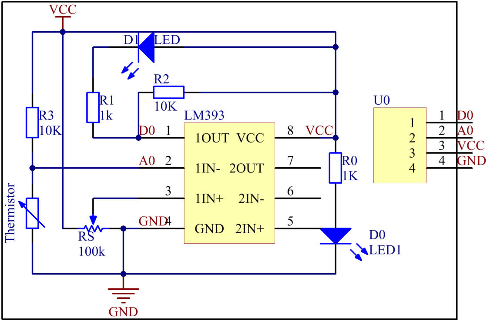
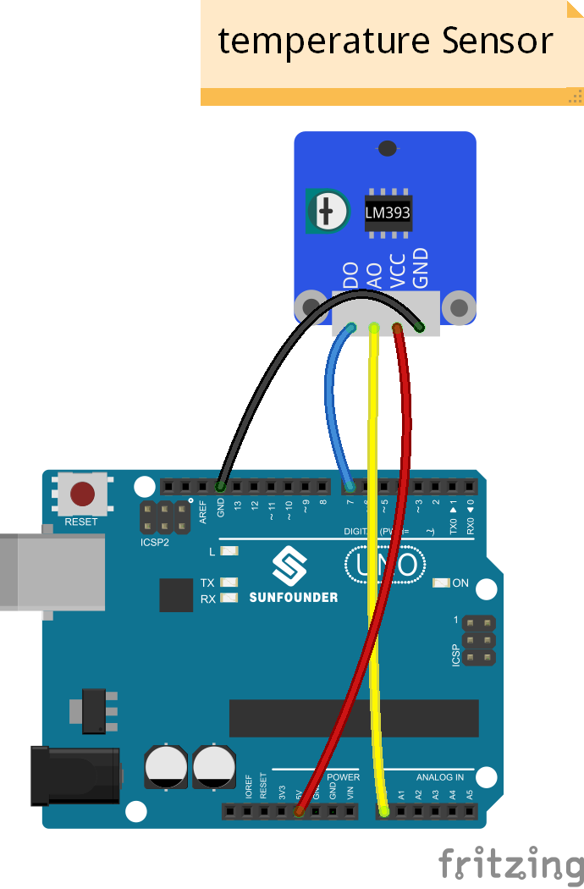
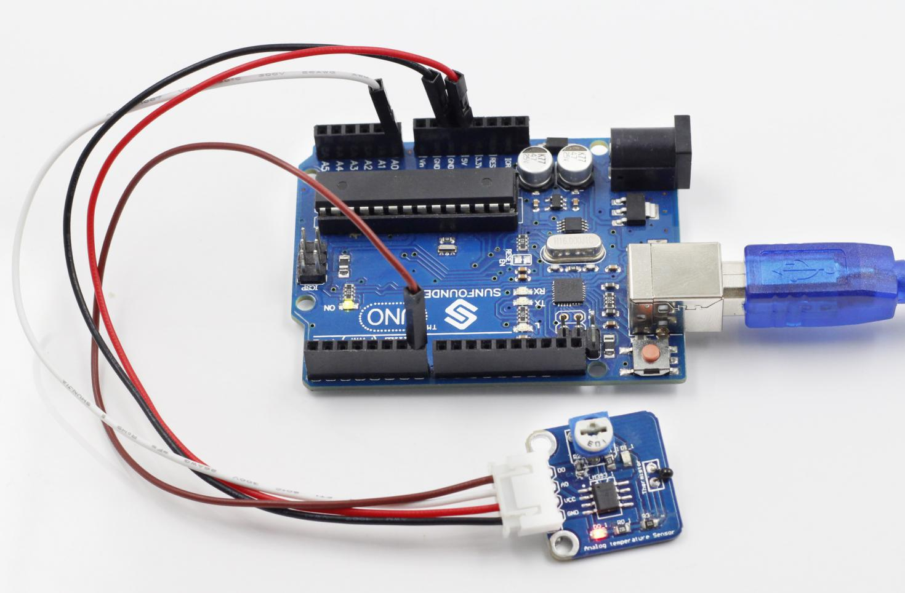

Lesson 4 Analog Temperature Sensor
==================================

**Introduction**

A temperature sensor is a component that senses temperature and converts
it into output signals. By material and component features, temperature
sensors can be divided into two types: thermal resistor and
thermocouple. Thermistor is one kind of the former type. It is made of
semiconductor materials; most thermistors are negative temperature
coefficient (NTC) ones, the resistance of which decreases with rising
temperature. Since their resistance changes acutely with temperature
changes, thermistors are the most sensitive temperature sensors.

The Analog Temperature Sensor module uses an NTC thermistor, thus
measuring temperature sensitively. It also has a built-in comparator
LM393 which enables the module to output both digital and analog signals
at the same time. The module can be used for temperature alarm and
temperature measurement.

.. image:: media/image5.png
   :width: 2.93681in
   :height: 2.31597in

**Components**

- 1 \* SunFounder Uno board

- 1 \* USB data cable

- 1 \* Analog temperature sensor module

- 1 \* 4-Pin anti-reverse cable

**Principle**

There is a comparator LM393 on the analog temperature sensor module. You
may set a threshold by the potentiometer on it. When you touch the
thermistor, the value of A0 decreases. Once the value is lower than the
threshold, D0 will output high level and the indicator LED on the analog
temperature sensor module and that attached to pin 13 of the SunFounder
Uno will go out. You can check the value of A0 and D0 on Serial Monitor.
The schematic diagram of the module:

**Experimental Procedures**

**Step 1:** Build the circuit

**Step 2:** Open the code file

**Step 3:** Select correct Board and Port

**Step 4:** Upload the sketch to the SunFounder Uno board

**Code**

.. raw:: html

    <iframe src=https://create.arduino.cc/editor/sunfounder01/cdf802aa-ba44-4d11-9112-fb6ef1b33860/preview?embed style="height:510px;width:100%;margin:10px 0" frameborder=0></iframe>

Now, touch the thermistor, and the LED on the analog temperature sensor
module and that attached to pin 13 of the SunFounder Uno will go out.

