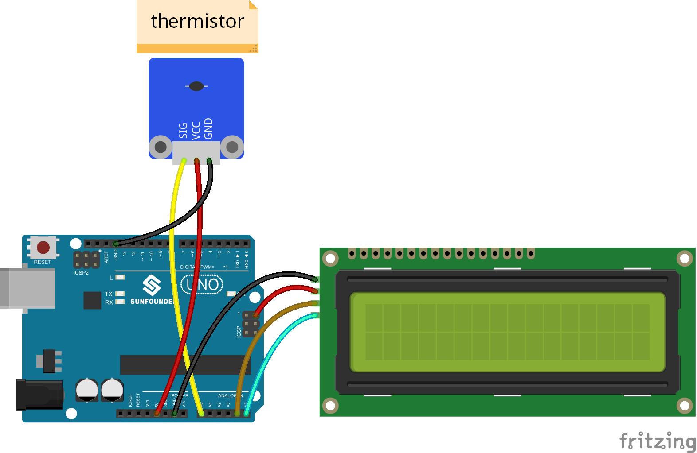
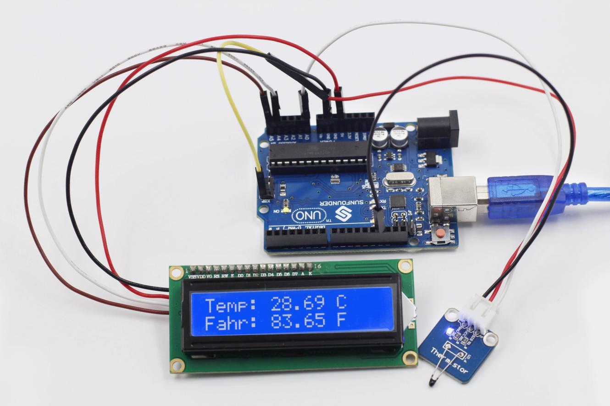

Lesson 5 Temperature Detection by Thermistor
============================================

**Introduction**

.. image:: media/image7.png
   :width: 250

As mentioned in Lesson 4, thermistors are the most sensitive
temperature sensors because their resistance changes acutely with
temperature changes. Therefore, the thermistor sensor module measures
temperature sensitively though it can output only analog signals. The
module is often used to detect the temperature changes in ambient
environment.

**Components**

- 1 \* SunFounder Uno board

- 1 \* USB data cable

- 1 \* Thermistor module

- 1 \* I2C LCD1602 module

- 1 \* 3-Pin anti-reverse cable

- 1 \* 4-Pin anti-reverse cable

- 1 \* Dupont wire (F to F)

**Principle**

How a thermistor works: its resistance varies significantly with the
ambient temperature. It can detect surrounding temperature changes in a
real-time manner and send the temperature data to analog I/O port of the
SunFounder board. What you need to do is convert the output to Celsius
temperatures by simple programming and then display it on an LCD.

The schematic diagram of the module:

**Experimental Procedures**

**Step 1:** Build the circuit

**Step 2:** Open the code file

**Step 3:** Select correct Board and Port

**Step 4:** Upload the sketch to the SunFounder Uno board

**Code**

.. raw:: html

    <iframe src=https://create.arduino.cc/editor/sunfounder01/1aec8fb2-11d1-41ca-ad26-a9c51c47248b/preview?embed style="height:510px;width:100%;margin:10px 0" frameborder=0></iframe>

Now, you can see the current value of temperature displayed on the LCD,
in both Celsius and Fahrenheit degrees.

