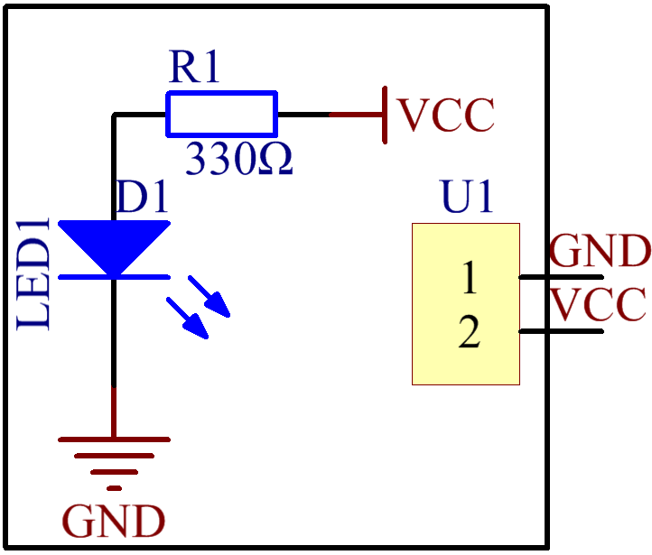
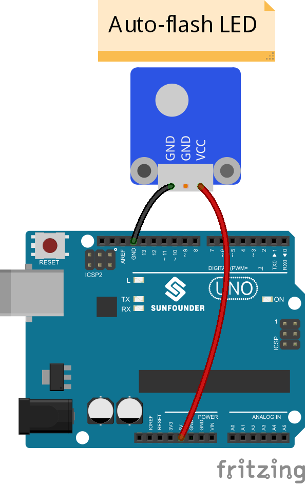
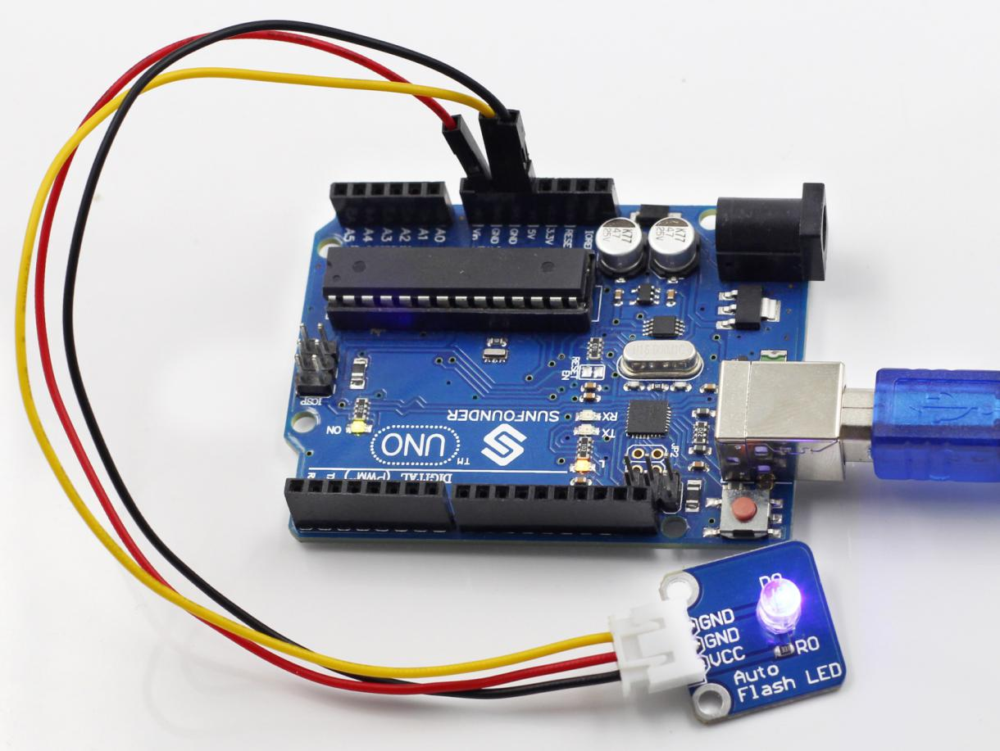

Lesson 6 Auto-flash LED
=======================

**Introduction**

.. image:: media/image6.png
   :width: 250

The 7-color auto-flash LED module can automatically flash built-in
colors after power on. It can be used to make quite fascinating light
effects.

**Components**

- 1 \* SunFounder Uno board

- 1 \* USB data cable

- 1 \* 7-color auto-flash LED module

- 1 \* 3-Pin anti-reverse cable

**Principle**

When it is power on, the 7-color auto flash LED will flash built-in
colors. The schematic diagram of the module:

**Experimental Procedures**

Just connect pin VCC of the module to 5V of the SunFounder Uno board and
pin GND to GND.

.. note::
    There are two GND pins on the module. You only need to connect one of them.

Now, you should see the LED flashing seven colors.

