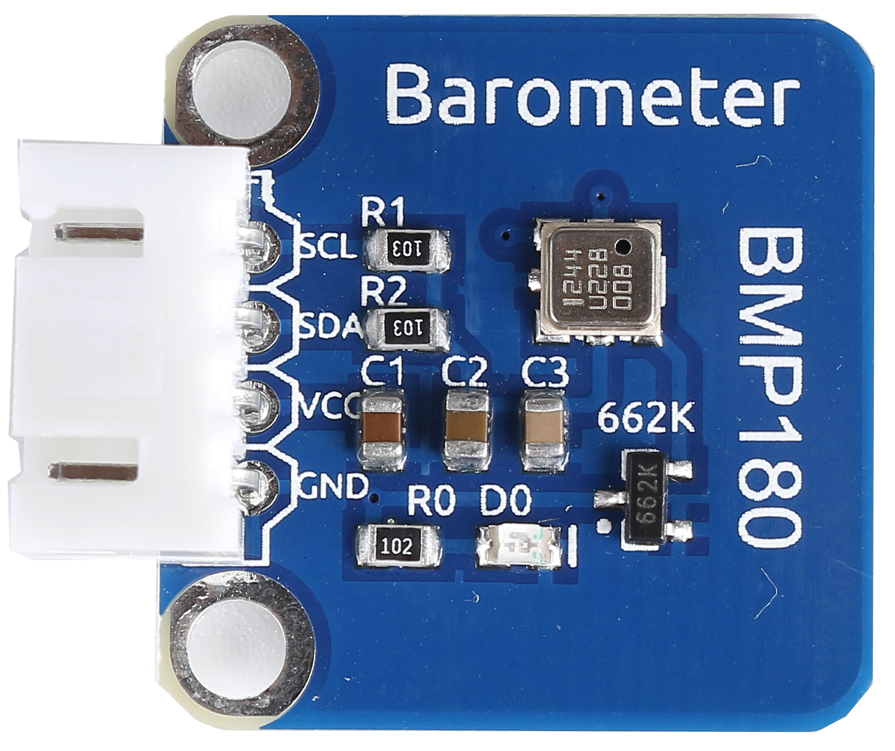
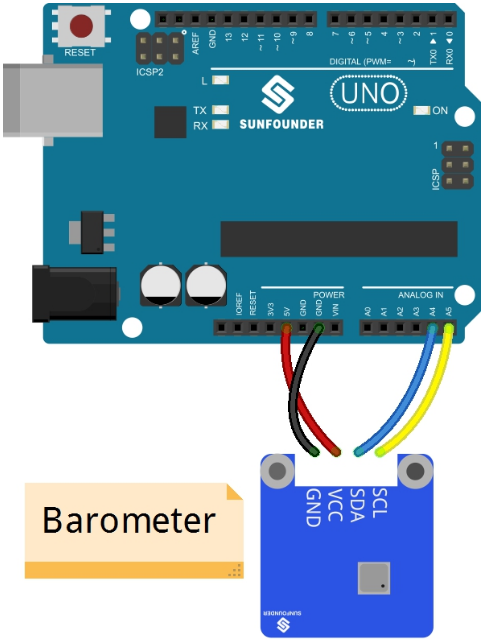
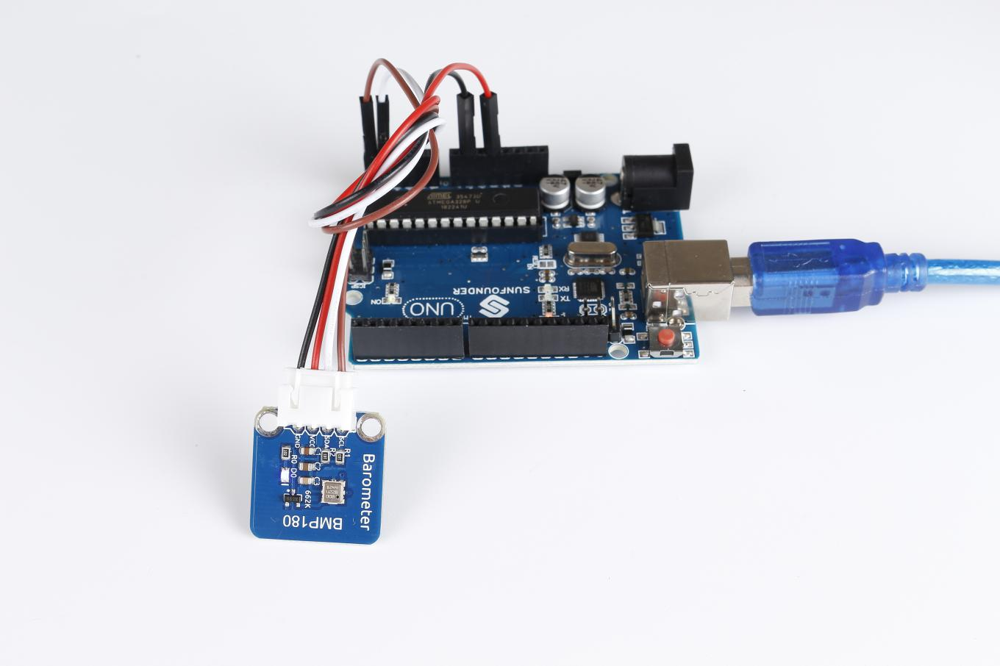
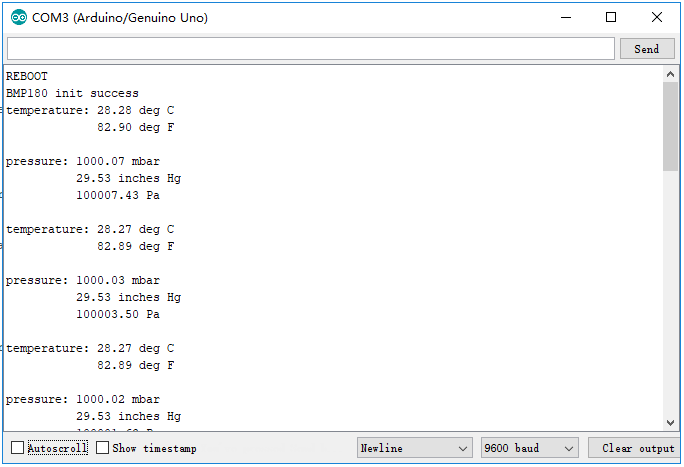

Lesson 7 Barometer BMP180
=========================

**Introduction**

The BMP180 barometer is the new digital barometric pressure
sensor, with a very high performance, which enables applications in
advanced mobile devices, such as smart phones, tablets and sports
devices. It complies with the BMP085 but boasts many improvements, like
a smaller size and more digital interfaces.

**Components**

- 1 \* SunFounder Uno Board

- 1 \* USB Cable

- 1 \* BMP180 Module

- Several Jump Wires

- 1\* Breadboard

**Principle**

The schematic diagram of the module:

.. image:: media/image85.png
   :alt: IMG_256
   :width: 6.09722in
   :height: 4.42153in

**Experimental Procedures**

**Step 1:** Build the circuit

+-----------------------+----------------------------------------------+
| BMP180                | SunFounder Uno/Mega2560                      |
+-----------------------+----------------------------------------------+
| VCC                   | 5V                                           |
+-----------------------+----------------------------------------------+
| GND                   | GND                                          |
+-----------------------+----------------------------------------------+
| SCL                   | A5/Pin 21 Mega2560                           |
+-----------------------+----------------------------------------------+
| SDA                   | A4/Pin 20 Mega2560                           |
+-----------------------+----------------------------------------------+

**Step 2:** Open the code file

**Step 3:** Select correct Board and Port

**Step 4:** Upload the sketch to the SunFounder Uno board

Open the serial monitor, and you will see the figures of the temperature
and the air pressure.

