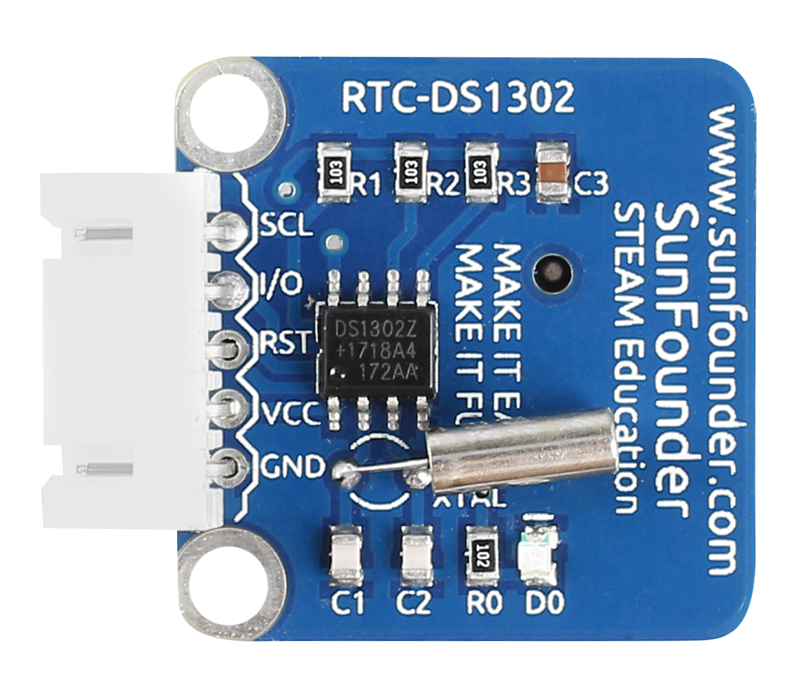
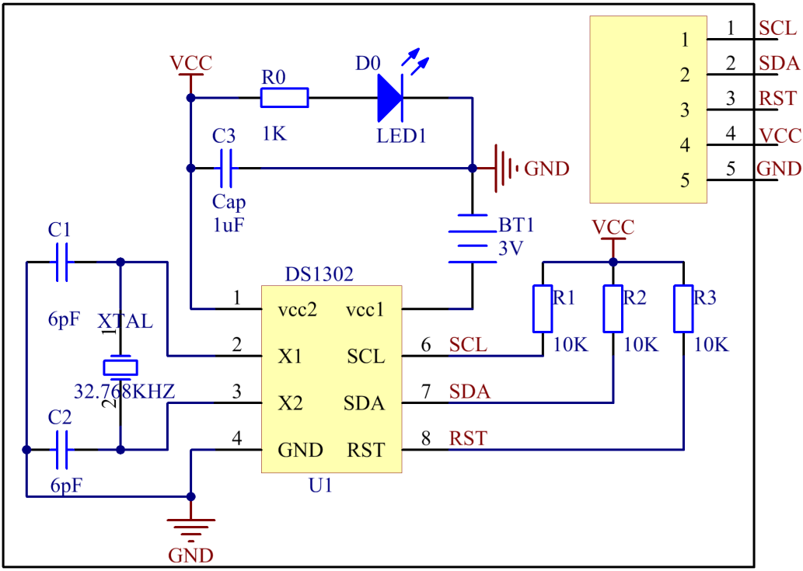
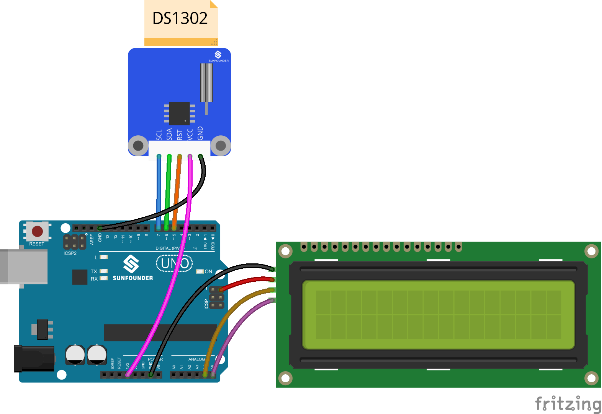
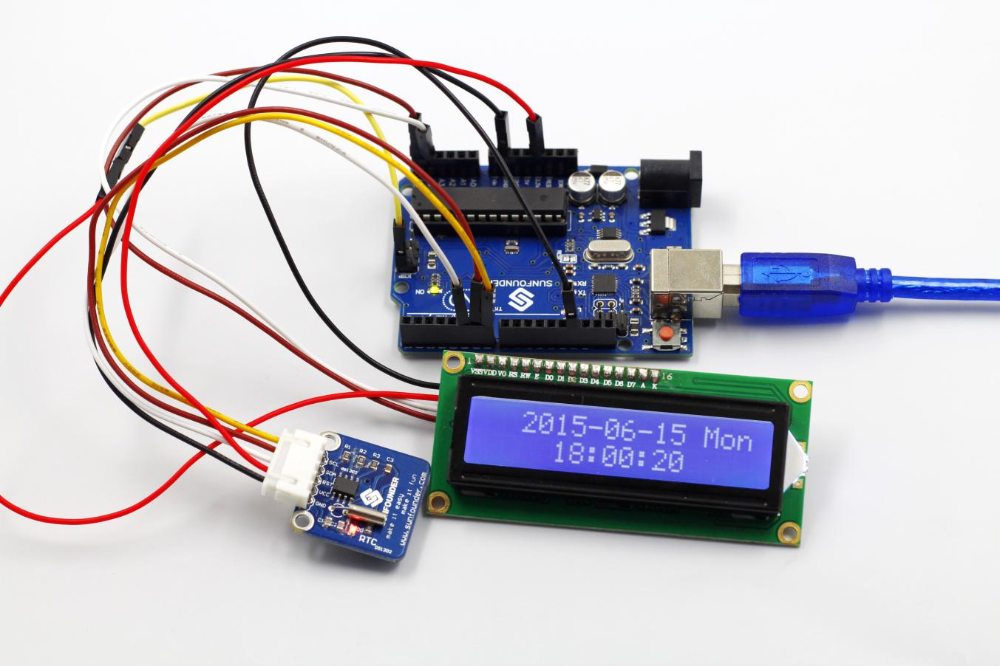

Lesson 8 Real-time Clock Module
===============================

**Introduction**

Nowadays there are many popular serial clock circuits such as DS1302,
DS1307, PCF8485, etc. They are widely used for simple interface, low
cost, and ease of use. In this lesson, we will use the DS1302 real-time
clock (RTC) module to obtain current date and time.

**Components**

- 1 \* SunFounder Uno board

- 1 \* USB data cable

- 1 \* RTC-DS1302 module

- 1 \* I2C LCD1602 module

- 1 \* 5-Pin anti-reverse cable

- 1 \* 4-Pin anti-reverse cable

- 1 \* Dupont wire (F to F)

**Principle**

DS1302 is a trickle charging clock chip, launched by DALLAS in America.
With a built-in real-time clock/calendar and a 31-byte static RAM, it
can communicate with MCU through simple serial ports. The real-time
clock/calendar circuit provides information about second, minute, hour,
day, week, month, and year. DS1302 can automatically adjust the number
of days per month and days in leap year. You can determine to use a
24-hour or 12-hour system by AM/PM selection. It can simply communicate
with MCU in synchronous serial way and only needs to use three port
cables: Reset (RST) cable, I/O data (SDA) cable and serial clock (SCL)
cable. The schematic diagram of the module:

**Experimental Procedures**

**Step 1:** Build the circuit

The wiring between DS1302 and SunFounder Uno board is as shown below:

+-----------------------------------+-----------------------------------+
| DS1302                            | SunFounder Uno                    |
+-----------------------------------+-----------------------------------+
| SCL                               | 7                                 |
+-----------------------------------+-----------------------------------+
| SDA                               | 6                                 |
+-----------------------------------+-----------------------------------+
| RST                               | 5                                 |
+-----------------------------------+-----------------------------------+
| VCC                               | 3.3V                              |
+-----------------------------------+-----------------------------------+
| GND                               | GND                               |
+-----------------------------------+-----------------------------------+

**Step 2:** Open the code file

**Step 3:** Select correct Board and Port

**Step 4:** Upload the sketch to the SunFounder Uno board

**Code**

.. raw:: html

    <iframe src=https://create.arduino.cc/editor/sunfounder01/f8242818-bd18-416e-9133-2b85fe1f26d7/preview?embed style="height:510px;width:100%;margin:10px 0" frameborder=0></iframe>

Now, you can see the current date and time information displayed on the
I2C LCD1602.

