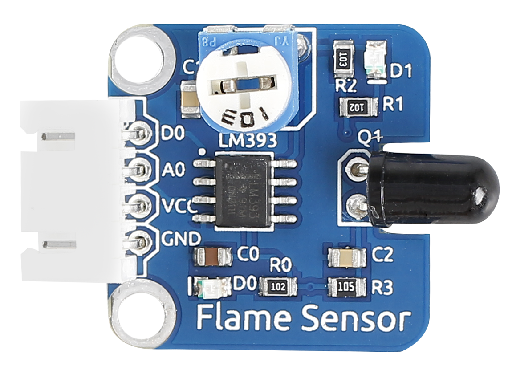
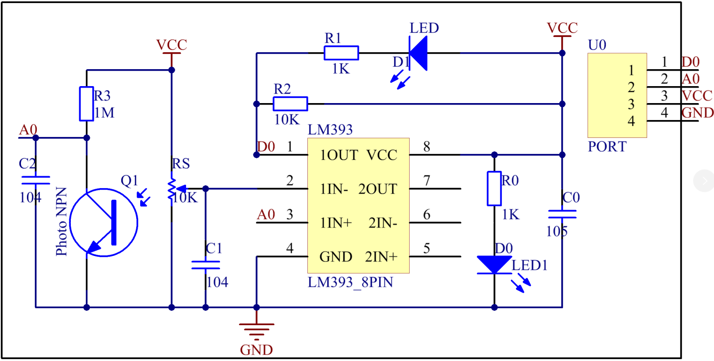
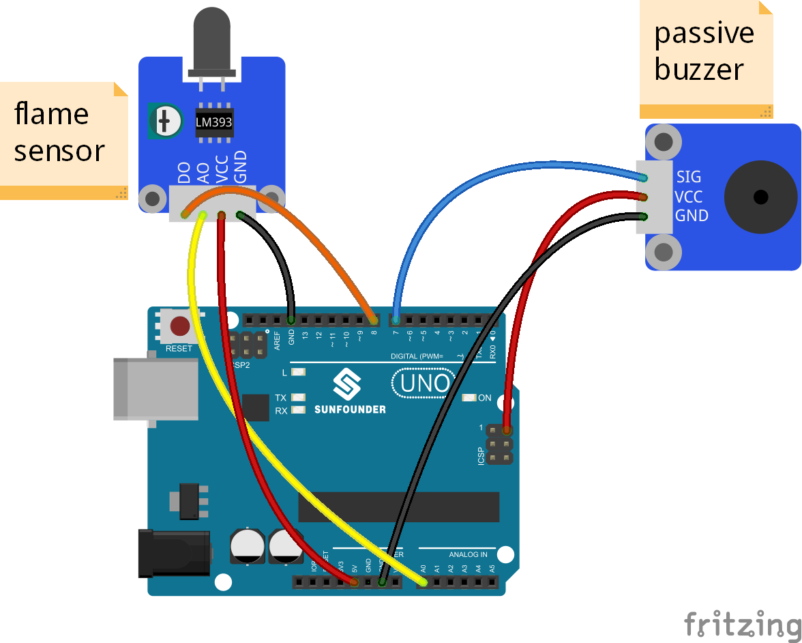
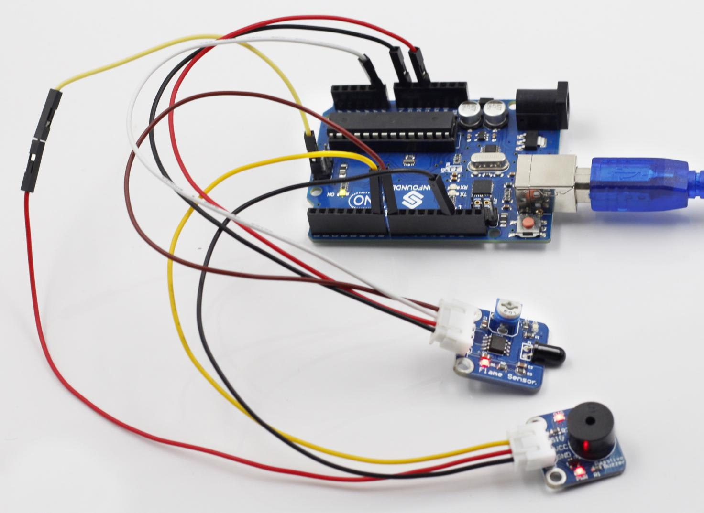

Lesson 9 Flame Alarm
====================

**Introduction**

A flame sensor module performs detection by capturing infrared
wavelengths from flame. It can be used to detect and warn of flames.

**Components**

- 1 \* SunFounder Uno board

- 1 \* USB data cable

- 1 \* Flame sensor module

- 1 \* Passive buzzer module

- 1 \* 4-Pin anti-reverse cable

- 1 \* 3-Pin anti-reverse cable

**Principle**

There are several types of flame sensors. In this experiment, we will
use a far-infrared flame sensor. It can detect infrared light with a
wavelength ranging from 700nm to 1000nm. A far-infrared flame probe
converts the strength changes of the external infrared light into
current changes. And then it converts analog quantities into digital
ones.

In this experiment, connect pin D0 to the digital port 8 of the
SunFounder board. Then when the flame sensor detects flame signals, the
buzzer beeps and the corresponding LED lights up. When it detects no
flame signals, the buzzer stops and the LED goes out.

The schematic diagram of the module:

**Experimental Procedures**

**Step 1:** Build the circuit

The wiring between the flame sensor and SunFounder Uno board:

+-----------------------------------+-----------------------------------+
| Flame Sensor                      | SunFounder Uno                    |
+-----------------------------------+-----------------------------------+
| D0                                | 8                                 |
+-----------------------------------+-----------------------------------+
| A0                                | A0                                |
+-----------------------------------+-----------------------------------+
| VCC                               | 5V                                |
+-----------------------------------+-----------------------------------+
| GND                               | GND                               |
+-----------------------------------+-----------------------------------+

The wiring between the passive buzzer and SunFounder Uno board:

+----------------------------------+-----------------------------------+
| Passive Buzzer                   | SunFounder Uno                    |
+----------------------------------+-----------------------------------+
| SIG                              | 7                                 |
+----------------------------------+-----------------------------------+
| VCC                              | 5V                                |
+----------------------------------+-----------------------------------+
| GND                              | GND                               |
+----------------------------------+-----------------------------------+

**Step 2:** Open the code file

**Step 3:** Select correct Board and Port

**Step 4:** Upload the sketch to the SunFounder Uno board

Now, ignite a lighter near the flame sensor. Then the buzzer will beep,
and the LED on the flame sensor module and that attached to pin 13 of
the SunFounder board will light up.

